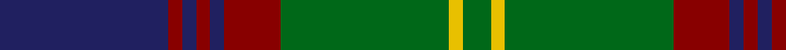

In pattern [BRBRBRGYG](/patterns/brbrbrgyg/).

This was sourced from tartans-authority.  It is a [9 stripes tartan](/stripes/stripes9/).

Original link http://www.tartansauthority.com/tartan-ferret/display/2228/

## Attestations

This cloth appears in 2 source records; the oldest owns this page.

- 1988 — Durie (Clan) (tartans-authority, [record](http://www.tartansauthority.com/tartan-ferret/display/2228/))
- 01/01/1994 — Durie (Personal) (register-of-tartans, [record](https://www.tartanregister.gov.uk/tartanDetails.aspx?ref=1053))

## Thread count
DB/48 DR4 DB4 DR4 DB4 DR16 G48 Y4 G/8

## Palette
Each colour and its ΔE from the base-6 reference it is a variant of.

| Colour | Shade | Base | ΔE (OKLab) |
|---|---|---|---|
| DB | <code style="background-color:#202060;">#202060</code> `#202060` | B <code style="background-color:#2C4084;">#2C4084</code> | 0.11 |
| DR | <code style="background-color:#880000;">#880000</code> `#880000` | R <code style="background-color:#C80000;">#C80000</code> | 0.14 |
| G | <code style="background-color:#006818;">#006818</code> `#006818` | G <code style="background-color:#006400;">#006400</code> | 0.02 |
| Y | <code style="background-color:#E8C000;">#E8C000</code> `#E8C000` | Y <code style="background-color:#E8C000;">#E8C000</code> | 0.00 |

## Nearest tartans

The nearest existing variants by ΔTartan distance.

1. [Shaw](/setts/s10/g48k4b6k4b16r4b16k4b6k4-b2c2c80-g006818-k101010-rc80000/) — ΔT 0.76
1. [Glen Tilt #1](/setts/s10/w4b4g4b44ba24b4g56b4g4w4-b4c0000-ba1c0070-g006818-wc0c0c0/) — ΔT 0.78
1. [Auld Lang Syne Burns Commemorative Tartan Tartan Number: 2400. Earliest known date: 01/01/2002 Launched on the 25th January at a the Beach Ballroom Aberdeen, to celebrate the birth of Robert Burns 2002./Threadcount and colours aren't 100% original. Generated manually./ See products available Copyright © Blair Urquhart, Comrie, 2015](/setts/s8/k6b6k6b48ba48k6ba6w6-b205d7a-ba351d00-k090700-wa7eae1/) — ΔT 0.79
1. [Scottish Tourist Board (1981) (Corp)](/setts/s11/b60k4b4k4b4k64g30r4g8r8g60-b2c2c80-g006818-k101010-rc80000/) — ΔT 0.86
1. [Cape Breton University Chemistry Society](/setts/s10/b8r34b8g8b4g8b8g54b8y8-b000080-g546c3a-r943602-yc49d38/) — ΔT 0.91
1. [Princess Louise (Royal)](/setts/s11/g8k4b36k28g4k4g4k4g36r4b4-b2c2c80-g006818-k101010-rc80000/) — ΔT 0.93
1. [Cork Irish County Tartan Tartan Number: 2253. Earliest known date: 1996 One of a series of Irish District tartans designed by Polly Wittering of the House of Edgar, with colours reminiscent of the Country with soft warm colours dominating. See products available Copyright © Blair Urquhart, Comrie, 2015](/setts/s9/g56r24g8b40y4b6y4b6g14-b141c50-g3c6838-r8c0020-yc48800/) — ΔT 0.95
1. [Stewart of Appin Htg (error)](/setts/s10/g16r6g6r10g52b14ba6b56r6b12-b2c2c80-ba5c8ca8-g006818-rc80000/) — ΔT 0.95
1. [Gordon #2](/setts/s10/b56k6b6k6b6k44g44y4g5y8-b2c4084-g005020-k101010-ye8c000/) — ΔT 0.95
1. [Sardar Chadha (Personal)](/setts/s10/y6g34b4g4k32g4b34g4b2g5-b202060-g006818-k101010-yfcb464/) — ΔT 0.97

## Neighbour map

Every grey dot is one of 15726 variants placed by the first two principal components of the ΔTartan feature space (44% of its variance). Red is this tartan; blue dots are its nearest — click one to open its page.

<svg viewBox="0 0 640 380" role="img" style="max-width:100%;height:auto;border:1px solid #e0e0e0;border-radius:4px;display:block" xmlns="http://www.w3.org/2000/svg"><image href="/nn/cloud.v1.png" width="640" height="380"/><a href="/setts/s10/g48k4b6k4b16r4b16k4b6k4-b2c2c80-g006818-k101010-rc80000/"><circle cx="279.9" cy="179.2" r="4" fill="#3465a4"><title>Shaw</title></circle></a><a href="/setts/s10/w4b4g4b44ba24b4g56b4g4w4-b4c0000-ba1c0070-g006818-wc0c0c0/"><circle cx="263.5" cy="157.1" r="4" fill="#3465a4"><title>Glen Tilt #1</title></circle></a><a href="/setts/s8/k6b6k6b48ba48k6ba6w6-b205d7a-ba351d00-k090700-wa7eae1/"><circle cx="251.4" cy="201.2" r="4" fill="#3465a4"><title>Auld Lang Syne Burns Commemorative Tartan Tartan Number: 2400. Earliest known date: 01/01/2002 Launched on the 25th January at a the Beach Ballroom Aberdeen, to celebrate the birth of Robert Burns 2002./Threadcount and colours aren't 100% original. Generated manually./ See products available Copyright © Blair Urquhart, Comrie, 2015</title></circle></a><a href="/setts/s11/b60k4b4k4b4k64g30r4g8r8g60-b2c2c80-g006818-k101010-rc80000/"><circle cx="248.8" cy="166.0" r="4" fill="#3465a4"><title>Scottish Tourist Board (1981) (Corp)</title></circle></a><a href="/setts/s10/b8r34b8g8b4g8b8g54b8y8-b000080-g546c3a-r943602-yc49d38/"><circle cx="277.4" cy="171.6" r="4" fill="#3465a4"><title>Cape Breton University Chemistry Society</title></circle></a><a href="/setts/s11/g8k4b36k28g4k4g4k4g36r4b4-b2c2c80-g006818-k101010-rc80000/"><circle cx="228.6" cy="190.9" r="4" fill="#3465a4"><title>Princess Louise (Royal)</title></circle></a><a href="/setts/s9/g56r24g8b40y4b6y4b6g14-b141c50-g3c6838-r8c0020-yc48800/"><circle cx="300.4" cy="187.9" r="4" fill="#3465a4"><title>Cork Irish County Tartan Tartan Number: 2253. Earliest known date: 1996 One of a series of Irish District tartans designed by Polly Wittering of the House of Edgar, with colours reminiscent of the Country with soft warm colours dominating. See products available Copyright © Blair Urquhart, Comrie, 2015</title></circle></a><a href="/setts/s10/g16r6g6r10g52b14ba6b56r6b12-b2c2c80-ba5c8ca8-g006818-rc80000/"><circle cx="267.7" cy="194.1" r="4" fill="#3465a4"><title>Stewart of Appin Htg (error)</title></circle></a><a href="/setts/s10/b56k6b6k6b6k44g44y4g5y8-b2c4084-g005020-k101010-ye8c000/"><circle cx="225.1" cy="173.5" r="4" fill="#3465a4"><title>Gordon #2</title></circle></a><a href="/setts/s10/y6g34b4g4k32g4b34g4b2g5-b202060-g006818-k101010-yfcb464/"><circle cx="241.1" cy="167.5" r="4" fill="#3465a4"><title>Sardar Chadha (Personal)</title></circle></a><circle cx="263.1" cy="178.3" r="5" fill="#c00000"/></svg>

ID: /setts/s9/b48r4b4r4b4r16g48y4g8-b202060-g006818-r880000-ye8c000/
