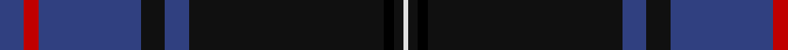

In pattern [BRBKBKKKW](/patterns/brbkbkkkw/).

This was sourced from weddslist.  It is a [9 stripes tartan](/stripes/stripes9/).

Original link http://www.weddslist.com/cgi-bin/tartans/pg.pl?source=sts

## Thread count
B/10 R6 B42 K10 B10 K80 Ka4 K4 LN/2

## Palette
Each colour and its ΔE from the base-6 reference it is a variant of.

| Colour | Shade | Base | ΔE (OKLab) |
|---|---|---|---|
| B | <code style="background-color:#304080;">#304080</code> `#304080` | B <code style="background-color:#2A418A;">#2A418A</code> | 0.02 |
| K | <code style="background-color:#101010;">#101010</code> `#101010` | K <code style="background-color:#000000;">#000000</code> | 0.17 |
| Ka | <code style="background-color:#000000;">#000000</code> `#000000` | K <code style="background-color:#000000;">#000000</code> | 0.00 |
| LN | <code style="background-color:#E0E0E0;">#E0E0E0</code> `#E0E0E0` | W <code style="background-color:#F7F7F7;">#F7F7F7</code> | 0.07 |
| R | <code style="background-color:#C00000;">#C00000</code> `#C00000` | R <code style="background-color:#CC0000;">#CC0000</code> | 0.03 |

## Nearest tartans

The nearest existing variants by ΔTartan distance.

1. [Weir Clan Tartan Tartan Number: 327. Earliest known date: pre 2003 This sample comes from the MacGregor-Hastie collection which forms the basis of the cloth archive of the Scottish Tartans Society. Some of the samples, including this one, were unmarked. One can assume that the sample dates between 1930 and 1950. See products available Copyright © Blair Urquhart, Comrie, 2015](/setts/s8/k8y1k1b28k12g2k1ba2x2~b2c2c80-ba5c8ca8-g006818-k101010-ye8c000/) — ΔT 1.02
1. [Hope-Weir/Weir](/setts/s8/k8y1k1b28k12g2k1ba2x2~b2c4084-ba3c82af-g005020-k101010-ye8c000/) — ΔT 1.02
1. [Al-Fadhli (Personal)](/setts/s10/b3g3b24k34w1k34b24r3b3w3x2~b2c4084-g003c14-k101010-rdc0000-we0e0e0/) — ΔT 1.06
1. [Nocken Blue Modern Tartan (Personal)](/setts/s9/y3k6w2k6b2k2b32k2ba1x2~b003152-ba666666-k101010-wffffff-y7a9dc3/) — ΔT 1.09
1. [Nocken (Personal)](/setts/s9/w3k6wa2k6b2k2b32k2ba1x2~b202060-ba5c5c5c-k101010-w98c8e8-wae8ccb8/) — ΔT 1.15
1. [Home or Hume (Vestiarium Scoticum)](/setts/s8/k28r1k2r1k8b24g2b3x2~b2c4084-g005020-k101010-rdc0000/) — ΔT 1.19
1. [MacLaurin of Brioch](/setts/s7/b36k10g3r3g6k1y2x2~b2c4084-g005020-k101010-rdc0000-ye8c000/) — ΔT 1.21
1. [Hebridean Heather Fashion Tartan Tartan Number: 6820. Earliest known date: 2005 Designed for new House of Edgar Collection in wedding grays. Originally called Balmoral but this was disallowed in recording as Balmoral tartans are restricted to the Royal Family. See products available Copyright © Blair Urquhart, Comrie, 2015](/setts/s9/b4ba2b7bb30b8bb7r5ba1w2x2~b5c5c5c-ba003c64-bb1c1c1c-r800028-we0e0e0/) — ΔT 1.21
1. [Hebridean Heather](/setts/s9/b4ba2b7bb30b8bb7r5ba1w2x2~b5c5c5c-ba003c64-bb1c1c1c-r800028-wf8f8f8/) — ΔT 1.22
1. [MacLaurin of Brioch Clan Tartan Tartan Number: 344. Earliest known date: 1856 This sett was approved by the Chief and accepted by the A.G.M. of the Clan MacLaren Society as Dress MacLaren in 1981. The sett has been designed by changing the blue ground of the usual MacLaren sett to white and then centering a blue stripe on the white ground. This illustration is based on a kilt belonging to the designer, Mr I.G.Campbell MacLaren. See products available Copyright © Blair Urquhart, Comrie, 2015](/setts/s7/b36k10g3r3g6k1y2x2~b2c2c80-g006818-k101010-rc80000-ye8c000/) — ΔT 1.22

## Neighbour map

Every grey dot is one of 15726 variants placed by the first two principal components of the ΔTartan feature space (44% of its variance). Red is this tartan; blue dots are its nearest — click one to open its page.

<svg viewBox="0 0 640 380" role="img" style="max-width:100%;height:auto;border:1px solid #e0e0e0;border-radius:4px;display:block" xmlns="http://www.w3.org/2000/svg"><image href="/nn/cloud.v1.png" width="640" height="380"/><a href="/setts/s8/k8y1k1b28k12g2k1ba2x2~b2c2c80-ba5c8ca8-g006818-k101010-ye8c000/"><circle cx="368.8" cy="144.1" r="4" fill="#3465a4"><title>Weir Clan Tartan Tartan Number: 327. Earliest known date: pre 2003 This sample comes from the MacGregor-Hastie collection which forms the basis of the cloth archive of the Scottish Tartans Society. Some of the samples, including this one, were unmarked. One can assume that the sample dates between 1930 and 1950. See products available Copyright © Blair Urquhart, Comrie, 2015</title></circle></a><a href="/setts/s8/k8y1k1b28k12g2k1ba2x2~b2c4084-ba3c82af-g005020-k101010-ye8c000/"><circle cx="367.9" cy="144.0" r="4" fill="#3465a4"><title>Hope-Weir/Weir</title></circle></a><a href="/setts/s10/b3g3b24k34w1k34b24r3b3w3x2~b2c4084-g003c14-k101010-rdc0000-we0e0e0/"><circle cx="346.3" cy="138.6" r="4" fill="#3465a4"><title>Al-Fadhli (Personal)</title></circle></a><a href="/setts/s9/y3k6w2k6b2k2b32k2ba1x2~b003152-ba666666-k101010-wffffff-y7a9dc3/"><circle cx="405.6" cy="121.6" r="4" fill="#3465a4"><title>Nocken Blue Modern Tartan (Personal)</title></circle></a><a href="/setts/s9/w3k6wa2k6b2k2b32k2ba1x2~b202060-ba5c5c5c-k101010-w98c8e8-wae8ccb8/"><circle cx="404.4" cy="117.6" r="4" fill="#3465a4"><title>Nocken (Personal)</title></circle></a><a href="/setts/s8/k28r1k2r1k8b24g2b3x2~b2c4084-g005020-k101010-rdc0000/"><circle cx="422.1" cy="172.4" r="4" fill="#3465a4"><title>Home or Hume (Vestiarium Scoticum)</title></circle></a><a href="/setts/s7/b36k10g3r3g6k1y2x2~b2c4084-g005020-k101010-rdc0000-ye8c000/"><circle cx="391.4" cy="132.1" r="4" fill="#3465a4"><title>MacLaurin of Brioch</title></circle></a><a href="/setts/s9/b4ba2b7bb30b8bb7r5ba1w2x2~b5c5c5c-ba003c64-bb1c1c1c-r800028-we0e0e0/"><circle cx="374.0" cy="140.8" r="4" fill="#3465a4"><title>Hebridean Heather Fashion Tartan Tartan Number: 6820. Earliest known date: 2005 Designed for new House of Edgar Collection in wedding grays. Originally called Balmoral but this was disallowed in recording as Balmoral tartans are restricted to the Royal Family. See products available Copyright © Blair Urquhart, Comrie, 2015</title></circle></a><a href="/setts/s9/b4ba2b7bb30b8bb7r5ba1w2x2~b5c5c5c-ba003c64-bb1c1c1c-r800028-wf8f8f8/"><circle cx="366.9" cy="138.0" r="4" fill="#3465a4"><title>Hebridean Heather</title></circle></a><a href="/setts/s7/b36k10g3r3g6k1y2x2~b2c2c80-g006818-k101010-rc80000-ye8c000/"><circle cx="383.2" cy="128.5" r="4" fill="#3465a4"><title>MacLaurin of Brioch Clan Tartan Tartan Number: 344. Earliest known date: 1856 This sett was approved by the Chief and accepted by the A.G.M. of the Clan MacLaren Society as Dress MacLaren in 1981. The sett has been designed by changing the blue ground of the usual MacLaren sett to white and then centering a blue stripe on the white ground. This illustration is based on a kilt belonging to the designer, Mr I.G.Campbell MacLaren. See products available Copyright © Blair Urquhart, Comrie, 2015</title></circle></a><circle cx="408.8" cy="126.1" r="5" fill="#c00000"/></svg>

ID: /setts/s9/b5r3b21k5b5k40ka2k2w1x2~b304080-k101010-ka000000-rc00000-we0e0e0/
