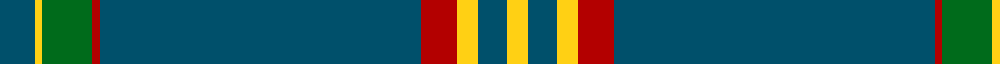

In pattern [BYGRBRYBY](/patterns/bygrbryby/).

This was sourced from house-of-tartan.  It is a [9 stripes tartan](/stripes/stripes9/).

Original link http://www.house-of-tartan.scotland.net/house/TartanViewjs.asp?colr=Def&tnam=10652

## Thread count
DB/10 Y2 G14 DR2 DB90 DR10 Y6 DB8 Y/6

## Palette
Each colour and its ΔE from the base-6 reference it is a variant of.

| Colour | Shade | Base | ΔE (OKLab) |
|---|---|---|---|
| DB | <code style="background-color:#00506B;">#00506B</code> `#00506B` | B <code style="background-color:#2A418A;">#2A418A</code> | 0.08 |
| DR | <code style="background-color:#B30000;">#B30000</code> `#B30000` | R <code style="background-color:#CC0000;">#CC0000</code> | 0.05 |
| G | <code style="background-color:#006B1B;">#006B1B</code> `#006B1B` | G <code style="background-color:#006100;">#006100</code> | 0.03 |
| Y | <code style="background-color:#FFD014;">#FFD014</code> `#FFD014` | Y <code style="background-color:#F2BF00;">#F2BF00</code> | 0.05 |

## Nearest tartans

The nearest existing variants by ΔTartan distance.

1. [Salvation Army, Hunting](/setts/s7/b40g8k1y2k1g8b5~b304080-g008000-k000000-yf0c000~x4/) — ΔT 1.05
1. [Crail](/setts/s7/b140k3w16k3ba16k3ba16~b606060-ba381c0c-k000000-we0e0e0/) — ΔT 1.14
1. [Hastings-Stephenson (Personal)](/setts/s8/g44b11g5ba3g4b8g4w1~b000048-ba2888c4-g00643c-wf8f8f8~x2/) — ΔT 1.22
1. [Chateau](/setts/s10/b36k3g3ba1g3k3b4g6k1ba2~b306084-ba488cc0-g484800-k000000~x4/) — ΔT 1.41
1. [Kinfauns Castle (Corporate)](/setts/s6/r4b12g2b2g46w1~b780078-g006818-rc80000-we0e0e0~x2/) — ΔT 1.51
1. [Melrose Newbigging Grey (Name)](/setts/s10/b1k6b35k6b2ba3b1k6b2w1~b5c5c5c-ba440044-k101010-we0e0e0~x2/) — ΔT 1.51
1. [Pride of the Clyde](/setts/s8/b8w4ba6b2ba6r10ba63w3~b2c2c80-ba003c64-r888888-we0e0e0/) — ΔT 1.54
1. [Glenfeshie (Personal)](/setts/s9/r4g3b3g44b16g10w2g2b2~b6c0070-g006818-rc8002c-wfcfcfc~x2/) — ΔT 1.59
1. [Hogan](/setts/s13/g49r3w2y1b3g19w2y1g5r3w2y1b3~b5488ac-g004830-r8c0020-we0e0e0-yf4bc3c~x2/) — ΔT 1.59
1. [Lochnagar Dress (Fashion)](/setts/s10/g5k1g33b1g9k9b5k1r2k4~b440044-g686868-k101010-r880000~x2/) — ΔT 1.62

## Neighbour map

Every grey dot is one of 15726 variants placed by the first two principal components of the ΔTartan feature space (44% of its variance). Red is this tartan; blue dots are its nearest — click one to open its page.

<svg viewBox="0 0 640 380" role="img" style="max-width:100%;height:auto;border:1px solid #e0e0e0;border-radius:4px;display:block" xmlns="http://www.w3.org/2000/svg"><image href="/nn/cloud.v1.png" width="640" height="380"/><a href="/setts/s7/b40g8k1y2k1g8b5~b304080-g008000-k000000-yf0c000~x4/"><circle cx="484.8" cy="142.8" r="4" fill="#3465a4"><title>Salvation Army, Hunting</title></circle></a><a href="/setts/s7/b140k3w16k3ba16k3ba16~b606060-ba381c0c-k000000-we0e0e0/"><circle cx="501.2" cy="114.1" r="4" fill="#3465a4"><title>Crail</title></circle></a><a href="/setts/s8/g44b11g5ba3g4b8g4w1~b000048-ba2888c4-g00643c-wf8f8f8~x2/"><circle cx="499.7" cy="145.2" r="4" fill="#3465a4"><title>Hastings-Stephenson (Personal)</title></circle></a><a href="/setts/s10/b36k3g3ba1g3k3b4g6k1ba2~b306084-ba488cc0-g484800-k000000~x4/"><circle cx="448.5" cy="120.7" r="4" fill="#3465a4"><title>Chateau</title></circle></a><a href="/setts/s6/r4b12g2b2g46w1~b780078-g006818-rc80000-we0e0e0~x2/"><circle cx="517.0" cy="141.6" r="4" fill="#3465a4"><title>Kinfauns Castle (Corporate)</title></circle></a><a href="/setts/s10/b1k6b35k6b2ba3b1k6b2w1~b5c5c5c-ba440044-k101010-we0e0e0~x2/"><circle cx="474.1" cy="124.6" r="4" fill="#3465a4"><title>Melrose Newbigging Grey (Name)</title></circle></a><a href="/setts/s8/b8w4ba6b2ba6r10ba63w3~b2c2c80-ba003c64-r888888-we0e0e0/"><circle cx="508.1" cy="145.0" r="4" fill="#3465a4"><title>Pride of the Clyde</title></circle></a><a href="/setts/s9/r4g3b3g44b16g10w2g2b2~b6c0070-g006818-rc8002c-wfcfcfc~x2/"><circle cx="448.1" cy="148.5" r="4" fill="#3465a4"><title>Glenfeshie (Personal)</title></circle></a><a href="/setts/s13/g49r3w2y1b3g19w2y1g5r3w2y1b3~b5488ac-g004830-r8c0020-we0e0e0-yf4bc3c~x2/"><circle cx="526.1" cy="76.6" r="4" fill="#3465a4"><title>Hogan</title></circle></a><a href="/setts/s10/g5k1g33b1g9k9b5k1r2k4~b440044-g686868-k101010-r880000~x2/"><circle cx="466.8" cy="136.0" r="4" fill="#3465a4"><title>Lochnagar Dress (Fashion)</title></circle></a><circle cx="505.9" cy="114.7" r="5" fill="#c00000"/></svg>

ID: /setts/s9/b5y1g7r1b45r5y3b4y3~b00506b-g006b1b-rb30000-yffd014~x2/
