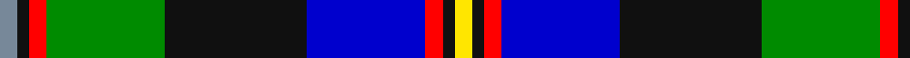

In pattern [BKRGKBRKY](/patterns/bkrgkbrky/).

This was sourced from register-of-tartans.  It is a [9 stripes tartan](/stripes/stripes9/).

Original link https://www.tartanregister.gov.uk/tartanDetails.aspx?ref=10586

## Thread count
N/6 K4 R6 G40 K48 B40 R6 K4 Y/6

## Palette
Each colour and its ΔE from the base-6 reference it is a variant of.

| Colour | Shade | Base | ΔE (OKLab) |
|---|---|---|---|
| B | <code style="background-color:#0000CD;">#0000CD</code> `#0000CD` | B <code style="background-color:#2C4084;">#2C4084</code> | 0.15 |
| G | <code style="background-color:#008B00;">#008B00</code> `#008B00` | G <code style="background-color:#006400;">#006400</code> | 0.12 |
| K | <code style="background-color:#101010;">#101010</code> `#101010` | K <code style="background-color:#000000;">#000000</code> | 0.17 |
| N | <code style="background-color:#778899;">#778899</code> `#778899` | B <code style="background-color:#2C4084;">#2C4084</code> | 0.24 |
| R | <code style="background-color:#FF0000;">#FF0000</code> `#FF0000` | R <code style="background-color:#C80000;">#C80000</code> | 0.11 |
| Y | <code style="background-color:#FFE600;">#FFE600</code> `#FFE600` | Y <code style="background-color:#E8C000;">#E8C000</code> | 0.10 |

## Nearest tartans

The nearest existing variants by ΔTartan distance.

1. [McCuaig (Glenelg and the Western Isles)](/setts/s9/k20y6k4b40k20g30k4r6w6-b0000cd-g008b00-k101010-rff0000-wffffff-yffe600/) — ΔT 0.75
1. [Greene](/setts/s10/b12r8b48w6k12g36y8g4y4g8-b00008c-g007800-k000000-r8c0000-wc8c8c8-yc88c00/) — ΔT 0.76
1. [McCuaig (2010) (Name)](/setts/s9/k20y6k4b40k20g30k4r6w6-b1474b4-g006818-k101010-rc8002c-we0e0e0-ye8c000/) — ΔT 0.83
1. [Minnesota (District)](/setts/s8/k12w6k4b60r18k8g40y6-b2c2c80-g289c18-k101010-ra00024-we0e0e0-ye8c000/) — ΔT 0.84
1. [St Columba](/setts/s8/b60ba5w4r12g42bb12ba5bb12-b000050-ba5480b0-bb800080-g008000-r906030-we0e0e0/) — ΔT 0.85
1. [Souza Nery](/setts/s7/y8g44r6k34r6b74w6-b304080-g008000-k000000-rc00020-we0e0e0-yf0c000/) — ΔT 0.85
1. [Federated Women's Institutes of](/setts/s9/r8k4y8g12y16g12b48k4w8-b003478-g007800-k000000-r8c0000-wc8c8c8-yc88c00/) — ΔT 0.91
1. [Unnamed, No 20](/setts/s11/b3k2b2ba8bb20r4g16ba4b2k2b3-b5480b0-ba8080d0-bb000050-g008000-k000000-rc00000/) — ΔT 0.93
1. [Leung (Personal)](/setts/s9/r8k14r4b50k38w4g26k4y6-b2c2c80-g006818-k101010-rb468ac-wfcfcfc-ye8c000/) — ΔT 0.94
1. [Cusack](/setts/s9/b8k4b32k24w2g26r4g4y8-b00008c-g007800-k000000-r8c0000-wfcfcfc-yc88c00/) — ΔT 0.94

## Neighbour map

Every grey dot is one of 15726 variants placed by the first two principal components of the ΔTartan feature space (44% of its variance). Red is this tartan; blue dots are its nearest — click one to open its page.

<svg viewBox="0 0 640 380" role="img" style="max-width:100%;height:auto;border:1px solid #e0e0e0;border-radius:4px;display:block" xmlns="http://www.w3.org/2000/svg"><image href="/nn/cloud.v1.png" width="640" height="380"/><a href="/setts/s9/k20y6k4b40k20g30k4r6w6-b0000cd-g008b00-k101010-rff0000-wffffff-yffe600/"><circle cx="92.3" cy="151.6" r="4" fill="#3465a4"><title>McCuaig (Glenelg and the Western Isles)</title></circle></a><a href="/setts/s10/b12r8b48w6k12g36y8g4y4g8-b00008c-g007800-k000000-r8c0000-wc8c8c8-yc88c00/"><circle cx="148.5" cy="136.2" r="4" fill="#3465a4"><title>Greene</title></circle></a><a href="/setts/s9/k20y6k4b40k20g30k4r6w6-b1474b4-g006818-k101010-rc8002c-we0e0e0-ye8c000/"><circle cx="110.2" cy="157.6" r="4" fill="#3465a4"><title>McCuaig (2010) (Name)</title></circle></a><a href="/setts/s8/k12w6k4b60r18k8g40y6-b2c2c80-g289c18-k101010-ra00024-we0e0e0-ye8c000/"><circle cx="149.5" cy="131.5" r="4" fill="#3465a4"><title>Minnesota (District)</title></circle></a><a href="/setts/s8/b60ba5w4r12g42bb12ba5bb12-b000050-ba5480b0-bb800080-g008000-r906030-we0e0e0/"><circle cx="160.8" cy="135.1" r="4" fill="#3465a4"><title>St Columba</title></circle></a><a href="/setts/s7/y8g44r6k34r6b74w6-b304080-g008000-k000000-rc00020-we0e0e0-yf0c000/"><circle cx="152.1" cy="145.9" r="4" fill="#3465a4"><title>Souza Nery</title></circle></a><a href="/setts/s9/r8k4y8g12y16g12b48k4w8-b003478-g007800-k000000-r8c0000-wc8c8c8-yc88c00/"><circle cx="137.0" cy="135.6" r="4" fill="#3465a4"><title>Federated Women's Institutes of</title></circle></a><a href="/setts/s11/b3k2b2ba8bb20r4g16ba4b2k2b3-b5480b0-ba8080d0-bb000050-g008000-k000000-rc00000/"><circle cx="80.3" cy="133.1" r="4" fill="#3465a4"><title>Unnamed, No 20</title></circle></a><a href="/setts/s9/r8k14r4b50k38w4g26k4y6-b2c2c80-g006818-k101010-rb468ac-wfcfcfc-ye8c000/"><circle cx="146.8" cy="145.1" r="4" fill="#3465a4"><title>Leung (Personal)</title></circle></a><a href="/setts/s9/b8k4b32k24w2g26r4g4y8-b00008c-g007800-k000000-r8c0000-wfcfcfc-yc88c00/"><circle cx="123.5" cy="138.0" r="4" fill="#3465a4"><title>Cusack</title></circle></a><circle cx="114.5" cy="133.0" r="5" fill="#c00000"/></svg>

ID: /setts/s9/b6k4r6g40k48ba40r6k4y6-b778899-ba0000cd-g008b00-k101010-rff0000-yffe600/
