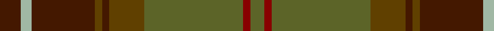

In pattern [BYBGBGGRG](/patterns/bybgbggrg/).

This was sourced from register-of-tartans.  It is a [9 stripes tartan](/stripes/stripes9/).

Original link https://www.tartanregister.gov.uk/tartanDetails.aspx?ref=3712

## Attestations

This cloth appears in 2 source records; the oldest owns this page.

- 01/07/2007 — Scottish Crofting Foundation (register-of-tartans, [record](https://www.tartanregister.gov.uk/tartanDetails.aspx?ref=3712))
- July 2007 — Scottish Crofting Foundation (Corp) (tartans-authority, [record](http://www.tartansauthority.com/tartan-ferret/display/7239/))

## Register references

External register numbers recorded for this tartan.

- Scottish Register of Tartans: [3712](https://www.tartanregister.gov.uk/tartanDetails.aspx?ref=3712)
- Scottish Tartans Authority (ITI): 7239

## Thread count
DR/12 N6 DR36 T4 DR4 T20 G56 DRa4 G/8

## Palette
Each colour and its ΔE from the base-6 reference it is a variant of.

| Colour | Shade | Base | ΔE (OKLab) |
|---|---|---|---|
| DR | <code style="background-color:#441800;">#441800</code> `#441800` | B <code style="background-color:#2A418A;">#2A418A</code> | 0.23 |
| DRa | <code style="background-color:#880000;">#880000</code> `#880000` | R <code style="background-color:#CC0000;">#CC0000</code> | 0.15 |
| G | <code style="background-color:#5C6428;">#5C6428</code> `#5C6428` | G <code style="background-color:#006100;">#006100</code> | 0.10 |
| N | <code style="background-color:#A0B8A4;">#A0B8A4</code> `#A0B8A4` | Y <code style="background-color:#F2BF00;">#F2BF00</code> | 0.17 |
| R | <code style="background-color:#C80000;">#C80000</code> `#C80000` | R <code style="background-color:#CC0000;">#CC0000</code> | 0.01 |
| T | <code style="background-color:#604000;">#604000</code> `#604000` | G <code style="background-color:#006100;">#006100</code> | 0.14 |

## Nearest tartans

The nearest existing variants by ΔTartan distance.

1. [John Muir Way](/setts/s8/g35ga19r3gb8r3ga8r3b3~b5f749c-g604000-ga003c14-gb767e52-rc80000~x2/) — ΔT 0.45
1. [John Muir Way](/setts/s8/g35ga19r3gb8r3ga8r3b3~b2c2c80-g603800-ga003820-gb408060-rc80000~x2/) — ΔT 0.56
1. [State Seal of Minnesota (Fashion)](/setts/s8/r4g46r10b10ga33b5ga4y3~b2c2c80-g006818-ga604000-r880000-ybc8c00~x2/) — ΔT 0.84
1. [Cozumel](/setts/s9/g7k1ga1r1k1r7ga15k1y1~g604000-ga003820-k101010-ra00000-yd09800~x4/) — ΔT 1.01
1. [Methven](/setts/s11/r2g3ga18r2ga2r21gb6g2gb2g24y2~g003820-ga503c14-gb5c6428-rb03000-yc88c00~x2/) — ΔT 1.02
1. [Pubcrawlers (Corporate)](/setts/s7/g3ga4g2ga22b5r16y3~b5c5c5c-g006818-ga604000-r901c38-ye8c000~x2/) — ΔT 1.11
1. [Ramsay (Green Fashion)](/setts/s7/g1r7g7b2r1ga15w1~b5c5c5c-g006818-ga285800-r880000-wc0c0c0~x4/) — ΔT 1.21
1. [Henry, W. A.](/setts/s9/g16r16y3ga16ra2r1ra2g6r2~g484800-ga004c00-r9c0030-ra9c8000-yb0b0b0~x4/) — ΔT 1.21
1. [Brousseau (Personal)](/setts/s9/g25r2w2b2w2r13ga28b2r3~b2c2c80-g5c6428-ga643424-ra00000-we8ccb8~x2/) — ΔT 1.28
1. [Brave for Men (Fashion)](/setts/s8/k5g5k5g34b33k6b5r2~b5c5c5c-g604000-k101010-r888888/) — ΔT 1.29

## Neighbour map

Every grey dot is one of 15726 variants placed by the first two principal components of the ΔTartan feature space (44% of its variance). Red is this tartan; blue dots are its nearest — click one to open its page.

<svg viewBox="0 0 640 380" role="img" style="max-width:100%;height:auto;border:1px solid #e0e0e0;border-radius:4px;display:block" xmlns="http://www.w3.org/2000/svg"><image href="/nn/cloud.v1.png" width="640" height="380"/><a href="/setts/s8/g35ga19r3gb8r3ga8r3b3~b5f749c-g604000-ga003c14-gb767e52-rc80000~x2/"><circle cx="300.9" cy="194.8" r="4" fill="#3465a4"><title>John Muir Way</title></circle></a><a href="/setts/s8/g35ga19r3gb8r3ga8r3b3~b2c2c80-g603800-ga003820-gb408060-rc80000~x2/"><circle cx="299.2" cy="194.5" r="4" fill="#3465a4"><title>John Muir Way</title></circle></a><a href="/setts/s8/r4g46r10b10ga33b5ga4y3~b2c2c80-g006818-ga604000-r880000-ybc8c00~x2/"><circle cx="287.7" cy="183.4" r="4" fill="#3465a4"><title>State Seal of Minnesota (Fashion)</title></circle></a><a href="/setts/s9/g7k1ga1r1k1r7ga15k1y1~g604000-ga003820-k101010-ra00000-yd09800~x4/"><circle cx="308.1" cy="165.3" r="4" fill="#3465a4"><title>Cozumel</title></circle></a><a href="/setts/s11/r2g3ga18r2ga2r21gb6g2gb2g24y2~g003820-ga503c14-gb5c6428-rb03000-yc88c00~x2/"><circle cx="250.3" cy="168.6" r="4" fill="#3465a4"><title>Methven</title></circle></a><a href="/setts/s7/g3ga4g2ga22b5r16y3~b5c5c5c-g006818-ga604000-r901c38-ye8c000~x2/"><circle cx="317.0" cy="205.7" r="4" fill="#3465a4"><title>Pubcrawlers (Corporate)</title></circle></a><a href="/setts/s7/g1r7g7b2r1ga15w1~b5c5c5c-g006818-ga285800-r880000-wc0c0c0~x4/"><circle cx="313.0" cy="199.5" r="4" fill="#3465a4"><title>Ramsay (Green Fashion)</title></circle></a><a href="/setts/s9/g16r16y3ga16ra2r1ra2g6r2~g484800-ga004c00-r9c0030-ra9c8000-yb0b0b0~x4/"><circle cx="236.8" cy="173.8" r="4" fill="#3465a4"><title>Henry, W. A.</title></circle></a><a href="/setts/s9/g25r2w2b2w2r13ga28b2r3~b2c2c80-g5c6428-ga643424-ra00000-we8ccb8~x2/"><circle cx="268.9" cy="162.8" r="4" fill="#3465a4"><title>Brousseau (Personal)</title></circle></a><a href="/setts/s8/k5g5k5g34b33k6b5r2~b5c5c5c-g604000-k101010-r888888/"><circle cx="355.4" cy="203.8" r="4" fill="#3465a4"><title>Brave for Men (Fashion)</title></circle></a><circle cx="308.9" cy="183.5" r="5" fill="#c00000"/></svg>

ID: /setts/s9/b6y3b18g2b2g10ga28r2ga4~b441800-g604000-ga5c6428-r880000-ya0b8a4~x2/
