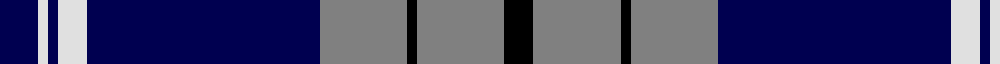

In pattern [BWBWBGKGK](/patterns/bwbwbgkgk/).

This was sourced from weddslist.  It is a [9 stripes tartan](/stripes/stripes9/).

Original link http://www.weddslist.com/cgi-bin/tartans/pg.pl?source=sts

## Thread count
DB/8 LN2 DB2 LN6 DB48 N18 K2 N18 K/6

## Palette
Each colour and its ΔE from the base-6 reference it is a variant of.

| Colour | Shade | Base | ΔE (OKLab) |
|---|---|---|---|
| DB | <code style="background-color:#000050;">#000050</code> `#000050` | B <code style="background-color:#2C4084;">#2C4084</code> | 0.20 |
| K | <code style="background-color:#000000;">#000000</code> `#000000` | K <code style="background-color:#000000;">#000000</code> | 0.00 |
| LN | <code style="background-color:#E0E0E0;">#E0E0E0</code> `#E0E0E0` | W <code style="background-color:#F4F4F0;">#F4F4F0</code> | 0.06 |
| N | <code style="background-color:#808080;">#808080</code> `#808080` | G <code style="background-color:#006400;">#006400</code> | 0.22 |

## Nearest tartans

The nearest existing variants by ΔTartan distance.

1. [Eildon (1980)](/setts/s8/b84w4wa4w4b10ba24wa64b8-b000050-ba003478-w94acfc-wac8c8c8/) — ΔT 0.92
1. [Rhys (Welsh Name)](/setts/s10/y6b3y3b15ba7y7ba5y17ba46y4-b202060-ba000048-ya08858/) — ΔT 0.97
1. [Swedish](/setts/s13/y14k2b44k4b2k4b8k4b2k4b8k36w10-b2c4084-k000028-we0e0e0-ye8c000/) — ΔT 1.03
1. [Highlands School (North Carolina)](/setts/s8/y24b4y4b60ba4b4ba26w8-b1c0070-ba14283c-wc0c0c0-yd09800/) — ΔT 1.05
1. [Ewbank](/setts/s9/r6b28y4k4b28k72y4k4y4-b1474b4-k101010-rc80000-ye8c000/) — ΔT 1.12
1. [Longniddry Eildon Blue Dress Fancy Tartan Tartan Number: 5486. Earliest known date: pre 1992 Dancers tartan See products available Copyright © Blair Urquhart, Comrie, 2015](/setts/s8/b84w4wa4w4b10ba24wa64b8-b202060-ba003c64-wa8ace8-wac0c0c0/) — ΔT 1.14
1. [Scottish Knights Templar, of M.T.S. International](/setts/s9/r6b40k12w10k8w6k4r2b4-b304080-k000000-rc00000-we0e0e0/) — ΔT 1.15
1. [Knights Templar International Corporate Tartan Tartan Number: 560. Earliest known date: 1989 Alternative sett (International Branch). Stuart Davidson was a founder member of the Scottish Tartans Society. See products available Copyright © Blair Urquhart, Comrie, 2015](/setts/s9/r6b40k12w10k8w6k4r2b4-b2c2c80-k101010-rc80000-we0e0e0/) — ΔT 1.15
1. [DeCloud-McMasters (Personal)](/setts/s8/r6b4w4b52k44w6b6w6-b00008c-k101010-rc80000-wffffff/) — ΔT 1.15
1. [Home (Clan)](/setts/s8/k72r6k6r6k18b72g6b4-b1474b4-g289c18-k101010-rc80000/) — ΔT 1.15

## Neighbour map

Every grey dot is one of 15726 variants placed by the first two principal components of the ΔTartan feature space (44% of its variance). Red is this tartan; blue dots are its nearest — click one to open its page.

<svg viewBox="0 0 640 380" role="img" style="max-width:100%;height:auto;border:1px solid #e0e0e0;border-radius:4px;display:block" xmlns="http://www.w3.org/2000/svg"><image href="/nn/cloud.v1.png" width="640" height="380"/><a href="/setts/s8/b84w4wa4w4b10ba24wa64b8-b000050-ba003478-w94acfc-wac8c8c8/"><circle cx="270.7" cy="136.8" r="4" fill="#3465a4"><title>Eildon (1980)</title></circle></a><a href="/setts/s10/y6b3y3b15ba7y7ba5y17ba46y4-b202060-ba000048-ya08858/"><circle cx="281.0" cy="156.5" r="4" fill="#3465a4"><title>Rhys (Welsh Name)</title></circle></a><a href="/setts/s13/y14k2b44k4b2k4b8k4b2k4b8k36w10-b2c4084-k000028-we0e0e0-ye8c000/"><circle cx="251.6" cy="119.8" r="4" fill="#3465a4"><title>Swedish</title></circle></a><a href="/setts/s8/y24b4y4b60ba4b4ba26w8-b1c0070-ba14283c-wc0c0c0-yd09800/"><circle cx="269.3" cy="159.1" r="4" fill="#3465a4"><title>Highlands School (North Carolina)</title></circle></a><a href="/setts/s9/r6b28y4k4b28k72y4k4y4-b1474b4-k101010-rc80000-ye8c000/"><circle cx="304.7" cy="141.9" r="4" fill="#3465a4"><title>Ewbank</title></circle></a><a href="/setts/s8/b84w4wa4w4b10ba24wa64b8-b202060-ba003c64-wa8ace8-wac0c0c0/"><circle cx="285.4" cy="138.3" r="4" fill="#3465a4"><title>Longniddry Eildon Blue Dress Fancy Tartan Tartan Number: 5486. Earliest known date: pre 1992 Dancers tartan See products available Copyright © Blair Urquhart, Comrie, 2015</title></circle></a><a href="/setts/s9/r6b40k12w10k8w6k4r2b4-b304080-k000000-rc00000-we0e0e0/"><circle cx="240.5" cy="136.2" r="4" fill="#3465a4"><title>Scottish Knights Templar, of M.T.S. International</title></circle></a><a href="/setts/s9/r6b40k12w10k8w6k4r2b4-b2c2c80-k101010-rc80000-we0e0e0/"><circle cx="250.8" cy="138.9" r="4" fill="#3465a4"><title>Knights Templar International Corporate Tartan Tartan Number: 560. Earliest known date: 1989 Alternative sett (International Branch). Stuart Davidson was a founder member of the Scottish Tartans Society. See products available Copyright © Blair Urquhart, Comrie, 2015</title></circle></a><a href="/setts/s8/r6b4w4b52k44w6b6w6-b00008c-k101010-rc80000-wffffff/"><circle cx="252.0" cy="160.1" r="4" fill="#3465a4"><title>DeCloud-McMasters (Personal)</title></circle></a><a href="/setts/s8/k72r6k6r6k18b72g6b4-b1474b4-g289c18-k101010-rc80000/"><circle cx="314.6" cy="158.4" r="4" fill="#3465a4"><title>Home (Clan)</title></circle></a><circle cx="297.1" cy="136.3" r="5" fill="#c00000"/></svg>

ID: /setts/s9/b8w2b2w6b48g18k2g18k6-b000050-g808080-k000000-we0e0e0/
