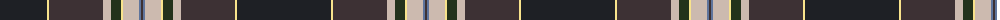

In pattern [BBYYGYBYB](/patterns/bbyygybyb/).

This was sourced from register-of-tartans.  It is a [9 stripes tartan](/stripes/stripes9/).

Original link https://www.tartanregister.gov.uk/tartanDetails.aspx?ref=10434

## Thread count
K/94 LY2 T54 N8 Ka10 LY2 N16 B2 T/2

## Palette
Each colour and its ΔE from the base-6 reference it is a variant of.

| Colour | Shade | Base | ΔE (OKLab) |
|---|---|---|---|
| B | <code style="background-color:#5F749C;">#5F749C</code> `#5F749C` | B <code style="background-color:#2C4084;">#2C4084</code> | 0.17 |
| K | <code style="background-color:#1E2025;">#1E2025</code> `#1E2025` | B <code style="background-color:#2C4084;">#2C4084</code> | 0.18 |
| Ka | <code style="background-color:#23321B;">#23321B</code> `#23321B` | G <code style="background-color:#006400;">#006400</code> | 0.17 |
| LY | <code style="background-color:#F8E38C;">#F8E38C</code> `#F8E38C` | Y <code style="background-color:#E8C000;">#E8C000</code> | 0.11 |
| N | <code style="background-color:#CCBAAF;">#CCBAAF</code> `#CCBAAF` | Y <code style="background-color:#E8C000;">#E8C000</code> | 0.15 |
| T | <code style="background-color:#3D3134;">#3D3134</code> `#3D3134` | B <code style="background-color:#2C4084;">#2C4084</code> | 0.14 |

ID: /setts/s9/b94y2ba54ya8g10y2ya16bb2ba2-b1e2025-ba3d3134-bb5f749c-g23321b-yf8e38c-yaccbaaf/
