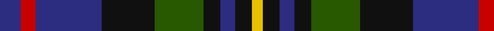

In pattern [BRBKGKBKY](/stripes/brbkgkbky/).

This was sourced from register-of-tartans.  It is a [9 stripe tartan](/stripes/stripes9/).

Original link https://www.tartanregister.gov.uk/tartanDetails.aspx?ref=2309

## Attestations

This cloth appears in 2 source records; the oldest owns this page.

- 01/01/2002 — MacCallum of Berwick (register-of-tartans, [record](https://www.tartanregister.gov.uk/tartanDetails.aspx?ref=2309))
- pre 2002 — MacCallum of Berwick (Clan) (tartans-authority, [record](http://www.tartansauthority.com/tartan-ferret/display/492/))

## Register references

External register numbers recorded for this tartan.

- Scottish Register of Tartans: [2309](https://www.tartanregister.gov.uk/tartanDetails.aspx?ref=2309)
- Scottish Tartans Authority (ITI): 492
- Scottish Tartans World Register: 492

## Thread count
DB/20 R14 DB62 K50 G46 K16 DB14 K16 Y/10

## Palette
Each colour and the base-6 reference it is a variant of.

| Colour | Shade | Base |
|---|---|---|
| DB | <code style="background-color:#2C2C80;">#2C2C80</code> `oklch(35.0% 0.138 276.6)` <small>#2C2C80</small> | B <code style="background-color:#2A418A;">#2A418A</code> |
| G | <code style="background-color:#285800;">#285800</code> `oklch(41.0% 0.122 135.8)` <small>#285800</small> | G <code style="background-color:#006100;">#006100</code> |
| K | <code style="background-color:#101010;">#101010</code> `oklch(17.3% 0.000 89.9)` <small>#101010</small> | K <code style="background-color:#000000;">#000000</code> |
| R | <code style="background-color:#C80000;">#C80000</code> `oklch(52.3% 0.215 29.2)` <small>#C80000</small> | R <code style="background-color:#CC0000;">#CC0000</code> |
| Y | <code style="background-color:#E8C000;">#E8C000</code> `oklch(81.9% 0.168 93.7)` <small>#E8C000</small> | Y <code style="background-color:#F2BF00;">#F2BF00</code> |

## Nearest tartans

The nearest existing variants by ΔTartan distance, with this tartan at the top so the swatches line up against it.

ΔTartan

Tartan

Sett

—

<a href="/ttd/edit/#slug=db10r7db31k25dg23k8db7k8ly5~x2">MacCallum of Berwick</a> <a class="nn-out" href="/setts/s9/db10r7db31k25dg23k8db7k8ly5~x2/" title="open its dictionary page">↗</a>

0.59

<a href="/ttd/edit/#slug=db10o3db10r3k21g20k15r3~x2">Williamson/Smart (Personal)</a> <a class="nn-out" href="/setts/s8/db10o3db10r3k21g20k15r3~x2/" title="open its dictionary page">↗</a>

0.65

<a href="/ttd/edit/#slug=db20k10lo3k7r4k7lo3k8g20~x2">Scottish Tartan Society</a> <a class="nn-out" href="/setts/s9/db20k10lo3k7r4k7lo3k8g20~x2/" title="open its dictionary page">↗</a>

0.76

<a href="/ttd/edit/#slug=db10r7db31k25dg23k8db7r8ly5~x2">MacAllum of Berwick (Clan?)</a> <a class="nn-out" href="/setts/s9/db10r7db31k25dg23k8db7r8ly5~x2/" title="open its dictionary page">↗</a>

0.79

<a href="/ttd/edit/#slug=lr8g33k21db6k6db33r6db6">Royal Highland Corporate Tartan Tartan Number: 2054. Earliest known date: March 1992 In 1808 the Highland Society of Scotland used the Universal or Black Watch tartan. This has been incorporated in the new design along with colours to represent the agricultural heritage and interests of the Society. This design includes changes that were made when the first version proved an exact match to the 'Wellington' tartan. The white is 'Barley white'. See products available Copyright © Blair Urquhart, Comrie, 2015</a> <a class="nn-out" href="/setts/s8/lr8g33k21db6k6db33r6db6/" title="open its dictionary page">↗</a>

0.87

<a href="/ttd/edit/#slug=db5k15o5n9o2db2o2db2n9k3~x2">Ryukoku University Heian SHS (Corp)</a> <a class="nn-out" href="/setts/s10/db5k15o5n9o2db2o2db2n9k3~x2/" title="open its dictionary page">↗</a>

0.89

<a href="/ttd/edit/#slug=g11t3g5r3g5k22db22k5~x2">Wood (Personal)</a> <a class="nn-out" href="/setts/s8/g11t3g5r3g5k22db22k5~x2/" title="open its dictionary page">↗</a>

0.89

<a href="/ttd/edit/#slug=db18k10dg9k2r2k2dg9k10db9w2~x2">Robertson Hunting #2</a> <a class="nn-out" href="/setts/s10/db18k10dg9k2r2k2dg9k10db9w2~x2/" title="open its dictionary page">↗</a>

0.92

<a href="/ttd/edit/#slug=k14t2db6dg7r2k14db6t2db2t4~x2">Unidentified #2</a> <a class="nn-out" href="/setts/s10/k14t2db6dg7r2k14db6t2db2t4~x2/" title="open its dictionary page">↗</a>

0.93

<a href="/ttd/edit/#slug=k4b21dy10y4k20r6b3~x2">Swankie (Personal)</a> <a class="nn-out" href="/setts/s7/k4b21dy10y4k20r6b3~x2/" title="open its dictionary page">↗</a>

0.97

<a href="/ttd/edit/#slug=g8k1g8k8r1db8w1db8r1k8r1~x4">Hunter of Peebleshire (Clan?)</a> <a class="nn-out" href="/setts/s11/g8k1g8k8r1db8w1db8r1k8r1~x4/" title="open its dictionary page">↗</a>

## Neighbour map

Every grey dot is one of 14299 variants placed by the first two principal components of the ΔTartan feature space (44% of its variance). Red is this tartan; blue dots are its nearest — click one to open its page.

<svg viewBox="0 0 640 380" role="img" style="max-width:100%;height:auto;border:1px solid #e0e0e0;border-radius:4px;display:block" xmlns="http://www.w3.org/2000/svg"><image href="/nn/cloud.v1.png" width="640" height="380"/><a href="/setts/s8/db10o3db10r3k21g20k15r3~x2/"><circle cx="173.0" cy="224.2" r="4" fill="#3465a4"><title>Williamson/Smart (Personal)</title></circle></a><a href="/setts/s9/db20k10lo3k7r4k7lo3k8g20~x2/"><circle cx="149.1" cy="217.1" r="4" fill="#3465a4"><title>Scottish Tartan Society</title></circle></a><a href="/setts/s9/db10r7db31k25dg23k8db7r8ly5~x2/"><circle cx="165.0" cy="230.0" r="4" fill="#3465a4"><title>MacAllum of Berwick (Clan?)</title></circle></a><a href="/setts/s8/lr8g33k21db6k6db33r6db6/"><circle cx="146.7" cy="217.7" r="4" fill="#3465a4"><title>Royal Highland Corporate Tartan Tartan Number: 2054. Earliest known date: March 1992 In 1808 the Highland Society of Scotland used the Universal or Black Watch tartan. This has been incorporated in the new design along with colours to represent the agricultural heritage and interests of the Society. This design includes changes that were made when the first version proved an exact match to the 'Wellington' tartan. The white is 'Barley white'. See products available Copyright © Blair Urquhart, Comrie, 2015</title></circle></a><a href="/setts/s10/db5k15o5n9o2db2o2db2n9k3~x2/"><circle cx="149.5" cy="203.4" r="4" fill="#3465a4"><title>Ryukoku University Heian SHS (Corp)</title></circle></a><a href="/setts/s8/g11t3g5r3g5k22db22k5~x2/"><circle cx="172.4" cy="216.8" r="4" fill="#3465a4"><title>Wood (Personal)</title></circle></a><a href="/setts/s10/db18k10dg9k2r2k2dg9k10db9w2~x2/"><circle cx="181.9" cy="214.5" r="4" fill="#3465a4"><title>Robertson Hunting #2</title></circle></a><a href="/setts/s10/k14t2db6dg7r2k14db6t2db2t4~x2/"><circle cx="211.7" cy="214.3" r="4" fill="#3465a4"><title>Unidentified #2</title></circle></a><a href="/setts/s7/k4b21dy10y4k20r6b3~x2/"><circle cx="147.4" cy="213.4" r="4" fill="#3465a4"><title>Swankie (Personal)</title></circle></a><a href="/setts/s11/g8k1g8k8r1db8w1db8r1k8r1~x4/"><circle cx="139.1" cy="199.7" r="4" fill="#3465a4"><title>Hunter of Peebleshire (Clan?)</title></circle></a><circle cx="159.6" cy="223.9" r="5" fill="#c00000"/></svg>

ID: /setts/s9/db10r7db31k25dg23k8db7k8ly5~x2/
