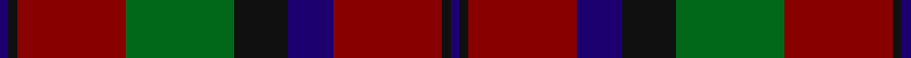

This page is one **sett** — a single exact thread-count. It belongs to the [tartan](/tartans/db1k1dr12g12k6db5dr12k1db1/)
(the same proportion at any scale), whose colour order is pattern [BKRBKGRKB](/stripes/bkrbkgrkb/).

Sourced from register-of-tartans.  It is a [9 stripe tartan](/stripes/stripes9/).

Original link https://www.tartanregister.gov.uk/tartanDetails.aspx?ref=2998

## Register references

External register numbers recorded for this tartan.

- Scottish Register of Tartans: [2998](https://www.tartanregister.gov.uk/tartanDetails.aspx?ref=2998)
- Scottish Tartans Authority (ITI): 5667

## Thread count
DB/4 K4 DR48 G48 K24 DB20 DR48 K4 DB/4

## Palette
Each colour and the base-6 reference it is a variant of.

| Colour | Shade | Base |
|---|---|---|
| DB | <code style="background-color:#1C0070;">#1C0070</code> `oklch(26.3% 0.162 277.1)` <small>#1C0070</small> | B <code style="background-color:#2A418A;">#2A418A</code> |
| DR | <code style="background-color:#880000;">#880000</code> `oklch(39.4% 0.162 29.2)` <small>#880000</small> | R <code style="background-color:#CC0000;">#CC0000</code> |
| G | <code style="background-color:#006818;">#006818</code> `oklch(45.0% 0.142 145.0)` <small>#006818</small> | G <code style="background-color:#006100;">#006100</code> |
| K | <code style="background-color:#101010;">#101010</code> `oklch(17.3% 0.000 89.9)` <small>#101010</small> | K <code style="background-color:#000000;">#000000</code> |

## Nearest tartans

The nearest existing variants by ΔTartan distance, with this tartan at the top so the swatches line up against it.

ΔTartan

Tartan

Sett

—

<a href="/ttd/edit/#slug=db1k1r12g12k6db5r12k1db1~x4">Montrose (Macnaughton variation)</a> <a class="nn-out" href="/setts/s9/db1k1r12g12k6db5r12k1db1~x4/" title="open its dictionary page">↗</a>

0.95

<a href="/ttd/edit/#slug=g4r28db6g10k10g3~x2">Canadian Autumn</a> <a class="nn-out" href="/setts/s6/g4r28db6g10k10g3~x2/" title="open its dictionary page">↗</a>

1.00

<a href="/ttd/edit/#slug=dr8k5dr8dg27dr13dg3dr13o27dr8o3dr3~x2">McCall/MacCall</a> <a class="nn-out" href="/setts/s11/dr8k5dr8dg27dr13dg3dr13o27dr8o3dr3~x2/" title="open its dictionary page">↗</a>

1.03

<a href="/ttd/edit/#slug=dg3r9t1dg9r1dg1r8db9r1~x4">Baronage</a> <a class="nn-out" href="/setts/s9/dg3r9t1dg9r1dg1r8db9r1~x4/" title="open its dictionary page">↗</a>

1.05

<a href="/ttd/edit/#slug=lb2dr12g6dr1n6dr1~x4">Fraser Green</a> <a class="nn-out" href="/setts/s6/lb2dr12g6dr1n6dr1~x4/" title="open its dictionary page">↗</a>

1.06

<a href="/ttd/edit/#slug=k6db4r11k36lo5k5lo5k8r30db10r8db4">Johnnie Walker (2003) (Corporate)</a> <a class="nn-out" href="/setts/s12/k6db4r11k36lo5k5lo5k8r30db10r8db4/" title="open its dictionary page">↗</a>

1.06

<a href="/ttd/edit/#slug=o5t13dr4r4dr27t3dr4o5">Daks, Blue Loden</a> <a class="nn-out" href="/setts/s8/o5t13dr4r4dr27t3dr4o5/" title="open its dictionary page">↗</a>

1.08

<a href="/ttd/edit/#slug=r3dg12r12r5dg2db30r2dg2~x2">Rannoch Moor (Fashion)</a> <a class="nn-out" href="/setts/s8/r3dg12r12r5dg2db30r2dg2~x2/" title="open its dictionary page">↗</a>

1.08

<a href="/ttd/edit/#slug=r4t3r32db30r4dg32r3dg32r3dg3~x2">Unidentified Plaid #15</a> <a class="nn-out" href="/setts/s10/r4t3r32db30r4dg32r3dg32r3dg3~x2/" title="open its dictionary page">↗</a>

1.09

<a href="/ttd/edit/#slug=r6dg16r4db12r16b1r2~x2">MacQuarrie LO</a> <a class="nn-out" href="/setts/s7/r6dg16r4db12r16b1r2~x2/" title="open its dictionary page">↗</a>

1.12

<a href="/ttd/edit/#slug=k4lo15dg5k3dg7k3dg30r20dg3~x2">MacKillen</a> <a class="nn-out" href="/setts/s9/k4lo15dg5k3dg7k3dg30r20dg3~x2/" title="open its dictionary page">↗</a>

## Neighbour map

Every grey dot is one of 14299 variants placed by the first two principal components of the ΔTartan feature space (44% of its variance). Red is this tartan; blue dots are its nearest — click one to open its page.

<svg viewBox="0 0 640 380" role="img" style="max-width:100%;height:auto;border:1px solid #e0e0e0;border-radius:4px;display:block" xmlns="http://www.w3.org/2000/svg"><image href="/nn/cloud.v1.png" width="640" height="380"/><a href="/setts/s6/g4r28db6g10k10g3~x2/"><circle cx="267.8" cy="226.5" r="4" fill="#3465a4"><title>Canadian Autumn</title></circle></a><a href="/setts/s11/dr8k5dr8dg27dr13dg3dr13o27dr8o3dr3~x2/"><circle cx="265.6" cy="214.5" r="4" fill="#3465a4"><title>McCall/MacCall</title></circle></a><a href="/setts/s9/dg3r9t1dg9r1dg1r8db9r1~x4/"><circle cx="247.0" cy="199.6" r="4" fill="#3465a4"><title>Baronage</title></circle></a><a href="/setts/s6/lb2dr12g6dr1n6dr1~x4/"><circle cx="288.5" cy="212.1" r="4" fill="#3465a4"><title>Fraser Green</title></circle></a><a href="/setts/s12/k6db4r11k36lo5k5lo5k8r30db10r8db4/"><circle cx="245.6" cy="188.2" r="4" fill="#3465a4"><title>Johnnie Walker (2003) (Corporate)</title></circle></a><a href="/setts/s8/o5t13dr4r4dr27t3dr4o5/"><circle cx="307.6" cy="202.2" r="4" fill="#3465a4"><title>Daks, Blue Loden</title></circle></a><a href="/setts/s8/r3dg12r12r5dg2db30r2dg2~x2/"><circle cx="289.3" cy="185.6" r="4" fill="#3465a4"><title>Rannoch Moor (Fashion)</title></circle></a><a href="/setts/s10/r4t3r32db30r4dg32r3dg32r3dg3~x2/"><circle cx="266.1" cy="183.6" r="4" fill="#3465a4"><title>Unidentified Plaid #15</title></circle></a><a href="/setts/s7/r6dg16r4db12r16b1r2~x2/"><circle cx="289.7" cy="200.6" r="4" fill="#3465a4"><title>MacQuarrie LO</title></circle></a><a href="/setts/s9/k4lo15dg5k3dg7k3dg30r20dg3~x2/"><circle cx="269.2" cy="196.4" r="4" fill="#3465a4"><title>MacKillen</title></circle></a><circle cx="272.7" cy="198.4" r="5" fill="#c00000"/></svg>

ID: /setts/s9/db1k1r12g12k6db5r12k1db1~x4/
