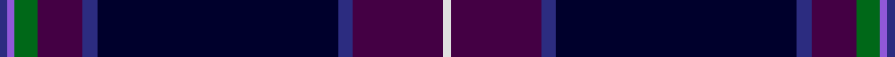

This page is one **sett** — a single exact thread-count. It belongs to the [tartan](/tartans/dba1pa1g3dp6dba2dbb32dba2dp12ln1/)
(the same proportion at any scale), whose colour order is pattern [BBGBBKBBW](/stripes/bbgbbkbbw/).

Sourced from register-of-tartans.  It is a [9 stripe tartan](/stripes/stripes9/).

Original link https://www.tartanregister.gov.uk/tartanDetails.aspx?ref=3720

3 attestations — the source records this cloth was collapsed from (oldest owns this page)

<ul>
<li>02/10/2001 — Scottish Heather (register-of-tartans, <a href="https://www.tartanregister.gov.uk/tartanDetails.aspx?ref=3720">record</a>)</li>
<li>Oct. 2001 — Scottish Heather (Fashion) (tartans-authority, <a href="http://www.tartansauthority.com/tartan-ferret/display/3909/">record</a>)</li>
<li>undated — Scottish Heather (Fashion) Fashion Tartan Tartan Number: 3909. Earliest known date: Oct. 2001 Designed for Houston Kiltmakers of Paisley. See products available Copyright © Blair Urquhart, Comrie, 2015 (house-of-tartan, <a href="http://www.house-of-tartan.scotland.net/house/TartanViewjs.asp?colr=Def&tnam=3909">record</a>)</li>
</ul>

## Register references

External register numbers recorded for this tartan.

- Scottish Register of Tartans: [3720](https://www.tartanregister.gov.uk/tartanDetails.aspx?ref=3720)
- Scottish Tartans Authority (ITI): 3909
- Scottish Tartans World Register: 2859

## Thread count
DBa/2 Pa2 G6 DP12 DBa4 DBb64 DBa4 DP24 LN/2

## Palette
Each colour and the base-6 reference it is a variant of.

| Colour | Shade | Base |
|---|---|---|
| DB | <code style="background-color:#202060;">#202060</code> `oklch(28.9% 0.111 276.9)` <small>#202060</small> | B <code style="background-color:#2A418A;">#2A418A</code> |
| DBa | <code style="background-color:#2C2C80;">#2C2C80</code> `oklch(35.0% 0.138 276.6)` <small>#2C2C80</small> | B <code style="background-color:#2A418A;">#2A418A</code> |
| DBb | <code style="background-color:#00002C;">#00002C</code> `oklch(13.2% 0.092 264.1)` <small>#00002C</small> | K <code style="background-color:#000000;">#000000</code> |
| DP | <code style="background-color:#440044;">#440044</code> `oklch(27.1% 0.125 328.4)` <small>#440044</small> | B <code style="background-color:#2A418A;">#2A418A</code> |
| G | <code style="background-color:#006818;">#006818</code> `oklch(45.0% 0.142 145.0)` <small>#006818</small> | G <code style="background-color:#006100;">#006100</code> |
| LN | <code style="background-color:#E0E0E0;">#E0E0E0</code> `oklch(90.7% 0.000 89.9)` <small>#E0E0E0</small> | W <code style="background-color:#F7F7F7;">#F7F7F7</code> |
| P | <code style="background-color:#780078;">#780078</code> `oklch(40.2% 0.185 328.4)` <small>#780078</small> | B <code style="background-color:#2A418A;">#2A418A</code> |
| Pa | <code style="background-color:#9058D8;">#9058D8</code> `oklch(58.4% 0.190 300.8)` <small>#9058D8</small> | B <code style="background-color:#2A418A;">#2A418A</code> |

## Nearest tartans

The nearest existing variants by ΔTartan distance, with this tartan at the top so the swatches line up against it.

ΔTartan

Tartan

Sett

—

<a href="/ttd/edit/#slug=db1p1g3dp6db2k32db2dp12w1~x2">Scottish Heather</a> <a class="nn-out" href="/setts/s9/db1p1g3dp6db2k32db2dp12w1~x2/" title="open its dictionary page">↗</a>

1.09

<a href="/ttd/edit/#slug=db5w1db44dp1g12k12dp5k2m2k3~x2">Heart of Scotland (Fashion)</a> <a class="nn-out" href="/setts/s10/db5w1db44dp1g12k12dp5k2m2k3~x2/" title="open its dictionary page">↗</a>

1.11

<a href="/ttd/edit/#slug=k6w1k40p1k12dg12p6dg2dp2dg4~x2">Scotland the Brave</a> <a class="nn-out" href="/setts/s10/k6w1k40p1k12dg12p6dg2dp2dg4~x2/" title="open its dictionary page">↗</a>

1.22

<a href="/ttd/edit/#slug=o4k2dg2ly1dg8k20db50r2db2~x2">Buckie</a> <a class="nn-out" href="/setts/s9/o4k2dg2ly1dg8k20db50r2db2~x2/" title="open its dictionary page">↗</a>

1.28

<a href="/ttd/edit/#slug=db3o3db36db7k3db6g5k1ly3~x2">Incorporation of Weavers (Glasgow)</a> <a class="nn-out" href="/setts/s9/db3o3db36db7k3db6g5k1ly3~x2/" title="open its dictionary page">↗</a>

1.28

<a href="/ttd/edit/#slug=db6db4k37g6db80o4k4lo4">Law Enforcement Officers' Memorial</a> <a class="nn-out" href="/setts/s8/db6db4k37g6db80o4k4lo4/" title="open its dictionary page">↗</a>

1.36

<a href="/ttd/edit/#slug=db92k14db18db5db5db5db5dg32dp16k5dp7ly8">Bavidge</a> <a class="nn-out" href="/setts/s12/db92k14db18db5db5db5db5dg32dp16k5dp7ly8/" title="open its dictionary page">↗</a>

1.38

<a href="/ttd/edit/#slug=db6w1db40m1k12dg12m6dg2dp2dg4~x2">Scotland the Brave (Fashion)</a> <a class="nn-out" href="/setts/s10/db6w1db40m1k12dg12m6dg2dp2dg4~x2/" title="open its dictionary page">↗</a>

1.39

<a href="/ttd/edit/#slug=db5lb1db44m1g12k12m5k2lp2k3~x2">Heart of Scotland Fancy Tartan Tartan Number: 4230. Earliest known date: 1999 October 1999. Designed by Lochcarron of Scotland for 'Gavin' Kiltmaker. They use it for their hire kilts. Colour checked against sample. See products available Copyright © Blair Urquhart, Comrie, 2015</a> <a class="nn-out" href="/setts/s10/db5lb1db44m1g12k12m5k2lp2k3~x2/" title="open its dictionary page">↗</a>

1.45

<a href="/ttd/edit/#slug=db4t1w1t1k29db3ly1k4db20k2db1k3db3~x2">Silverton Family (Basingstoke)</a> <a class="nn-out" href="/setts/s13/db4t1w1t1k29db3ly1k4db20k2db1k3db3~x2/" title="open its dictionary page">↗</a>

1.47

<a href="/ttd/edit/#slug=g6dp2dp2g2dp15g3k2g1k15db43w2~x2">Scottish Pride (Fashion)</a> <a class="nn-out" href="/setts/s11/g6dp2dp2g2dp15g3k2g1k15db43w2~x2/" title="open its dictionary page">↗</a>

## Neighbour map

Every grey dot is one of 14299 variants placed by the first two principal components of the ΔTartan feature space (44% of its variance). Red is this tartan; blue dots are its nearest — click one to open its page.

<svg viewBox="0 0 640 380" role="img" style="max-width:100%;height:auto;border:1px solid #e0e0e0;border-radius:4px;display:block" xmlns="http://www.w3.org/2000/svg"><image href="/nn/cloud.v1.png" width="640" height="380"/><a href="/setts/s10/db5w1db44dp1g12k12dp5k2m2k3~x2/"><circle cx="383.6" cy="105.5" r="4" fill="#3465a4"><title>Heart of Scotland (Fashion)</title></circle></a><a href="/setts/s10/k6w1k40p1k12dg12p6dg2dp2dg4~x2/"><circle cx="346.1" cy="115.0" r="4" fill="#3465a4"><title>Scotland the Brave</title></circle></a><a href="/setts/s9/o4k2dg2ly1dg8k20db50r2db2~x2/"><circle cx="400.3" cy="99.8" r="4" fill="#3465a4"><title>Buckie</title></circle></a><a href="/setts/s9/db3o3db36db7k3db6g5k1ly3~x2/"><circle cx="364.7" cy="110.3" r="4" fill="#3465a4"><title>Incorporation of Weavers (Glasgow)</title></circle></a><a href="/setts/s8/db6db4k37g6db80o4k4lo4/"><circle cx="381.8" cy="144.9" r="4" fill="#3465a4"><title>Law Enforcement Officers' Memorial</title></circle></a><a href="/setts/s12/db92k14db18db5db5db5db5dg32dp16k5dp7ly8/"><circle cx="324.0" cy="130.9" r="4" fill="#3465a4"><title>Bavidge</title></circle></a><a href="/setts/s10/db6w1db40m1k12dg12m6dg2dp2dg4~x2/"><circle cx="338.8" cy="103.5" r="4" fill="#3465a4"><title>Scotland the Brave (Fashion)</title></circle></a><a href="/setts/s10/db5lb1db44m1g12k12m5k2lp2k3~x2/"><circle cx="352.4" cy="88.3" r="4" fill="#3465a4"><title>Heart of Scotland Fancy Tartan Tartan Number: 4230. Earliest known date: 1999 October 1999. Designed by Lochcarron of Scotland for 'Gavin' Kiltmaker. They use it for their hire kilts. Colour checked against sample. See products available Copyright © Blair Urquhart, Comrie, 2015</title></circle></a><a href="/setts/s13/db4t1w1t1k29db3ly1k4db20k2db1k3db3~x2/"><circle cx="375.6" cy="106.8" r="4" fill="#3465a4"><title>Silverton Family (Basingstoke)</title></circle></a><a href="/setts/s11/g6dp2dp2g2dp15g3k2g1k15db43w2~x2/"><circle cx="313.9" cy="95.8" r="4" fill="#3465a4"><title>Scottish Pride (Fashion)</title></circle></a><circle cx="366.8" cy="121.3" r="5" fill="#c00000"/></svg>

ID: /setts/s9/db1p1g3dp6db2k32db2dp12w1~x2/
