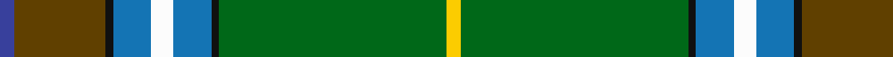

**Bands:** [BGKBWBKGY](/stripes/bgkbwbkgy/) · **Stripes:** [DB DY K B W B K G LY](/stripes/stripes9/) DB DY K B W B K G LY

This was sourced from tartans-authority.  It is a [9 band tartan](/bands/bands9/).

Original link http://www.tartansauthority.com/tartan-ferret/display/11066/

## Thread count
Ba/4 T24 K2 B10 W6 B10 K2 G60 Y/4

## Palette
Each colour and its ΔE from the base-6 reference it is a variant of.

| Colour | Shade | Base | ΔE (OKLab) |
|---|---|---|---|
| B | <code style="background-color:#1474B4;">#1474B4</code> `#1474B4` | B <code style="background-color:#2A418A;">#2A418A</code> | 0.15 |
| Ba | <code style="background-color:#38409C;">#38409C</code> `#38409C` | B <code style="background-color:#2A418A;">#2A418A</code> | 0.04 |
| G | <code style="background-color:#006818;">#006818</code> `#006818` | G <code style="background-color:#006100;">#006100</code> | 0.02 |
| K | <code style="background-color:#101010;">#101010</code> `#101010` | K <code style="background-color:#000000;">#000000</code> | 0.17 |
| T | <code style="background-color:#604000;">#604000</code> `#604000` | G <code style="background-color:#006100;">#006100</code> | 0.14 |
| W | <code style="background-color:#FCFCFC;">#FCFCFC</code> `#FCFCFC` | W <code style="background-color:#F7F7F7;">#F7F7F7</code> | 0.01 |
| Y | <code style="background-color:#FCCC00;">#FCCC00</code> `#FCCC00` | Y <code style="background-color:#F2BF00;">#F2BF00</code> | 0.04 |

## Nearest tartans

The nearest existing variants by ΔTartan distance.

1. [Stirling, University](/setts/s9/g28r4k3y2k1dg2r3db20ly2~x2/) — ΔT 1.01
1. [St Brigid's Quirindi](/setts/s9/b2do12k1b5w3b5k1g30lo2~x2/) — ΔT 1.11
1. [Stirling, University of Corporate Univ Tartan Tartan Number: 2297. Earliest known date: 1994 This is the accepted University design. See products available Copyright © Blair Urquhart, Comrie, 2015](/setts/s8/g22r3k1g2r3t16k3ly2~x4/) — ΔT 1.21
1. [Stirling University Corporate Tartan Tartan Number: 2074. Earliest known date: Aug 1992 This is a simplified Stirling and Bannockburn district sett with the Universities 'Green and Grey' striped through the black. See products available Copyright © Blair Urquhart, Comrie, 2015](/setts/s9/g28r4k3o2k1dg2r3db20ly2~x2/) — ΔT 1.22
1. [Stirling University (Corporate)](/setts/s8/g22r3w1g2r3t16k3ly2~x4/) — ΔT 1.23
1. [Mull Millennium](/setts/s8/g92ly3k28n18r12db18w2g12/) — ΔT 1.24
1. [Muskoka Canadian Tartan Tartan Number: 1799. Earliest known date: pre 2003 A note in the Highland Society of London collection reads, 'Murray (Tullibardine) This piece of cloth was made in 1794'. The sample is woven at 54 threads to the inch. The full sett measures 15 and one quarter inches. (A. Nisbet, 1988). See products available Copyright © Blair Urquhart, Comrie, 2015](/setts/s8/w4g10t24g42r3ly4r4ly2/) — ΔT 1.26
1. [State Seal of South Carolina (Fash)](/setts/s11/g55k13b4k3g6lo3b2k3dy10k12b14~x2/) — ΔT 1.32
1. [Currie](/setts/s11/db16w3db1ly4g24r1g3r4g3r1t8~x2/) — ΔT 1.34
1. [Washington District Tartan Tartan Number: 2148. Earliest known date: 1988 The Washington State tartan was a project of the Vancouver U.S.A. Country Dancers. It was designed by Margaret McLeod van Nus and Frank Cannonito in order to commemorate the Washington State Centennial celebrations. Governor Booth Gardner signed the bill into law, adopting the design on behalf of the House of Representatives in 1991. The tartan is accredited by the Scottish Tartans Society. See products available Copyright © Blair Urquhart, Comrie, 2015](/setts/s7/w3r4db13g37t3k3ly2~x2/) — ΔT 1.40

## Neighbour map

Every grey dot is one of 14313 variants placed by the first two principal components of the ΔTartan feature space (44% of its variance). Red is this tartan; blue dots are its nearest — click one to open its page.

<svg viewBox="0 0 640 380" role="img" style="max-width:100%;height:auto;border:1px solid #e0e0e0;border-radius:4px;display:block" xmlns="http://www.w3.org/2000/svg"><image href="/nn/cloud.v1.png" width="640" height="380"/><a href="/setts/s9/g28r4k3y2k1dg2r3db20ly2~x2/"><circle cx="216.1" cy="83.6" r="4" fill="#3465a4"><title>Stirling, University</title></circle></a><a href="/setts/s9/b2do12k1b5w3b5k1g30lo2~x2/"><circle cx="242.1" cy="74.7" r="4" fill="#3465a4"><title>St Brigid's Quirindi</title></circle></a><a href="/setts/s8/g22r3k1g2r3t16k3ly2~x4/"><circle cx="250.6" cy="124.7" r="4" fill="#3465a4"><title>Stirling, University of Corporate Univ Tartan Tartan Number: 2297. Earliest known date: 1994 This is the accepted University design. See products available Copyright © Blair Urquhart, Comrie, 2015</title></circle></a><a href="/setts/s9/g28r4k3o2k1dg2r3db20ly2~x2/"><circle cx="234.3" cy="92.3" r="4" fill="#3465a4"><title>Stirling University Corporate Tartan Tartan Number: 2074. Earliest known date: Aug 1992 This is a simplified Stirling and Bannockburn district sett with the Universities 'Green and Grey' striped through the black. See products available Copyright © Blair Urquhart, Comrie, 2015</title></circle></a><a href="/setts/s8/g22r3w1g2r3t16k3ly2~x4/"><circle cx="250.7" cy="123.9" r="4" fill="#3465a4"><title>Stirling University (Corporate)</title></circle></a><a href="/setts/s8/g92ly3k28n18r12db18w2g12/"><circle cx="321.6" cy="94.2" r="4" fill="#3465a4"><title>Mull Millennium</title></circle></a><a href="/setts/s8/w4g10t24g42r3ly4r4ly2/"><circle cx="293.2" cy="117.8" r="4" fill="#3465a4"><title>Muskoka Canadian Tartan Tartan Number: 1799. Earliest known date: pre 2003 A note in the Highland Society of London collection reads, 'Murray (Tullibardine) This piece of cloth was made in 1794'. The sample is woven at 54 threads to the inch. The full sett measures 15 and one quarter inches. (A. Nisbet, 1988). See products available Copyright © Blair Urquhart, Comrie, 2015</title></circle></a><a href="/setts/s11/g55k13b4k3g6lo3b2k3dy10k12b14~x2/"><circle cx="237.4" cy="101.9" r="4" fill="#3465a4"><title>State Seal of South Carolina (Fash)</title></circle></a><a href="/setts/s11/db16w3db1ly4g24r1g3r4g3r1t8~x2/"><circle cx="217.7" cy="104.0" r="4" fill="#3465a4"><title>Currie</title></circle></a><a href="/setts/s7/w3r4db13g37t3k3ly2~x2/"><circle cx="283.6" cy="115.3" r="4" fill="#3465a4"><title>Washington District Tartan Tartan Number: 2148. Earliest known date: 1988 The Washington State tartan was a project of the Vancouver U.S.A. Country Dancers. It was designed by Margaret McLeod van Nus and Frank Cannonito in order to commemorate the Washington State Centennial celebrations. Governor Booth Gardner signed the bill into law, adopting the design on behalf of the House of Representatives in 1991. The tartan is accredited by the Scottish Tartans Society. See products available Copyright © Blair Urquhart, Comrie, 2015</title></circle></a><circle cx="259.0" cy="90.4" r="5" fill="#c00000"/></svg>

ID: /setts/s9/db2dy12k1b5w3b5k1g30ly2~x2/
