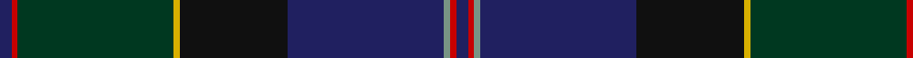

In pattern [BRGBKYGRB](/stripes/brgbkygrb/).

This was sourced from tartans-authority.  It is a [9 stripe tartan](/stripes/stripes9/).

Original link http://www.tartansauthority.com/tartan-ferret/display/3157/

## Also known as

This cloth is also recorded under:

- Robb Hunting
- Robb Personal

## Attestations

This cloth appears in 3 source records; the oldest owns this page.

- 1994 — Robb Hunting (Personal) (tartans-authority, [record](http://www.tartansauthority.com/tartan-ferret/display/3157/))
- undated — Robb (Personal) (register-of-tartans, [record](https://www.tartanregister.gov.uk/tartanDetails.aspx?ref=4854))
- undated — Robb (Personal) Personal Tartan Tartan Number: 3157. Earliest known date: 1994 Designed by Peter MacDonald for Martin Robb of Carroglen, Comrie, Perthshire. Can be worn by anyone of the name but Martin Robb would appreciate being advised. See products available Copyright © Blair Urquhart, Comrie, 2015 (house-of-tartan, [record](http://www.house-of-tartan.scotland.net/house/TartanViewjs.asp?colr=Def&tnam=3157))

## Register references

External register numbers recorded for this tartan.

- Scottish Register of Tartans: [4854](https://www.tartanregister.gov.uk/tartanDetails.aspx?ref=4854)
- Scottish Tartans Authority (ITI): 3157

## Thread count
DB/4 R2 DG52 Y2 K36 DB52 LG2 R2 DB/4

## Palette
Each colour and the base-6 reference it is a variant of.

| Colour | Shade | Base |
|---|---|---|
| DB | <code style="background-color:#202060;">#202060</code> `oklch(28.9% 0.111 276.9)` <small>#202060</small> | B <code style="background-color:#2A418A;">#2A418A</code> |
| DG | <code style="background-color:#003820;">#003820</code> `oklch(30.0% 0.070 158.3)` <small>#003820</small> | G <code style="background-color:#006100;">#006100</code> |
| K | <code style="background-color:#101010;">#101010</code> `oklch(17.3% 0.000 89.9)` <small>#101010</small> | K <code style="background-color:#000000;">#000000</code> |
| LG | <code style="background-color:#789484;">#789484</code> `oklch(64.0% 0.040 160.0)` <small>#789484</small> | G <code style="background-color:#006100;">#006100</code> |
| R | <code style="background-color:#C80000;">#C80000</code> `oklch(52.3% 0.215 29.2)` <small>#C80000</small> | R <code style="background-color:#CC0000;">#CC0000</code> |
| Y | <code style="background-color:#D8B000;">#D8B000</code> `oklch(77.1% 0.158 92.3)` <small>#D8B000</small> | Y <code style="background-color:#F2BF00;">#F2BF00</code> |

## Nearest tartans

The nearest existing variants by ΔTartan distance, with this tartan at the top so the swatches line up against it.

ΔTartan

Tartan

Sett

—

<a href="/ttd/edit/#slug=db2r1dg26ly1k18db26y1r1db2~x2">Robb Hunting (Personal)</a> <a class="nn-out" href="/setts/s9/db2r1dg26ly1k18db26y1r1db2~x2/" title="open its dictionary page">↗</a>

1.10

<a href="/ttd/edit/#slug=o7dg20y2dg4k5db4k2db20k3w1~x2">McMeeken</a> <a class="nn-out" href="/setts/s10/o7dg20y2dg4k5db4k2db20k3w1~x2/" title="open its dictionary page">↗</a>

1.11

<a href="/ttd/edit/#slug=db2k2db21db1db1db2db1db8dg23ly2r2~x2">Century 21 (Fashion)</a> <a class="nn-out" href="/setts/s11/db2k2db21db1db1db2db1db8dg23ly2r2~x2/" title="open its dictionary page">↗</a>

1.14

<a href="/ttd/edit/#slug=db4b1dt20db2dt2db18dg2db2dg22m2dp4~x2">Heartlands (Fashion)</a> <a class="nn-out" href="/setts/s11/db4b1dt20db2dt2db18dg2db2dg22m2dp4~x2/" title="open its dictionary page">↗</a>

1.30

<a href="/ttd/edit/#slug=k12g8ly1dg13t1db31k8~x2">Chesters, Eric (Personal)</a> <a class="nn-out" href="/setts/s7/k12g8ly1dg13t1db31k8~x2/" title="open its dictionary page">↗</a>

1.39

<a href="/ttd/edit/#slug=do31lo6lr3db36do8dg60lo7t7~x2">Little-Dowse Wedding</a> <a class="nn-out" href="/setts/s8/do31lo6lr3db36do8dg60lo7t7~x2/" title="open its dictionary page">↗</a>

1.42

<a href="/ttd/edit/#slug=db29y3k3y3k3y3dg28k3y2k3r3lo3~x2">Bro-Vigouden (Corporate)</a> <a class="nn-out" href="/setts/s12/db29y3k3y3k3y3dg28k3y2k3r3lo3~x2/" title="open its dictionary page">↗</a>

1.42

<a href="/ttd/edit/#slug=dg28r3k28dt8t1dg8r2k3~x2">Stansbury (2014)</a> <a class="nn-out" href="/setts/s8/dg28r3k28dt8t1dg8r2k3~x2/" title="open its dictionary page">↗</a>

1.45

<a href="/ttd/edit/#slug=w2k2r1dt20k15dg30ly1~x2">Muir-Hill (Personal)</a> <a class="nn-out" href="/setts/s7/w2k2r1dt20k15dg30ly1~x2/" title="open its dictionary page">↗</a>

1.45

<a href="/ttd/edit/#slug=dg28r3k28db8t1dg8r2k3~x2">Stansbury</a> <a class="nn-out" href="/setts/s8/dg28r3k28db8t1dg8r2k3~x2/" title="open its dictionary page">↗</a>

1.46

<a href="/setts/s10/db47dg14dp5do2r3dg7~x2/">Round Table of Britain and Ire Corporate Tartan Tartan Number: 2365. Earliest known date: 1997 Designed by Polly Wittering of House of Edgar in June 1997 for the Round Table of Britain and Ireland. Sample in STA Johnston Collection. For this graphic medium red, green and blue used in place of called-for dark versions of each. See products available Copyright © Blair Urquhart, Comrie, 2015</a>

## Neighbour map

Every grey dot is one of 14299 variants placed by the first two principal components of the ΔTartan feature space (44% of its variance). Red is this tartan; blue dots are its nearest — click one to open its page.

<svg viewBox="0 0 640 380" role="img" style="max-width:100%;height:auto;border:1px solid #e0e0e0;border-radius:4px;display:block" xmlns="http://www.w3.org/2000/svg"><image href="/nn/cloud.v1.png" width="640" height="380"/><a href="/setts/s10/o7dg20y2dg4k5db4k2db20k3w1~x2/"><circle cx="253.0" cy="169.8" r="4" fill="#3465a4"><title>McMeeken</title></circle></a><a href="/setts/s11/db2k2db21db1db1db2db1db8dg23ly2r2~x2/"><circle cx="286.1" cy="138.6" r="4" fill="#3465a4"><title>Century 21 (Fashion)</title></circle></a><a href="/setts/s11/db4b1dt20db2dt2db18dg2db2dg22m2dp4~x2/"><circle cx="246.8" cy="150.7" r="4" fill="#3465a4"><title>Heartlands (Fashion)</title></circle></a><a href="/setts/s7/k12g8ly1dg13t1db31k8~x2/"><circle cx="285.4" cy="177.4" r="4" fill="#3465a4"><title>Chesters, Eric (Personal)</title></circle></a><a href="/setts/s8/do31lo6lr3db36do8dg60lo7t7~x2/"><circle cx="254.0" cy="176.9" r="4" fill="#3465a4"><title>Little-Dowse Wedding</title></circle></a><a href="/setts/s12/db29y3k3y3k3y3dg28k3y2k3r3lo3~x2/"><circle cx="243.6" cy="152.6" r="4" fill="#3465a4"><title>Bro-Vigouden (Corporate)</title></circle></a><a href="/setts/s8/dg28r3k28dt8t1dg8r2k3~x2/"><circle cx="358.9" cy="190.8" r="4" fill="#3465a4"><title>Stansbury (2014)</title></circle></a><a href="/setts/s7/w2k2r1dt20k15dg30ly1~x2/"><circle cx="291.3" cy="161.0" r="4" fill="#3465a4"><title>Muir-Hill (Personal)</title></circle></a><a href="/setts/s8/dg28r3k28db8t1dg8r2k3~x2/"><circle cx="349.2" cy="184.1" r="4" fill="#3465a4"><title>Stansbury</title></circle></a><a href="/setts/s10/db47dg14dp5do2r3dg7~x2/"><circle cx="346.0" cy="159.1" r="4" fill="#3465a4"><title>Round Table of Britain and Ire Corporate Tartan Tartan Number: 2365. Earliest known date: 1997 Designed by Polly Wittering of House of Edgar in June 1997 for the Round Table of Britain and Ireland. Sample in STA Johnston Collection. For this graphic medium red, green and blue used in place of called-for dark versions of each. See products available Copyright © Blair Urquhart, Comrie, 2015</title></circle></a><circle cx="310.8" cy="160.6" r="5" fill="#c00000"/></svg>

ID: /setts/s9/db2r1dg26ly1k18db26y1r1db2~x2/
