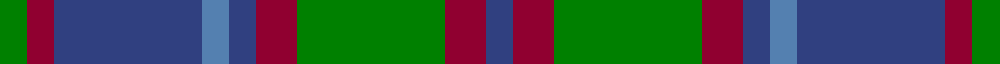

In pattern [BRGRBBBRG](/stripes/brgrbbbrg/).

This was sourced from weddslist.  It is a [9 stripe tartan](/stripes/stripes9/).

Original link http://www.weddslist.com/cgi-bin/tartans/pg.pl?source=sts

## Thread count
G/4 DR4 B22 Ba4 B4 DR6 G22 DR6 B/4

## Palette
Each colour and the base-6 reference it is a variant of.

| Colour | Shade | Base |
|---|---|---|
| B | <code style="background-color:#304080;">#304080</code> `oklch(39.4% 0.109 270.2)` <small>#304080</small> | B <code style="background-color:#2A418A;">#2A418A</code> |
| Ba | <code style="background-color:#5480B0;">#5480B0</code> `oklch(58.8% 0.089 251.5)` <small>#5480B0</small> | B <code style="background-color:#2A418A;">#2A418A</code> |
| DR | <code style="background-color:#900030;">#900030</code> `oklch(41.6% 0.166 13.6)` <small>#900030</small> | R <code style="background-color:#CC0000;">#CC0000</code> |
| G | <code style="background-color:#008000;">#008000</code> `oklch(52.0% 0.177 142.5)` <small>#008000</small> | G <code style="background-color:#006100;">#006100</code> |

## Nearest tartans

The nearest existing variants by ΔTartan distance.

1. [Auld Lang Syne](/setts/s8/k1n1k1n7dy7k1dy1lt1~x6/) — ΔT 0.87
1. [Daks (Navy)](/setts/s8/r3g6db2db2db11g9db2r3~x2/) — ΔT 0.93
1. [Beck-McSorley](/setts/s8/r1o1m1o7dg7m1dg1m1~x6/) — ΔT 0.93
1. [Antrim, County](/setts/s10/y5dt2y18lo2dt5lo2o5dt17y2lo4~x2/) — ΔT 0.95
1. [Auld Lang Syne (Philip King Tailoring)](/setts/s8/k1t1k1t7y7k1y1lb1~x6/) — ΔT 1.11
1. [Lamont #2](/setts/s8/dp11dy2dp2dy2dp2dy11dg14w2~x2/) — ΔT 1.13
1. [Cahonas Scotland](/setts/s9/k5b3k3b23n4k25n23lb3n5~x2/) — ΔT 1.16
1. [Daks (0600150)](/setts/s8/r5dt12g3db4g20dt3g3r5~x4/) — ΔT 1.17
1. [Flower of Scotland Commemorative Tartan Tartan Number: 2059. Earliest known date: September 1990 Designed as a tribute to Roy Williamson, writer of the words and music of 'The Flower of Scotland'. Roy wore the Gunn tartan which has been used as the framework of the new tartan. Cornflower blue and Zephyr green have been used to suggest the bluebell and the thistle. Worn by the Seafield and District pipe band, Strathallan Games, 1994 (UK Reg. Design No.600421) See products available Copyright © Blair Urquhart, Comrie, 2015](/setts/s6/o1b7k4b1g7b1~x4/) — ΔT 1.18
1. [Flower of Scotland MINI Tartan Tartan Number: 20599. Earliest known date: Dupion Silk. Generated only for display purposes. reduced copy of the original 2059 Flower of Scotland. See products available Copyright © Blair Urquhart, Comrie, 2015](/setts/s6/o1b7k4b1g7b1~x2/) — ΔT 1.18

## Neighbour map

Every grey dot is one of 14299 variants placed by the first two principal components of the ΔTartan feature space (44% of its variance). Red is this tartan; blue dots are its nearest — click one to open its page.

<svg viewBox="0 0 640 380" role="img" style="max-width:100%;height:auto;border:1px solid #e0e0e0;border-radius:4px;display:block" xmlns="http://www.w3.org/2000/svg"><image href="/nn/cloud.v1.png" width="640" height="380"/><a href="/setts/s8/k1n1k1n7dy7k1dy1lt1~x6/"><circle cx="243.9" cy="216.0" r="4" fill="#3465a4"><title>Auld Lang Syne</title></circle></a><a href="/setts/s8/r3g6db2db2db11g9db2r3~x2/"><circle cx="200.7" cy="247.1" r="4" fill="#3465a4"><title>Daks (Navy)</title></circle></a><a href="/setts/s8/r1o1m1o7dg7m1dg1m1~x6/"><circle cx="235.7" cy="203.5" r="4" fill="#3465a4"><title>Beck-McSorley</title></circle></a><a href="/setts/s10/y5dt2y18lo2dt5lo2o5dt17y2lo4~x2/"><circle cx="249.3" cy="206.2" r="4" fill="#3465a4"><title>Antrim, County</title></circle></a><a href="/setts/s8/k1t1k1t7y7k1y1lb1~x6/"><circle cx="234.4" cy="202.6" r="4" fill="#3465a4"><title>Auld Lang Syne (Philip King Tailoring)</title></circle></a><a href="/setts/s8/dp11dy2dp2dy2dp2dy11dg14w2~x2/"><circle cx="202.0" cy="227.7" r="4" fill="#3465a4"><title>Lamont #2</title></circle></a><a href="/setts/s9/k5b3k3b23n4k25n23lb3n5~x2/"><circle cx="198.7" cy="206.5" r="4" fill="#3465a4"><title>Cahonas Scotland</title></circle></a><a href="/setts/s8/r5dt12g3db4g20dt3g3r5~x4/"><circle cx="248.5" cy="231.4" r="4" fill="#3465a4"><title>Daks (0600150)</title></circle></a><a href="/setts/s6/o1b7k4b1g7b1~x4/"><circle cx="238.7" cy="252.6" r="4" fill="#3465a4"><title>Flower of Scotland Commemorative Tartan Tartan Number: 2059. Earliest known date: September 1990 Designed as a tribute to Roy Williamson, writer of the words and music of 'The Flower of Scotland'. Roy wore the Gunn tartan which has been used as the framework of the new tartan. Cornflower blue and Zephyr green have been used to suggest the bluebell and the thistle. Worn by the Seafield and District pipe band, Strathallan Games, 1994 (UK Reg. Design No.600421) See products available Copyright © Blair Urquhart, Comrie, 2015</title></circle></a><a href="/setts/s6/o1b7k4b1g7b1~x2/"><circle cx="238.7" cy="252.6" r="4" fill="#3465a4"><title>Flower of Scotland MINI Tartan Tartan Number: 20599. Earliest known date: Dupion Silk. Generated only for display purposes. reduced copy of the original 2059 Flower of Scotland. See products available Copyright © Blair Urquhart, Comrie, 2015</title></circle></a><circle cx="212.3" cy="228.9" r="5" fill="#c00000"/></svg>

ID: /setts/s9/db2r3g11r3db2t2db11r2g2~x2/
