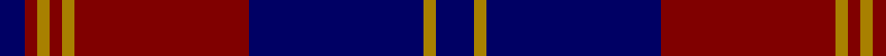

**Bands:** [BRBRRRRRB](/stripes/brbrrrrrb/) · **Stripes:** [DB O DB R O R O R DB](/stripes/stripes9/) DB O DB R O R O R DB

This was sourced from register-of-tartans.  It is a [9 band tartan](/bands/bands9/).

Original link https://www.tartanregister.gov.uk/tartanDetails.aspx?ref=6003

## Register references

External register numbers recorded for this tartan.

- Scottish Register of Tartans: [6003](https://www.tartanregister.gov.uk/tartanDetails.aspx?ref=6003)
- Scottish Tartans Authority (ITI): 7908

## Thread count
DB/8 DR4 DY4 DR4 DY4 DR56 DB56 DY4 DB/12

## Palette
Each colour and its ΔE from the base-6 reference it is a variant of.

| Colour | Shade | Base | ΔE (OKLab) |
|---|---|---|---|
| DB | <code style="background-color:#000064;">#000064</code> `#000064` | B <code style="background-color:#2A418A;">#2A418A</code> | 0.18 |
| DR | <code style="background-color:#800000;">#800000</code> `#800000` | R <code style="background-color:#CC0000;">#CC0000</code> | 0.17 |
| DY | <code style="background-color:#A88000;">#A88000</code> `#A88000` | R <code style="background-color:#CC0000;">#CC0000</code> | 0.20 |

## Nearest tartans

The nearest existing variants by ΔTartan distance.

1. [Breckon (Name)](/setts/s9/k3o1k14r14o1r1o1r1k2~x4/) — ΔT 0.51
1. [Murdoch Celebration (Personal)](/setts/s8/db30r2db2r4db9k26w2k4~x2/) — ΔT 1.31
1. [Ikelman #4 (Personal)](/setts/s7/r10db15g2db2w1db1w1~x4/) — ΔT 1.37
1. [St. Mildreds Check (School)](/setts/s7/db4r1db18r18db1r1w1~x2/) — ΔT 1.38
1. [Murdoch Clebration (Personal)](/setts/s8/k21db8r4db2r2db23k4w2~x2/) — ΔT 1.40
1. [New Breckon (Fashion?)](/setts/s9/dt6lo2dt27r27lo2r2lo2r2dt4~x2/) — ΔT 1.51
1. [POF (Fashion)](/setts/s9/b27db8b14db8b14db26r84db6r12/) — ΔT 1.58
1. [Hudson (Personal)](/setts/s11/db4t2k2db12t4r6k6r28k2t2r3~x2/) — ΔT 1.58
1. [Lang](/setts/s10/t4dp2t6dp2t10dp30g10dp2g9dp2~x2/) — ΔT 1.58
1. [Embrace, The](/setts/s8/db10r24db4r3db24w2r6db6~x2/) — ΔT 1.59

## Neighbour map

Every grey dot is one of 14313 variants placed by the first two principal components of the ΔTartan feature space (44% of its variance). Red is this tartan; blue dots are its nearest — click one to open its page.

<svg viewBox="0 0 640 380" role="img" style="max-width:100%;height:auto;border:1px solid #e0e0e0;border-radius:4px;display:block" xmlns="http://www.w3.org/2000/svg"><image href="/nn/cloud.v1.png" width="640" height="380"/><a href="/setts/s9/k3o1k14r14o1r1o1r1k2~x4/"><circle cx="356.6" cy="179.0" r="4" fill="#3465a4"><title>Breckon (Name)</title></circle></a><a href="/setts/s8/db30r2db2r4db9k26w2k4~x2/"><circle cx="334.5" cy="182.3" r="4" fill="#3465a4"><title>Murdoch Celebration (Personal)</title></circle></a><a href="/setts/s7/r10db15g2db2w1db1w1~x4/"><circle cx="340.3" cy="170.0" r="4" fill="#3465a4"><title>Ikelman #4 (Personal)</title></circle></a><a href="/setts/s7/db4r1db18r18db1r1w1~x2/"><circle cx="423.0" cy="195.5" r="4" fill="#3465a4"><title>St. Mildreds Check (School)</title></circle></a><a href="/setts/s8/k21db8r4db2r2db23k4w2~x2/"><circle cx="308.9" cy="198.5" r="4" fill="#3465a4"><title>Murdoch Clebration (Personal)</title></circle></a><a href="/setts/s9/dt6lo2dt27r27lo2r2lo2r2dt4~x2/"><circle cx="353.4" cy="170.7" r="4" fill="#3465a4"><title>New Breckon (Fashion?)</title></circle></a><a href="/setts/s9/b27db8b14db8b14db26r84db6r12/"><circle cx="339.6" cy="197.5" r="4" fill="#3465a4"><title>POF (Fashion)</title></circle></a><a href="/setts/s11/db4t2k2db12t4r6k6r28k2t2r3~x2/"><circle cx="289.6" cy="144.0" r="4" fill="#3465a4"><title>Hudson (Personal)</title></circle></a><a href="/setts/s10/t4dp2t6dp2t10dp30g10dp2g9dp2~x2/"><circle cx="326.4" cy="181.6" r="4" fill="#3465a4"><title>Lang</title></circle></a><a href="/setts/s8/db10r24db4r3db24w2r6db6~x2/"><circle cx="352.9" cy="212.1" r="4" fill="#3465a4"><title>Embrace, The</title></circle></a><circle cx="357.6" cy="179.6" r="5" fill="#c00000"/></svg>

ID: /setts/s9/db3o1db14r14o1r1o1r1db2~x4/
