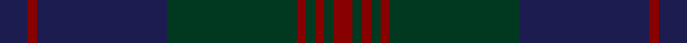

This page is one **sett** — a single exact thread-count. It belongs to the [tartan](/tartans/db3dr1db14dg14dr1dg1dr1dg1dr2/)
(the same proportion at any scale), whose colour order is pattern [BRBGRGRGR](/stripes/brbgrgrgr/).

Sourced from tartans-authority.  It is a [9 stripe tartan](/stripes/stripes9/).

Original link http://www.tartansauthority.com/tartan-ferret/display/10031/

## Thread count
DB/12 DR4 DB56 DG56 DR4 DG4 DR4 DG4 DR/8

## Palette
Each colour and the base-6 reference it is a variant of.

| Colour | Shade | Base |
|---|---|---|
| DB | <code style="background-color:#1C1C50;">#1C1C50</code> `oklch(26.2% 0.093 277.9)` <small>#1C1C50</small> | B <code style="background-color:#2A418A;">#2A418A</code> |
| DG | <code style="background-color:#003820;">#003820</code> `oklch(30.0% 0.070 158.3)` <small>#003820</small> | G <code style="background-color:#006100;">#006100</code> |
| DR | <code style="background-color:#880000;">#880000</code> `oklch(39.4% 0.162 29.2)` <small>#880000</small> | R <code style="background-color:#CC0000;">#CC0000</code> |

## Nearest tartans

The nearest existing variants by ΔTartan distance, with this tartan at the top so the swatches line up against it.

ΔTartan

Tartan

Sett

—

<a href="/ttd/edit/#slug=db3r1db14dg14r1dg1r1dg1r2~x4">Breckon Hunting (Name)</a> <a class="nn-out" href="/setts/s9/db3r1db14dg14r1dg1r1dg1r2~x4/" title="open its dictionary page">↗</a>

1.29

<a href="/ttd/edit/#slug=do8y2do27k10n4k2n3k2n16do2~x2">Highland Granite</a> <a class="nn-out" href="/setts/s10/do8y2do27k10n4k2n3k2n16do2~x2/" title="open its dictionary page">↗</a>

1.48

<a href="/ttd/edit/#slug=dg3dt1db2n2db16dt1dg1dt4db2n16db2dt1dg1db3~x2">Tiger of Sweden</a> <a class="nn-out" href="/setts/s14/dg3dt1db2n2db16dt1dg1dt4db2n16db2dt1dg1db3~x2/" title="open its dictionary page">↗</a>

1.55

<a href="/ttd/edit/#slug=dg20db2dg2db2dg2db8dr24db2dr3~x2">Lindsay</a> <a class="nn-out" href="/setts/s9/dg20db2dg2db2dg2db8dr24db2dr3~x2/" title="open its dictionary page">↗</a>

1.55

<a href="/ttd/edit/#slug=dg20db2dg2db2dg2db8dr24db2dr3">Lindsay</a> <a class="nn-out" href="/setts/s9/dg20db2dg2db2dg2db8dr24db2dr3/" title="open its dictionary page">↗</a>

1.62

<a href="/ttd/edit/#slug=dt4dg2dr16dr10dg10dt32n3~x2">Dempster Family Tartan Tartan Number: 2219. Earliest known date: 2001 Designed by Claire Donaldson of the House of Edgar. See products available Copyright © Blair Urquhart, Comrie, 2015</a> <a class="nn-out" href="/setts/s7/dt4dg2dr16dr10dg10dt32n3~x2/" title="open its dictionary page">↗</a>

1.63

<a href="/ttd/edit/#slug=k3dg4dt25k16dg3k3dg3k3dg6o3~x2">MacAndreis</a> <a class="nn-out" href="/setts/s10/k3dg4dt25k16dg3k3dg3k3dg6o3~x2/" title="open its dictionary page">↗</a>

1.63

<a href="/ttd/edit/#slug=dt30dp4dt5dg3dt2dg2dt2dg10dp7k2dp9~x2">Paxton Tartan Tartan Number: 6691. Earliest known date: 2004 Thread samples supplied See products available Copyright © Blair Urquhart, Comrie, 2015</a> <a class="nn-out" href="/setts/s11/dt30dp4dt5dg3dt2dg2dt2dg10dp7k2dp9~x2/" title="open its dictionary page">↗</a>

1.64

<a href="/ttd/edit/#slug=dg4db3dg20db9r2db2r2db18dp4~x2">New Club Centenary</a> <a class="nn-out" href="/setts/s9/dg4db3dg20db9r2db2r2db18dp4~x2/" title="open its dictionary page">↗</a>

1.79

<a href="/ttd/edit/#slug=dg24db3dg3db3dg3db9m24dg3m4~x2">Lindsay (Chisholm Red)</a> <a class="nn-out" href="/setts/s9/dg24db3dg3db3dg3db9m24dg3m4~x2/" title="open its dictionary page">↗</a>

1.85

<a href="/ttd/edit/#slug=dt5k2dt2k2dt2db5k2db1o1db1k10dt3~x4">Hopkins (Wales)</a> <a class="nn-out" href="/setts/s12/dt5k2dt2k2dt2db5k2db1o1db1k10dt3~x4/" title="open its dictionary page">↗</a>

## Neighbour map

Every grey dot is one of 14299 variants placed by the first two principal components of the ΔTartan feature space (44% of its variance). Red is this tartan; blue dots are its nearest — click one to open its page.

<svg viewBox="0 0 640 380" role="img" style="max-width:100%;height:auto;border:1px solid #e0e0e0;border-radius:4px;display:block" xmlns="http://www.w3.org/2000/svg"><image href="/nn/cloud.v1.png" width="640" height="380"/><a href="/setts/s10/do8y2do27k10n4k2n3k2n16do2~x2/"><circle cx="386.0" cy="231.4" r="4" fill="#3465a4"><title>Highland Granite</title></circle></a><a href="/setts/s14/dg3dt1db2n2db16dt1dg1dt4db2n16db2dt1dg1db3~x2/"><circle cx="387.9" cy="204.2" r="4" fill="#3465a4"><title>Tiger of Sweden</title></circle></a><a href="/setts/s9/dg20db2dg2db2dg2db8dr24db2dr3~x2/"><circle cx="351.1" cy="230.4" r="4" fill="#3465a4"><title>Lindsay</title></circle></a><a href="/setts/s9/dg20db2dg2db2dg2db8dr24db2dr3/"><circle cx="351.1" cy="230.4" r="4" fill="#3465a4"><title>Lindsay</title></circle></a><a href="/setts/s7/dt4dg2dr16dr10dg10dt32n3~x2/"><circle cx="383.9" cy="251.1" r="4" fill="#3465a4"><title>Dempster Family Tartan Tartan Number: 2219. Earliest known date: 2001 Designed by Claire Donaldson of the House of Edgar. See products available Copyright © Blair Urquhart, Comrie, 2015</title></circle></a><a href="/setts/s10/k3dg4dt25k16dg3k3dg3k3dg6o3~x2/"><circle cx="309.0" cy="247.6" r="4" fill="#3465a4"><title>MacAndreis</title></circle></a><a href="/setts/s11/dt30dp4dt5dg3dt2dg2dt2dg10dp7k2dp9~x2/"><circle cx="385.0" cy="206.1" r="4" fill="#3465a4"><title>Paxton Tartan Tartan Number: 6691. Earliest known date: 2004 Thread samples supplied See products available Copyright © Blair Urquhart, Comrie, 2015</title></circle></a><a href="/setts/s9/dg4db3dg20db9r2db2r2db18dp4~x2/"><circle cx="376.8" cy="249.8" r="4" fill="#3465a4"><title>New Club Centenary</title></circle></a><a href="/setts/s9/dg24db3dg3db3dg3db9m24dg3m4~x2/"><circle cx="342.1" cy="251.2" r="4" fill="#3465a4"><title>Lindsay (Chisholm Red)</title></circle></a><a href="/setts/s12/dt5k2dt2k2dt2db5k2db1o1db1k10dt3~x4/"><circle cx="331.4" cy="254.2" r="4" fill="#3465a4"><title>Hopkins (Wales)</title></circle></a><circle cx="419.7" cy="240.6" r="5" fill="#c00000"/></svg>

ID: /setts/s9/db3r1db14dg14r1dg1r1dg1r2~x4/
