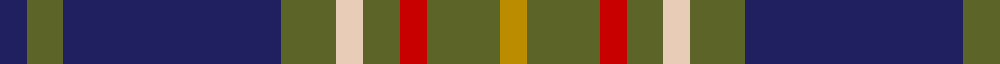

**Bands:** [BGBGWGRGY](/stripes/bgbgwgrgy/) · **Stripes:** [DB Y DB Y LB Y R Y LO](/stripes/stripes9/) DB Y DB Y LB Y R Y LO

This was sourced from tartans-authority.  It is a [9 band tartan](/bands/bands9/).

Original link http://www.tartansauthority.com/tartan-ferret/display/4040/

## Thread count
DB/6 G8 DB48 G12 LR6 G8 R6 G16 DY/6

## Palette
Each colour and its ΔE from the base-6 reference it is a variant of.

| Colour | Shade | Base | ΔE (OKLab) |
|---|---|---|---|
| DB | <code style="background-color:#202060;">#202060</code> `#202060` | B <code style="background-color:#2A418A;">#2A418A</code> | 0.11 |
| DY | <code style="background-color:#BC8C00;">#BC8C00</code> `#BC8C00` | Y <code style="background-color:#F2BF00;">#F2BF00</code> | 0.16 |
| G | <code style="background-color:#5C6428;">#5C6428</code> `#5C6428` | G <code style="background-color:#006100;">#006100</code> | 0.10 |
| LR | <code style="background-color:#E8CCB8;">#E8CCB8</code> `#E8CCB8` | W <code style="background-color:#F7F7F7;">#F7F7F7</code> | 0.12 |
| R | <code style="background-color:#C80000;">#C80000</code> `#C80000` | R <code style="background-color:#CC0000;">#CC0000</code> | 0.01 |

## Nearest tartans

The nearest existing variants by ΔTartan distance.

1. [Tennessee](/setts/s10/r2db10w1m1dg1r1dg6m1dg10w1~x2/) — ΔT 0.90
1. [American Society of Travel Agents, The (2001)](/setts/s11/db4y32db4y4db32m6db32dg4db3dg32w4/) — ΔT 0.93
1. [Dama Resort](/setts/s11/p3k2n6k2n2k18y13lb2y2k6p2~x2/) — ΔT 0.97
1. [Sverker](/setts/s10/lt2dt8n16dy3dt20dy3dt3dy3n4w2~x2/) — ΔT 1.01
1. [Jones Htg (Name)](/setts/s10/dp4t2dp2t8k3dp8g3dp4g24g2~x2/) — ΔT 1.01
1. [Boyle Family, Susan (Personal)](/setts/s11/g9r6g40dp6g6dp6k6dp36ly4dp8ly4/) — ΔT 1.01
1. [Scottish Chamber Orchestra](/setts/s9/lb3db20k3db2k5db2k3y15r2~x2/) — ΔT 1.03
1. [Donegal Irish County Tartan Tartan Number: 2247. Earliest known date: 1996 One of a series of Irish District tartans designed by Polly Wittering of the House of Edgar, with colours reminiscent of the Country with soft warm colours dominating. See products available Copyright © Blair Urquhart, Comrie, 2015](/setts/s10/lo3g17n3g3n3k5n18r2n8r2~x2/) — ΔT 1.06
1. [Chinzei Keiai Senior High School](/setts/s9/n3o3k16n2k2n16k3n2lb2~x2/) — ΔT 1.06
1. [Cailean (Scotch House)](/setts/s12/dy4w2dy2r3dy19t6db3t2db2t2db15dy3~x2/) — ΔT 1.07

## Neighbour map

Every grey dot is one of 14313 variants placed by the first two principal components of the ΔTartan feature space (44% of its variance). Red is this tartan; blue dots are its nearest — click one to open its page.

<svg viewBox="0 0 640 380" role="img" style="max-width:100%;height:auto;border:1px solid #e0e0e0;border-radius:4px;display:block" xmlns="http://www.w3.org/2000/svg"><image href="/nn/cloud.v1.png" width="640" height="380"/><a href="/setts/s10/r2db10w1m1dg1r1dg6m1dg10w1~x2/"><circle cx="262.3" cy="170.6" r="4" fill="#3465a4"><title>Tennessee</title></circle></a><a href="/setts/s11/db4y32db4y4db32m6db32dg4db3dg32w4/"><circle cx="234.4" cy="170.3" r="4" fill="#3465a4"><title>American Society of Travel Agents, The (2001)</title></circle></a><a href="/setts/s11/p3k2n6k2n2k18y13lb2y2k6p2~x2/"><circle cx="230.2" cy="171.4" r="4" fill="#3465a4"><title>Dama Resort</title></circle></a><a href="/setts/s10/lt2dt8n16dy3dt20dy3dt3dy3n4w2~x2/"><circle cx="255.6" cy="183.7" r="4" fill="#3465a4"><title>Sverker</title></circle></a><a href="/setts/s10/dp4t2dp2t8k3dp8g3dp4g24g2~x2/"><circle cx="238.5" cy="159.7" r="4" fill="#3465a4"><title>Jones Htg (Name)</title></circle></a><a href="/setts/s11/g9r6g40dp6g6dp6k6dp36ly4dp8ly4/"><circle cx="225.9" cy="155.3" r="4" fill="#3465a4"><title>Boyle Family, Susan (Personal)</title></circle></a><a href="/setts/s9/lb3db20k3db2k5db2k3y15r2~x2/"><circle cx="226.6" cy="176.8" r="4" fill="#3465a4"><title>Scottish Chamber Orchestra</title></circle></a><a href="/setts/s10/lo3g17n3g3n3k5n18r2n8r2~x2/"><circle cx="249.1" cy="184.4" r="4" fill="#3465a4"><title>Donegal Irish County Tartan Tartan Number: 2247. Earliest known date: 1996 One of a series of Irish District tartans designed by Polly Wittering of the House of Edgar, with colours reminiscent of the Country with soft warm colours dominating. See products available Copyright © Blair Urquhart, Comrie, 2015</title></circle></a><a href="/setts/s9/n3o3k16n2k2n16k3n2lb2~x2/"><circle cx="281.3" cy="198.1" r="4" fill="#3465a4"><title>Chinzei Keiai Senior High School</title></circle></a><a href="/setts/s12/dy4w2dy2r3dy19t6db3t2db2t2db15dy3~x2/"><circle cx="239.3" cy="165.6" r="4" fill="#3465a4"><title>Cailean (Scotch House)</title></circle></a><circle cx="240.8" cy="179.9" r="5" fill="#c00000"/></svg>

ID: /setts/s9/db3y4db24y6lb3y4r3y8lo3~x2/
