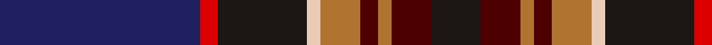

**Bands:** [KBRBRWKRB](/stripes/kbrbrwkrb/) · **Stripes:** [K DR O DR O LB K R DB](/stripes/stripes9/) K DR O DR O LB K R DB

This was sourced from register-of-tartans.  It is a [9 band tartan](/bands/bands9/).

Original link https://www.tartanregister.gov.uk/tartanDetails.aspx?ref=11037

## Register references

External register numbers recorded for this tartan.

- Scottish Register of Tartans: [11037](https://www.tartanregister.gov.uk/tartanDetails.aspx?ref=11037)

## Thread count
DB/90 R8 K40 LR6 LT18 DR8 LT6 DR18 K/22

## Palette
Each colour and its ΔE from the base-6 reference it is a variant of.

| Colour | Shade | Base | ΔE (OKLab) |
|---|---|---|---|
| DB | <code style="background-color:#202060;">#202060</code> `#202060` | B <code style="background-color:#2A418A;">#2A418A</code> | 0.11 |
| DR | <code style="background-color:#4C0000;">#4C0000</code> `#4C0000` | B <code style="background-color:#2A418A;">#2A418A</code> | 0.25 |
| K | <code style="background-color:#1C1714;">#1C1714</code> `#1C1714` | K <code style="background-color:#000000;">#000000</code> | 0.21 |
| LR | <code style="background-color:#E8CCB8;">#E8CCB8</code> `#E8CCB8` | W <code style="background-color:#F7F7F7;">#F7F7F7</code> | 0.12 |
| LT | <code style="background-color:#B07430;">#B07430</code> `#B07430` | R <code style="background-color:#CC0000;">#CC0000</code> | 0.16 |
| R | <code style="background-color:#DC0000;">#DC0000</code> `#DC0000` | R <code style="background-color:#CC0000;">#CC0000</code> | 0.03 |

## Nearest tartans

The nearest existing variants by ΔTartan distance.

1. [United Arrows House Check](/setts/s9/db40r4k16w3dy8r4dy3r8k10~x2/) — ΔT 0.70
1. [Real Mary King's Close, The](/setts/s9/k2r2k15o2k4o2n9do27w2~x2/) — ΔT 0.77
1. [Alba](/setts/s8/dp24dt2g3m2g3k11dt29w2~x2/) — ΔT 0.83
1. [Crieff Primary School](/setts/s10/k3g1o1dt6n2dt1n1dt1o10lb1~x4/) — ΔT 0.90
1. [Scottish Association for Neurological Sciences](/setts/s9/db46ly4db4ly4db6k16n66lb11r6/) — ΔT 1.04
1. [KPMG (Corporate)](/setts/s10/r12lo2db3k3db30k20dr6k10lo2dr4~x2/) — ΔT 1.11
1. [Caisteal Leòdhais](/setts/s10/y4t3y18dt14y2dt2dp18lo1dp2lo3~x2/) — ΔT 1.13
1. [Purves (2014)](/setts/s8/k4w1dg12k3db16r1db1r1~x2/) — ΔT 1.13
1. [Oban (District?)](/setts/s13/k2r1db9r2k7db2r6g6r2k12lb1n1k1~x4/) — ΔT 1.13
1. [Creiff Highland Gathering](/setts/s9/k3dp16g5dp3p2dp2k12dt23w2~x2/) — ΔT 1.14

## Neighbour map

Every grey dot is one of 14299 variants placed by the first two principal components of the ΔTartan feature space (44% of its variance). Red is this tartan; blue dots are its nearest — click one to open its page.

<svg viewBox="0 0 640 380" role="img" style="max-width:100%;height:auto;border:1px solid #e0e0e0;border-radius:4px;display:block" xmlns="http://www.w3.org/2000/svg"><image href="/nn/cloud.v1.png" width="640" height="380"/><a href="/setts/s9/db40r4k16w3dy8r4dy3r8k10~x2/"><circle cx="206.8" cy="147.8" r="4" fill="#3465a4"><title>United Arrows House Check</title></circle></a><a href="/setts/s9/k2r2k15o2k4o2n9do27w2~x2/"><circle cx="229.5" cy="149.0" r="4" fill="#3465a4"><title>Real Mary King's Close, The</title></circle></a><a href="/setts/s8/dp24dt2g3m2g3k11dt29w2~x2/"><circle cx="237.1" cy="154.0" r="4" fill="#3465a4"><title>Alba</title></circle></a><a href="/setts/s10/k3g1o1dt6n2dt1n1dt1o10lb1~x4/"><circle cx="191.9" cy="147.6" r="4" fill="#3465a4"><title>Crieff Primary School</title></circle></a><a href="/setts/s9/db46ly4db4ly4db6k16n66lb11r6/"><circle cx="216.1" cy="127.9" r="4" fill="#3465a4"><title>Scottish Association for Neurological Sciences</title></circle></a><a href="/setts/s10/r12lo2db3k3db30k20dr6k10lo2dr4~x2/"><circle cx="217.8" cy="163.8" r="4" fill="#3465a4"><title>KPMG (Corporate)</title></circle></a><a href="/setts/s10/y4t3y18dt14y2dt2dp18lo1dp2lo3~x2/"><circle cx="188.2" cy="137.5" r="4" fill="#3465a4"><title>Caisteal Leòdhais</title></circle></a><a href="/setts/s8/k4w1dg12k3db16r1db1r1~x2/"><circle cx="263.4" cy="163.6" r="4" fill="#3465a4"><title>Purves (2014)</title></circle></a><a href="/setts/s13/k2r1db9r2k7db2r6g6r2k12lb1n1k1~x4/"><circle cx="198.0" cy="156.1" r="4" fill="#3465a4"><title>Oban (District?)</title></circle></a><a href="/setts/s9/k3dp16g5dp3p2dp2k12dt23w2~x2/"><circle cx="168.6" cy="159.6" r="4" fill="#3465a4"><title>Creiff Highland Gathering</title></circle></a><circle cx="224.6" cy="147.0" r="5" fill="#c00000"/></svg>

ID: /setts/s9/db45r4k20lb3o9dr4o3dr9k11~x2/
