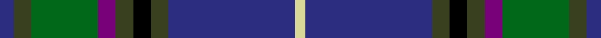

In pattern [BGGBGKGBY](/stripes/bggbgkgby/).

This was sourced from tartans-authority.  It is a [9 stripe tartan](/stripes/stripes9/).

Original link http://www.tartansauthority.com/tartan-ferret/display/4217/

## Thread count
DB/8 T10 G38 P10 T10 K10 T10 DB72 LY/6

## Palette
Each colour and its ΔE from the base-6 reference it is a variant of.

| Colour | Shade | Base | ΔE (OKLab) |
|---|---|---|---|
| DB | <code style="background-color:#2C2C80;">#2C2C80</code> `#2C2C80` | B <code style="background-color:#2A418A;">#2A418A</code> | 0.06 |
| G | <code style="background-color:#006818;">#006818</code> `#006818` | G <code style="background-color:#006100;">#006100</code> | 0.02 |
| K | <code style="background-color:#000000;">#000000</code> `#000000` | K <code style="background-color:#000000;">#000000</code> | 0.00 |
| LY | <code style="background-color:#D8D898;">#D8D898</code> `#D8D898` | Y <code style="background-color:#F2BF00;">#F2BF00</code> | 0.10 |
| P | <code style="background-color:#780078;">#780078</code> `#780078` | B <code style="background-color:#2A418A;">#2A418A</code> | 0.17 |
| T | <code style="background-color:#384020;">#384020</code> `#384020` | G <code style="background-color:#006100;">#006100</code> | 0.12 |

## Nearest tartans

The nearest existing variants by ΔTartan distance.

1. [Boyle (Personal)](/setts/s10/db4db3r2db26k3db3g3db3g17lo3~x2/) — ΔT 0.85
1. [Spirit of Fife (Corporate)](/setts/s8/dg10w2dt3g2m14dt26dg2dt6~x2/) — ΔT 0.92
1. [Robert Burns Legacy](/setts/s9/db10g42db8t8db8k24db8db71r10/) — ΔT 0.93
1. [Wcwm 1290](/setts/s11/dg28lb2dg3lo4dg3lb2dg3k14lg2db28lb3~x2/) — ΔT 0.94
1. [Souza Nery (Personal)](/setts/s12/db37r3k17r3g22k4g22r3k17r3db37w3~x2/) — ΔT 0.94
1. [Scottish Italian](/setts/s8/b11db5g4w3r3k16db28b2~x2/) — ΔT 0.96
1. [Halcrow Howell (Name)](/setts/s9/db4t3db6k2db12g2db2g24lb2~x2/) — ΔT 0.98
1. [Czech National (District)](/setts/s11/db4ly2db24k2db5r3k14g14w3r3db3~x2/) — ΔT 1.00
1. [Scottish Rugby Union (Sports)](/setts/s11/db6k2db24k10g2m2g2m2g10k2lb3~x2/) — ΔT 1.01
1. [Remember the Somme 1916](/setts/s8/dg5g2b2db15r2t2dg5r2~x4/) — ΔT 1.02

## Neighbour map

Every grey dot is one of 14299 variants placed by the first two principal components of the ΔTartan feature space (44% of its variance). Red is this tartan; blue dots are its nearest — click one to open its page.

<svg viewBox="0 0 640 380" role="img" style="max-width:100%;height:auto;border:1px solid #e0e0e0;border-radius:4px;display:block" xmlns="http://www.w3.org/2000/svg"><image href="/nn/cloud.v1.png" width="640" height="380"/><a href="/setts/s10/db4db3r2db26k3db3g3db3g17lo3~x2/"><circle cx="243.8" cy="156.9" r="4" fill="#3465a4"><title>Boyle (Personal)</title></circle></a><a href="/setts/s8/dg10w2dt3g2m14dt26dg2dt6~x2/"><circle cx="252.4" cy="167.7" r="4" fill="#3465a4"><title>Spirit of Fife (Corporate)</title></circle></a><a href="/setts/s9/db10g42db8t8db8k24db8db71r10/"><circle cx="193.6" cy="176.3" r="4" fill="#3465a4"><title>Robert Burns Legacy</title></circle></a><a href="/setts/s11/dg28lb2dg3lo4dg3lb2dg3k14lg2db28lb3~x2/"><circle cx="204.4" cy="135.4" r="4" fill="#3465a4"><title>Wcwm 1290</title></circle></a><a href="/setts/s12/db37r3k17r3g22k4g22r3k17r3db37w3~x2/"><circle cx="192.2" cy="152.1" r="4" fill="#3465a4"><title>Souza Nery (Personal)</title></circle></a><a href="/setts/s8/b11db5g4w3r3k16db28b2~x2/"><circle cx="208.4" cy="156.1" r="4" fill="#3465a4"><title>Scottish Italian</title></circle></a><a href="/setts/s9/db4t3db6k2db12g2db2g24lb2~x2/"><circle cx="228.5" cy="159.6" r="4" fill="#3465a4"><title>Halcrow Howell (Name)</title></circle></a><a href="/setts/s11/db4ly2db24k2db5r3k14g14w3r3db3~x2/"><circle cx="199.3" cy="140.4" r="4" fill="#3465a4"><title>Czech National (District)</title></circle></a><a href="/setts/s11/db6k2db24k10g2m2g2m2g10k2lb3~x2/"><circle cx="240.1" cy="158.9" r="4" fill="#3465a4"><title>Scottish Rugby Union (Sports)</title></circle></a><a href="/setts/s8/dg5g2b2db15r2t2dg5r2~x4/"><circle cx="190.0" cy="188.1" r="4" fill="#3465a4"><title>Remember the Somme 1916</title></circle></a><circle cx="224.3" cy="156.1" r="5" fill="#c00000"/></svg>

ID: /setts/s9/db4dy5g19dp5dy5k5dy5db36ly3~x2/
