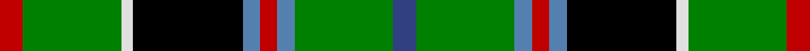

In pattern [BGBRBKWGR](/stripes/bgbrbkwgr/).

This was sourced from weddslist.  It is a [9 stripe tartan](/stripes/stripes9/).

Original link http://www.weddslist.com/cgi-bin/tartans/pg.pl?source=sts

## Thread count
R/8 G34 LN4 K38 Ba6 R6 Ba6 G34 B/8

## Palette
Each colour and the base-6 reference it is a variant of.

| Colour | Shade | Base |
|---|---|---|
| B | <code style="background-color:#304080;">#304080</code> `oklch(39.4% 0.109 270.2)` <small>#304080</small> | B <code style="background-color:#2A418A;">#2A418A</code> |
| Ba | <code style="background-color:#5480B0;">#5480B0</code> `oklch(58.8% 0.089 251.5)` <small>#5480B0</small> | B <code style="background-color:#2A418A;">#2A418A</code> |
| G | <code style="background-color:#008000;">#008000</code> `oklch(52.0% 0.177 142.5)` <small>#008000</small> | G <code style="background-color:#006100;">#006100</code> |
| K | <code style="background-color:#000000;">#000000</code> `oklch(0.0% 0.000 0.0)` <small>#000000</small> | K <code style="background-color:#000000;">#000000</code> |
| LN | <code style="background-color:#E0E0E0;">#E0E0E0</code> `oklch(90.7% 0.000 89.9)` <small>#E0E0E0</small> | W <code style="background-color:#F7F7F7;">#F7F7F7</code> |
| R | <code style="background-color:#C00000;">#C00000</code> `oklch(50.7% 0.208 29.2)` <small>#C00000</small> | R <code style="background-color:#CC0000;">#CC0000</code> |

## Nearest tartans

The nearest existing variants by ΔTartan distance.

1. [Wilson's, No 33](/setts/s9/db4g17t3r3t3k19ly2g17r4~x2/) — ΔT 0.10
1. [Wilson's, No 225](/setts/s9/g16g2p13t2k6ly2g16t2k12~x2/) — ΔT 0.63
1. [Stephenson](/setts/s11/k6g20t2r5t2k20ly3db20g26r3db5~x2/) — ΔT 0.96
1. [Louth County Crest (Fashion)](/setts/s9/ly16lo5k8lo8k68g46w8k8r8/) — ΔT 1.03
1. [Kelsey, William (Personal)](/setts/s12/g12r2g2r5g16db3lr2k2lr3db6k20ly3~x2/) — ΔT 1.04
1. [Madewell](/setts/s9/r2k2w2k14dg13g6ly2k2w2~x2/) — ΔT 1.04
1. [MacKellar](/setts/s12/g30w3g4ly5g4w3g6k14t3k14db18w4~x2/) — ΔT 1.11
1. [Wellecomme, Bernard (Personal)](/setts/s10/db4dg8k8db4ly3dg21k3lb4k3lb4~x2/) — ΔT 1.13
1. [Hislop (Name)](/setts/s8/w4k2t18g18k18w3k18r3~x2/) — ΔT 1.13
1. [Unnamed 4](/setts/s10/k6g14t2r3t2k16ly2b16g16r3~x2/) — ΔT 1.15

## Neighbour map

Every grey dot is one of 14299 variants placed by the first two principal components of the ΔTartan feature space (44% of its variance). Red is this tartan; blue dots are its nearest — click one to open its page.

<svg viewBox="0 0 640 380" role="img" style="max-width:100%;height:auto;border:1px solid #e0e0e0;border-radius:4px;display:block" xmlns="http://www.w3.org/2000/svg"><image href="/nn/cloud.v1.png" width="640" height="380"/><a href="/setts/s9/db4g17t3r3t3k19ly2g17r4~x2/"><circle cx="159.9" cy="154.9" r="4" fill="#3465a4"><title>Wilson's, No 33</title></circle></a><a href="/setts/s9/g16g2p13t2k6ly2g16t2k12~x2/"><circle cx="135.0" cy="168.8" r="4" fill="#3465a4"><title>Wilson's, No 225</title></circle></a><a href="/setts/s11/k6g20t2r5t2k20ly3db20g26r3db5~x2/"><circle cx="140.2" cy="137.3" r="4" fill="#3465a4"><title>Stephenson</title></circle></a><a href="/setts/s9/ly16lo5k8lo8k68g46w8k8r8/"><circle cx="198.1" cy="124.3" r="4" fill="#3465a4"><title>Louth County Crest (Fashion)</title></circle></a><a href="/setts/s12/g12r2g2r5g16db3lr2k2lr3db6k20ly3~x2/"><circle cx="113.4" cy="127.4" r="4" fill="#3465a4"><title>Kelsey, William (Personal)</title></circle></a><a href="/setts/s9/r2k2w2k14dg13g6ly2k2w2~x2/"><circle cx="125.4" cy="159.9" r="4" fill="#3465a4"><title>Madewell</title></circle></a><a href="/setts/s12/g30w3g4ly5g4w3g6k14t3k14db18w4~x2/"><circle cx="127.9" cy="139.2" r="4" fill="#3465a4"><title>MacKellar</title></circle></a><a href="/setts/s10/db4dg8k8db4ly3dg21k3lb4k3lb4~x2/"><circle cx="163.2" cy="179.9" r="4" fill="#3465a4"><title>Wellecomme, Bernard (Personal)</title></circle></a><a href="/setts/s8/w4k2t18g18k18w3k18r3~x2/"><circle cx="145.8" cy="175.4" r="4" fill="#3465a4"><title>Hislop (Name)</title></circle></a><a href="/setts/s10/k6g14t2r3t2k16ly2b16g16r3~x2/"><circle cx="92.1" cy="157.3" r="4" fill="#3465a4"><title>Unnamed 4</title></circle></a><circle cx="158.8" cy="154.5" r="5" fill="#c00000"/></svg>

ID: /setts/s9/db4g17t3r3t3k19w2g17r4~x2/
