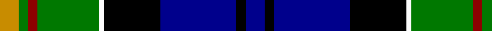

This page is one **sett** — a single exact thread-count. It belongs to the [tartan](/tartans/db4k2db16k12w1g13r2g2lo4/)
(the same proportion at any scale), whose colour order is pattern [BKBKWGRGY](/stripes/bkbkwgrgy/).

Sourced from register-of-tartans.  It is a [9 stripe tartan](/stripes/stripes9/).

Original link https://www.tartanregister.gov.uk/tartanDetails.aspx?ref=857

## Also known as

This cloth is also recorded under:

- Cusack Clan/Family

3 attestations — the source records this cloth was collapsed from (oldest owns this page)

<ul>
<li>01/01/1999 — Cusack (register-of-tartans, <a href="https://www.tartanregister.gov.uk/tartanDetails.aspx?ref=857">record</a>)</li>
<li>pre 2002 — Cusack (Name) (tartans-authority, <a href="http://www.tartansauthority.com/tartan-ferret/display/4649/">record</a>)</li>
<li>undated — Cusack Clan/Family Tartan Tartan Number: 4649. Earliest known date: 2002 Designed by Peter MacDonald for Jeremy Cusack, Guernsey, Channel Isles. Copyright Peter MacDonald but can be worn by all Cusacks. See products available Copyright © Blair Urquhart, Comrie, 2015 (house-of-tartan, <a href="http://www.house-of-tartan.scotland.net/house/TartanViewjs.asp?colr=Def&tnam=4649">record</a>)</li>
</ul>

## Register references

External register numbers recorded for this tartan.

- Scottish Register of Tartans: [857](https://www.tartanregister.gov.uk/tartanDetails.aspx?ref=857)
- Scottish Tartans Authority (ITI): 4649
- Scottish Tartans World Register: 2775

## Thread count
DY/8 G4 DR4 G26 W2 K24 DB32 K4 DB/8

## Palette

Palette: <strong>Tartan Register</strong> <small style="color:#888">(5 of 6 colours)</small>
<table><thead><tr><th>Colour</th><th>Threads</th><th>Shade</th><th>Base</th><th>OKLCh</th></tr></thead><tbody><tr><td>DY/</td><td style="text-align:right;font-variant-numeric:tabular-nums">8</td><td><code style="background-color:#C88C00;">#C88C00</code> <small style="color:#888">#C88C00</small></td><td>Y <code style="background-color:#F2BF00;">#F2BF00</code></td><td><small style="color:#888">oklch(68.2% 0.142 78.2)</small></td></tr><tr><td>G</td><td style="text-align:right;font-variant-numeric:tabular-nums">4</td><td><code style="background-color:#007800;">#007800</code> <small style="color:#888">#007800</small></td><td>G <code style="background-color:#006100;">#006100</code></td><td><small style="color:#888">oklch(49.6% 0.169 142.5)</small></td></tr><tr><td>DR</td><td style="text-align:right;font-variant-numeric:tabular-nums">4</td><td><code style="background-color:#8C0000;">#8C0000</code> <small style="color:#888">#8C0000</small></td><td>R <code style="background-color:#CC0000;">#CC0000</code></td><td><small style="color:#888">oklch(40.2% 0.165 29.2)</small></td></tr><tr><td>G</td><td style="text-align:right;font-variant-numeric:tabular-nums">26</td><td><code style="background-color:#007800;">#007800</code> <small style="color:#888">#007800</small></td><td>G <code style="background-color:#006100;">#006100</code></td><td><small style="color:#888">oklch(49.6% 0.169 142.5)</small></td></tr><tr><td>W</td><td style="text-align:right;font-variant-numeric:tabular-nums">2</td><td><code style="background-color:#FCFCFC;">#FCFCFC</code> <small style="color:#888">#FCFCFC</small></td><td>W <code style="background-color:#F7F7F7;">#F7F7F7</code></td><td><small style="color:#888">oklch(99.1% 0.000 89.9)</small></td></tr><tr><td>K</td><td style="text-align:right;font-variant-numeric:tabular-nums">24</td><td><code style="background-color:#000000;">#000000</code> <small style="color:#888">#000000</small></td><td>K <code style="background-color:#000000;">#000000</code></td><td><small style="color:#888">oklch(0.0% 0.000 0.0)</small></td></tr><tr><td>DB</td><td style="text-align:right;font-variant-numeric:tabular-nums">32</td><td><code style="background-color:#00008C;">#00008C</code> <small style="color:#888">#00008C</small></td><td>B <code style="background-color:#2A418A;">#2A418A</code></td><td><small style="color:#888">oklch(28.9% 0.200 264.1)</small></td></tr><tr><td>K</td><td style="text-align:right;font-variant-numeric:tabular-nums">4</td><td><code style="background-color:#000000;">#000000</code> <small style="color:#888">#000000</small></td><td>K <code style="background-color:#000000;">#000000</code></td><td><small style="color:#888">oklch(0.0% 0.000 0.0)</small></td></tr><tr><td>DB/</td><td style="text-align:right;font-variant-numeric:tabular-nums">8</td><td><code style="background-color:#00008C;">#00008C</code> <small style="color:#888">#00008C</small></td><td>B <code style="background-color:#2A418A;">#2A418A</code></td><td><small style="color:#888">oklch(28.9% 0.200 264.1)</small></td></tr></tbody></table>

## Nearest tartans

The nearest existing variants by ΔTartan distance, with this tartan at the top so the swatches line up against it.

ΔTartan

Tartan

Sett

—

<a href="/ttd/edit/#slug=db4k2db16k12w1g13r2g2lo4~x2">Cusack</a> <a class="nn-out" href="/setts/s9/db4k2db16k12w1g13r2g2lo4~x2/" title="open its dictionary page">↗</a>

0.91

<a href="/ttd/edit/#slug=r7db2g5k24db2g10db28g10lb3~x2">Colgan (Personal)</a> <a class="nn-out" href="/setts/s9/r7db2g5k24db2g10db28g10lb3~x2/" title="open its dictionary page">↗</a>

0.94

<a href="/ttd/edit/#slug=w1r2db16k14g15k3ly1~x2">MacNeil 7</a> <a class="nn-out" href="/setts/s7/w1r2db16k14g15k3ly1~x2/" title="open its dictionary page">↗</a>

0.94

<a href="/ttd/edit/#slug=t3k2r3g20k24db20r3k2ly3~x2">Loch Awe</a> <a class="nn-out" href="/setts/s9/t3k2r3g20k24db20r3k2ly3~x2/" title="open its dictionary page">↗</a>

0.99

<a href="/ttd/edit/#slug=db6k2n2db8k18lo2g20db8n3k10lb6~x2">Veere (District)</a> <a class="nn-out" href="/setts/s11/db6k2n2db8k18lo2g20db8n3k10lb6~x2/" title="open its dictionary page">↗</a>

1.02

<a href="/ttd/edit/#slug=dg19k20m1db8b8dg8db3m1lb12k8m1lb1~x2">Vine (2015)</a> <a class="nn-out" href="/setts/s12/dg19k20m1db8b8dg8db3m1lb12k8m1lb1~x2/" title="open its dictionary page">↗</a>

1.03

<a href="/ttd/edit/#slug=db6r4db24lb3k6g18lo4g2lo2g4~x2">Greene</a> <a class="nn-out" href="/setts/s10/db6r4db24lb3k6g18lo4g2lo2g4~x2/" title="open its dictionary page">↗</a>

1.08

<a href="/ttd/edit/#slug=ly1k3dg15k14db16r2lb1~x2">MacNeil</a> <a class="nn-out" href="/setts/s7/ly1k3dg15k14db16r2lb1~x2/" title="open its dictionary page">↗</a>

1.08

<a href="/ttd/edit/#slug=k10ly3k2db20k10g15k2r3w3~x2">McCuaig (Glenelg and the Western Isles)</a> <a class="nn-out" href="/setts/s9/k10ly3k2db20k10g15k2r3w3~x2/" title="open its dictionary page">↗</a>

1.10

<a href="/ttd/edit/#slug=db60t5w4o12g42p12t5p12">St Columba</a> <a class="nn-out" href="/setts/s8/db60t5w4o12g42p12t5p12/" title="open its dictionary page">↗</a>

1.11

<a href="/ttd/edit/#slug=w2db3t3db13k13db4r2db4g12lp3r1~x2">Fitzgerald, hunting</a> <a class="nn-out" href="/setts/s11/w2db3t3db13k13db4r2db4g12lp3r1~x2/" title="open its dictionary page">↗</a>

## Neighbour map

Every grey dot is one of 14299 variants placed by the first two principal components of the ΔTartan feature space (44% of its variance). Red is this tartan; blue dots are its nearest — click one to open its page.

<svg viewBox="0 0 640 380" role="img" style="max-width:100%;height:auto;border:1px solid #e0e0e0;border-radius:4px;display:block" xmlns="http://www.w3.org/2000/svg"><image href="/nn/cloud.v1.png" width="640" height="380"/><a href="/setts/s9/r7db2g5k24db2g10db28g10lb3~x2/"><circle cx="149.4" cy="161.9" r="4" fill="#3465a4"><title>Colgan (Personal)</title></circle></a><a href="/setts/s7/w1r2db16k14g15k3ly1~x2/"><circle cx="135.0" cy="148.1" r="4" fill="#3465a4"><title>MacNeil 7</title></circle></a><a href="/setts/s9/t3k2r3g20k24db20r3k2ly3~x2/"><circle cx="120.5" cy="134.4" r="4" fill="#3465a4"><title>Loch Awe</title></circle></a><a href="/setts/s11/db6k2n2db8k18lo2g20db8n3k10lb6~x2/"><circle cx="97.5" cy="156.5" r="4" fill="#3465a4"><title>Veere (District)</title></circle></a><a href="/setts/s12/dg19k20m1db8b8dg8db3m1lb12k8m1lb1~x2/"><circle cx="102.7" cy="117.1" r="4" fill="#3465a4"><title>Vine (2015)</title></circle></a><a href="/setts/s10/db6r4db24lb3k6g18lo4g2lo2g4~x2/"><circle cx="154.4" cy="138.3" r="4" fill="#3465a4"><title>Greene</title></circle></a><a href="/setts/s7/ly1k3dg15k14db16r2lb1~x2/"><circle cx="150.7" cy="160.3" r="4" fill="#3465a4"><title>MacNeil</title></circle></a><a href="/setts/s9/k10ly3k2db20k10g15k2r3w3~x2/"><circle cx="97.9" cy="152.6" r="4" fill="#3465a4"><title>McCuaig (Glenelg and the Western Isles)</title></circle></a><a href="/setts/s8/db60t5w4o12g42p12t5p12/"><circle cx="166.6" cy="137.6" r="4" fill="#3465a4"><title>St Columba</title></circle></a><a href="/setts/s11/w2db3t3db13k13db4r2db4g12lp3r1~x2/"><circle cx="107.0" cy="126.2" r="4" fill="#3465a4"><title>Fitzgerald, hunting</title></circle></a><circle cx="129.8" cy="140.1" r="5" fill="#c00000"/></svg>

ID: /setts/s9/db4k2db16k12w1g13r2g2lo4~x2/
