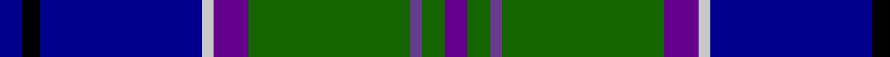

This page is one **sett** — a single exact thread-count. It belongs to the [tartan](/tartans/db4k3db28n2p6g28na2g4p4/)
(the same proportion at any scale), whose colour order is pattern [BGBGBWBKB](/stripes/bgbgbwbkb/).

Sourced from register-of-tartans.  It is a [9 stripe tartan](/stripes/stripes9/).

Original link https://www.tartanregister.gov.uk/tartanDetails.aspx?ref=553

2 attestations — the source records this cloth was collapsed from (oldest owns this page)

<ul>
<li>01/01/1995 — Canmore (register-of-tartans, <a href="https://www.tartanregister.gov.uk/tartanDetails.aspx?ref=553">record</a>)</li>
<li>1995 — Canmore (Fashion) (tartans-authority, <a href="http://www.tartansauthority.com/tartan-ferret/display/4450/">record</a>)</li>
</ul>

## Register references

External register numbers recorded for this tartan.

- Scottish Register of Tartans: [553](https://www.tartanregister.gov.uk/tartanDetails.aspx?ref=553)
- Scottish Tartans Authority (ITI): 4450

## Thread count
DB/8 K6 DB56 N4 P12 G56 Na4 G8 P/8

## Palette
Each colour and the base-6 reference it is a variant of.

| Colour | Shade | Base |
|---|---|---|
| DB | <code style="background-color:#00008C;">#00008C</code> `oklch(28.9% 0.200 264.1)` <small>#00008C</small> | B <code style="background-color:#2A418A;">#2A418A</code> |
| G | <code style="background-color:#146400;">#146400</code> `oklch(43.9% 0.144 140.9)` <small>#146400</small> | G <code style="background-color:#006100;">#006100</code> |
| K | <code style="background-color:#000000;">#000000</code> `oklch(0.0% 0.000 0.0)` <small>#000000</small> | K <code style="background-color:#000000;">#000000</code> |
| N | <code style="background-color:#C8C8C8;">#C8C8C8</code> `oklch(83.3% 0.000 89.9)` <small>#C8C8C8</small> | W <code style="background-color:#F7F7F7;">#F7F7F7</code> |
| Na | <code style="background-color:#683C8C;">#683C8C</code> `oklch(44.7% 0.132 307.3)` <small>#683C8C</small> | B <code style="background-color:#2A418A;">#2A418A</code> |
| P | <code style="background-color:#64008C;">#64008C</code> `oklch(38.5% 0.193 311.3)` <small>#64008C</small> | B <code style="background-color:#2A418A;">#2A418A</code> |

## Nearest tartans

The nearest existing variants by ΔTartan distance, with this tartan at the top so the swatches line up against it.

ΔTartan

Tartan

Sett

—

<a href="/ttd/edit/#slug=db4k3db28lb2dp6g28n2g4dp4~x2">Canmore</a> <a class="nn-out" href="/setts/s9/db4k3db28lb2dp6g28n2g4dp4~x2/" title="open its dictionary page">↗</a>

0.96

<a href="/ttd/edit/#slug=w1db12k9g1k1g5lb1g3lo1~x4">St. Andrews Golf Club (Corporate)</a> <a class="nn-out" href="/setts/s9/w1db12k9g1k1g5lb1g3lo1~x4/" title="open its dictionary page">↗</a>

1.04

<a href="/ttd/edit/#slug=db35r2k16ly2t25w2t6~x2">US Forces (Thurso) Regimental Tartan Tartan Number: 549. Earliest known date: 1986 Originally listed as MacNeil, this sett was identified by Ken Dalgliesh, weaver in Selkirk, in 1999. See products available Copyright © Blair Urquhart, Comrie, 2015</a> <a class="nn-out" href="/setts/s7/db35r2k16ly2t25w2t6~x2/" title="open its dictionary page">↗</a>

1.11

<a href="/ttd/edit/#slug=b11db5g4w3r3k16db28b2~x2">Scottish Italian</a> <a class="nn-out" href="/setts/s8/b11db5g4w3r3k16db28b2~x2/" title="open its dictionary page">↗</a>

1.11

<a href="/ttd/edit/#slug=db60t5w4o12g42p12t5p12">St Columba</a> <a class="nn-out" href="/setts/s8/db60t5w4o12g42p12t5p12/" title="open its dictionary page">↗</a>

1.11

<a href="/ttd/edit/#slug=w2db20dg2dg2dg2dg5dg8ly2r1~x2">Unidentified (ex Tony Murray)</a> <a class="nn-out" href="/setts/s9/w2db20dg2dg2dg2dg5dg8ly2r1~x2/" title="open its dictionary page">↗</a>

1.13

<a href="/ttd/edit/#slug=db4w1k2db25k12db1k2g16k2r1~x2">Sidey Family (Dundee) (Personal)</a> <a class="nn-out" href="/setts/s10/db4w1k2db25k12db1k2g16k2r1~x2/" title="open its dictionary page">↗</a>

1.14

<a href="/ttd/edit/#slug=dp4db40k15g10dp2g10dp2g10w4~x2">Ebdon-Muir (Personal)</a> <a class="nn-out" href="/setts/s9/dp4db40k15g10dp2g10dp2g10w4~x2/" title="open its dictionary page">↗</a>

1.16

<a href="/ttd/edit/#slug=db4dy5g19dp5dy5k5dy5db36ly3~x2">Suzugamine (Corporate)</a> <a class="nn-out" href="/setts/s9/db4dy5g19dp5dy5k5dy5db36ly3~x2/" title="open its dictionary page">↗</a>

1.19

<a href="/ttd/edit/#slug=w4db8m3db25k13g4t29db3t8db2m3~x2">Air Force</a> <a class="nn-out" href="/setts/s11/w4db8m3db25k13g4t29db3t8db2m3~x2/" title="open its dictionary page">↗</a>

1.20

<a href="/ttd/edit/#slug=r2dg32ly2dg2k3db2ly2db28w2db2w2~x2">Pringle Personal Tartan Tartan Number: 5447. Earliest known date: c.1998 Dalgleish of Selkirk designed and wove this circa 1998 as a personal tartan for someone of the name, Pringle. See products available Copyright © Blair Urquhart, Comrie, 2015</a> <a class="nn-out" href="/setts/s11/r2dg32ly2dg2k3db2ly2db28w2db2w2~x2/" title="open its dictionary page">↗</a>

## Neighbour map

Every grey dot is one of 14299 variants placed by the first two principal components of the ΔTartan feature space (44% of its variance). Red is this tartan; blue dots are its nearest — click one to open its page.

<svg viewBox="0 0 640 380" role="img" style="max-width:100%;height:auto;border:1px solid #e0e0e0;border-radius:4px;display:block" xmlns="http://www.w3.org/2000/svg"><image href="/nn/cloud.v1.png" width="640" height="380"/><a href="/setts/s9/w1db12k9g1k1g5lb1g3lo1~x4/"><circle cx="164.5" cy="149.8" r="4" fill="#3465a4"><title>St. Andrews Golf Club (Corporate)</title></circle></a><a href="/setts/s7/db35r2k16ly2t25w2t6~x2/"><circle cx="198.9" cy="146.7" r="4" fill="#3465a4"><title>US Forces (Thurso) Regimental Tartan Tartan Number: 549. Earliest known date: 1986 Originally listed as MacNeil, this sett was identified by Ken Dalgliesh, weaver in Selkirk, in 1999. See products available Copyright © Blair Urquhart, Comrie, 2015</title></circle></a><a href="/setts/s8/b11db5g4w3r3k16db28b2~x2/"><circle cx="208.4" cy="156.1" r="4" fill="#3465a4"><title>Scottish Italian</title></circle></a><a href="/setts/s8/db60t5w4o12g42p12t5p12/"><circle cx="166.6" cy="137.6" r="4" fill="#3465a4"><title>St Columba</title></circle></a><a href="/setts/s9/w2db20dg2dg2dg2dg5dg8ly2r1~x2/"><circle cx="237.6" cy="123.7" r="4" fill="#3465a4"><title>Unidentified (ex Tony Murray)</title></circle></a><a href="/setts/s10/db4w1k2db25k12db1k2g16k2r1~x2/"><circle cx="229.7" cy="110.2" r="4" fill="#3465a4"><title>Sidey Family (Dundee) (Personal)</title></circle></a><a href="/setts/s9/dp4db40k15g10dp2g10dp2g10w4~x2/"><circle cx="213.9" cy="147.0" r="4" fill="#3465a4"><title>Ebdon-Muir (Personal)</title></circle></a><a href="/setts/s9/db4dy5g19dp5dy5k5dy5db36ly3~x2/"><circle cx="224.3" cy="156.1" r="4" fill="#3465a4"><title>Suzugamine (Corporate)</title></circle></a><a href="/setts/s11/w4db8m3db25k13g4t29db3t8db2m3~x2/"><circle cx="161.5" cy="130.0" r="4" fill="#3465a4"><title>Air Force</title></circle></a><a href="/setts/s11/r2dg32ly2dg2k3db2ly2db28w2db2w2~x2/"><circle cx="239.2" cy="103.6" r="4" fill="#3465a4"><title>Pringle Personal Tartan Tartan Number: 5447. Earliest known date: c.1998 Dalgleish of Selkirk designed and wove this circa 1998 as a personal tartan for someone of the name, Pringle. See products available Copyright © Blair Urquhart, Comrie, 2015</title></circle></a><circle cx="206.5" cy="142.0" r="5" fill="#c00000"/></svg>

ID: /setts/s9/db4k3db28lb2dp6g28n2g4dp4~x2/
