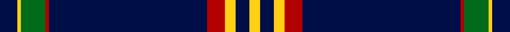

This page is one **sett** — a single exact thread-count. It belongs to the [tartan](/tartans/db5ly1g7r1db45r5ly3db4ly3/)
(the same proportion at any scale), whose colour order is pattern [BYGRBRYBY](/stripes/bygrbryby/).

Sourced from register-of-tartans.  It is a [9 stripe tartan](/stripes/stripes9/).

Original link https://www.tartanregister.gov.uk/tartanDetails.aspx?ref=10652

## Register references

External register numbers recorded for this tartan.

- Scottish Register of Tartans: [10652](https://www.tartanregister.gov.uk/tartanDetails.aspx?ref=10652)

## Thread count
DB/10 Y2 G14 DR2 DB90 DR10 Y6 DB8 Y/6

## Palette

Palette: <strong>custom</strong>
<table><thead><tr><th>Colour</th><th>Threads</th><th>Shade</th><th>Base</th><th>OKLCh</th></tr></thead><tbody><tr><td>DB/</td><td style="text-align:right;font-variant-numeric:tabular-nums">10</td><td><code style="background-color:#000E48;">#000E48</code> <small style="color:#888">#000E48</small></td><td>B <code style="background-color:#2A418A;">#2A418A</code></td><td><small style="color:#888">oklch(20.7% 0.109 263.4)</small></td></tr><tr><td>Y</td><td style="text-align:right;font-variant-numeric:tabular-nums">2</td><td><code style="background-color:#FFD014;">#FFD014</code> <small style="color:#888">#FFD014</small></td><td>Y <code style="background-color:#F2BF00;">#F2BF00</code></td><td><small style="color:#888">oklch(87.3% 0.176 91.9)</small></td></tr><tr><td>G</td><td style="text-align:right;font-variant-numeric:tabular-nums">14</td><td><code style="background-color:#006B1B;">#006B1B</code> <small style="color:#888">#006B1B</small></td><td>G <code style="background-color:#006100;">#006100</code></td><td><small style="color:#888">oklch(45.9% 0.143 145.3)</small></td></tr><tr><td>DR</td><td style="text-align:right;font-variant-numeric:tabular-nums">2</td><td><code style="background-color:#B30000;">#B30000</code> <small style="color:#888">#B30000</small></td><td>R <code style="background-color:#CC0000;">#CC0000</code></td><td><small style="color:#888">oklch(48.1% 0.198 29.2)</small></td></tr><tr><td>DB</td><td style="text-align:right;font-variant-numeric:tabular-nums">90</td><td><code style="background-color:#000E48;">#000E48</code> <small style="color:#888">#000E48</small></td><td>B <code style="background-color:#2A418A;">#2A418A</code></td><td><small style="color:#888">oklch(20.7% 0.109 263.4)</small></td></tr><tr><td>DR</td><td style="text-align:right;font-variant-numeric:tabular-nums">10</td><td><code style="background-color:#B30000;">#B30000</code> <small style="color:#888">#B30000</small></td><td>R <code style="background-color:#CC0000;">#CC0000</code></td><td><small style="color:#888">oklch(48.1% 0.198 29.2)</small></td></tr><tr><td>Y</td><td style="text-align:right;font-variant-numeric:tabular-nums">6</td><td><code style="background-color:#FFD014;">#FFD014</code> <small style="color:#888">#FFD014</small></td><td>Y <code style="background-color:#F2BF00;">#F2BF00</code></td><td><small style="color:#888">oklch(87.3% 0.176 91.9)</small></td></tr><tr><td>DB</td><td style="text-align:right;font-variant-numeric:tabular-nums">8</td><td><code style="background-color:#000E48;">#000E48</code> <small style="color:#888">#000E48</small></td><td>B <code style="background-color:#2A418A;">#2A418A</code></td><td><small style="color:#888">oklch(20.7% 0.109 263.4)</small></td></tr><tr><td>Y/</td><td style="text-align:right;font-variant-numeric:tabular-nums">6</td><td><code style="background-color:#FFD014;">#FFD014</code> <small style="color:#888">#FFD014</small></td><td>Y <code style="background-color:#F2BF00;">#F2BF00</code></td><td><small style="color:#888">oklch(87.3% 0.176 91.9)</small></td></tr></tbody></table>

## Nearest tartans

The nearest existing variants by ΔTartan distance, with this tartan at the top so the swatches line up against it.

ΔTartan

Tartan

Sett

—

<a href="/ttd/edit/#slug=db5ly1g7r1db45r5ly3db4ly3~x2">Brooks Brothers Signature</a> <a class="nn-out" href="/setts/s9/db5ly1g7r1db45r5ly3db4ly3~x2/" title="open its dictionary page">↗</a>

1.13

<a href="/ttd/edit/#slug=k5lo1dg7r1k45r5lo3k4lo3~x2">Brooks Brothers Signature (Corporate</a> <a class="nn-out" href="/setts/s9/k5lo1dg7r1k45r5lo3k4lo3~x2/" title="open its dictionary page">↗</a>

1.14

<a href="/ttd/edit/#slug=db62w2db4w5db6lo2r8lo3w4~x2">George, Stuart (Personal)</a> <a class="nn-out" href="/setts/s9/db62w2db4w5db6lo2r8lo3w4~x2/" title="open its dictionary page">↗</a>

1.15

<a href="/ttd/edit/#slug=k31w1k2w2dt3k2t4w2~x4">Capco</a> <a class="nn-out" href="/setts/s8/k31w1k2w2dt3k2t4w2~x4/" title="open its dictionary page">↗</a>

1.17

<a href="/ttd/edit/#slug=b10lb2k2b1k6lb1k45lo2~x2">Marine Harvest Scotland (Corporate)</a> <a class="nn-out" href="/setts/s8/b10lb2k2b1k6lb1k45lo2~x2/" title="open its dictionary page">↗</a>

1.24

<a href="/ttd/edit/#slug=db8r1k6r1lo8r1k45lo1~x2">degli Uberti, Baron of Cartsburn (Personal)</a> <a class="nn-out" href="/setts/s8/db8r1k6r1lo8r1k45lo1~x2/" title="open its dictionary page">↗</a>

1.26

<a href="/ttd/edit/#slug=t6k6t6db3w1k39ly3k3~x2">Washington County Sheriff’s Office (Oregon)</a> <a class="nn-out" href="/setts/s8/t6k6t6db3w1k39ly3k3~x2/" title="open its dictionary page">↗</a>

1.30

<a href="/ttd/edit/#slug=db62w2db4w5db6ly2r8ly3w4~x2">George, Stuart (Personal)</a> <a class="nn-out" href="/setts/s9/db62w2db4w5db6ly2r8ly3w4~x2/" title="open its dictionary page">↗</a>

1.30

<a href="/ttd/edit/#slug=db62r1db2r1db4k14g4w2g6k4~x2">Parr</a> <a class="nn-out" href="/setts/s10/db62r1db2r1db4k14g4w2g6k4~x2/" title="open its dictionary page">↗</a>

1.31

<a href="/ttd/edit/#slug=db10t2k2db1k6t1k45lo2~x2">Marine Harvest (Scotland)</a> <a class="nn-out" href="/setts/s8/db10t2k2db1k6t1k45lo2~x2/" title="open its dictionary page">↗</a>

1.31

<a href="/ttd/edit/#slug=db60w1ly4k4w1lp8w2~x2">Nunavut Territory (District)</a> <a class="nn-out" href="/setts/s7/db60w1ly4k4w1lp8w2~x2/" title="open its dictionary page">↗</a>

## Neighbour map

Every grey dot is one of 14359 variants placed by the first two principal components of the ΔTartan feature space (44% of its variance). Red is this tartan; blue dots are its nearest — click one to open its page.

<svg viewBox="0 0 640 380" role="img" style="max-width:100%;height:auto;border:1px solid #e0e0e0;border-radius:4px;display:block" xmlns="http://www.w3.org/2000/svg"><image href="/nn/cloud.v1.png" width="640" height="380"/><a href="/setts/s9/k5lo1dg7r1k45r5lo3k4lo3~x2/"><circle cx="509.0" cy="120.2" r="4" fill="#3465a4"><title>Brooks Brothers Signature (Corporate</title></circle></a><a href="/setts/s9/db62w2db4w5db6lo2r8lo3w4~x2/"><circle cx="483.1" cy="102.7" r="4" fill="#3465a4"><title>George, Stuart (Personal)</title></circle></a><a href="/setts/s8/k31w1k2w2dt3k2t4w2~x4/"><circle cx="483.1" cy="117.3" r="4" fill="#3465a4"><title>Capco</title></circle></a><a href="/setts/s8/b10lb2k2b1k6lb1k45lo2~x2/"><circle cx="538.7" cy="118.2" r="4" fill="#3465a4"><title>Marine Harvest Scotland (Corporate)</title></circle></a><a href="/setts/s8/db8r1k6r1lo8r1k45lo1~x2/"><circle cx="498.9" cy="118.6" r="4" fill="#3465a4"><title>degli Uberti, Baron of Cartsburn (Personal)</title></circle></a><a href="/setts/s8/t6k6t6db3w1k39ly3k3~x2/"><circle cx="446.4" cy="105.8" r="4" fill="#3465a4"><title>Washington County Sheriff’s Office (Oregon)</title></circle></a><a href="/setts/s9/db62w2db4w5db6ly2r8ly3w4~x2/"><circle cx="481.5" cy="101.2" r="4" fill="#3465a4"><title>George, Stuart (Personal)</title></circle></a><a href="/setts/s10/db62r1db2r1db4k14g4w2g6k4~x2/"><circle cx="450.6" cy="78.1" r="4" fill="#3465a4"><title>Parr</title></circle></a><a href="/setts/s8/db10t2k2db1k6t1k45lo2~x2/"><circle cx="550.4" cy="125.8" r="4" fill="#3465a4"><title>Marine Harvest (Scotland)</title></circle></a><a href="/setts/s7/db60w1ly4k4w1lp8w2~x2/"><circle cx="496.5" cy="86.1" r="4" fill="#3465a4"><title>Nunavut Territory (District)</title></circle></a><circle cx="481.0" cy="103.8" r="5" fill="#c00000"/></svg>

ID: /setts/s9/db5ly1g7r1db45r5ly3db4ly3~x2/
