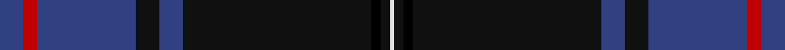

In pattern [BRBKBKKKW](/stripes/brbkbkkkw/).

This was sourced from weddslist.  It is a [9 stripe tartan](/stripes/stripes9/).

Original link http://www.weddslist.com/cgi-bin/tartans/pg.pl?source=sts

## Thread count
B/10 R6 B42 K10 B10 K80 Ka4 K4 LN/2

## Palette
Each colour and the base-6 reference it is a variant of.

| Colour | Shade | Base |
|---|---|---|
| B | <code style="background-color:#304080;">#304080</code> `oklch(39.4% 0.109 270.2)` <small>#304080</small> | B <code style="background-color:#2A418A;">#2A418A</code> |
| K | <code style="background-color:#101010;">#101010</code> `oklch(17.3% 0.000 89.9)` <small>#101010</small> | K <code style="background-color:#000000;">#000000</code> |
| Ka | <code style="background-color:#000000;">#000000</code> `oklch(0.0% 0.000 0.0)` <small>#000000</small> | K <code style="background-color:#000000;">#000000</code> |
| LN | <code style="background-color:#E0E0E0;">#E0E0E0</code> `oklch(90.7% 0.000 89.9)` <small>#E0E0E0</small> | W <code style="background-color:#F7F7F7;">#F7F7F7</code> |
| R | <code style="background-color:#C00000;">#C00000</code> `oklch(50.7% 0.208 29.2)` <small>#C00000</small> | R <code style="background-color:#CC0000;">#CC0000</code> |

## Nearest tartans

The nearest existing variants by ΔTartan distance.

1. [Hope-Weir/Weir](/setts/s8/k8ly1k1db28k12dg2k1t2~x2/) — ΔT 1.02
1. [Al-Fadhli (Personal)](/setts/s10/db3dg3db24k34w1k34db24r3db3w3~x2/) — ΔT 1.06
1. [Nocken Blue Modern Tartan (Personal)](/setts/s9/lr3k6w2k6dt2k2dt32k2n1~x2/) — ΔT 1.09
1. [Nocken (Personal)](/setts/s9/lb3k6lb2k6db2k2db32k2n1~x2/) — ΔT 1.15
1. [Home or Hume (Vestiarium Scoticum)](/setts/s8/k28r1k2r1k8db24dg2db3~x2/) — ΔT 1.19
1. [MacLaurin of Brioch](/setts/s7/db36k10dg3r3dg6k1ly2~x2/) — ΔT 1.21
1. [Hebridean Heather](/setts/s9/n4dt2n7dt30n8dt7r5dt1w2~x2/) — ΔT 1.22
1. [Binder Wedding (Personal)](/setts/s8/g1db1k1db30k30w2db5ly1~x2/) — ΔT 1.29
1. [Caledonian Mist](/setts/s7/dt27k5dp2n1dp1w1dp5~x4/) — ΔT 1.31
1. [McClafferty](/setts/s10/r3g10k12db3k2db2k2db30r4w1~x2/) — ΔT 1.34

## Neighbour map

Every grey dot is one of 14299 variants placed by the first two principal components of the ΔTartan feature space (44% of its variance). Red is this tartan; blue dots are its nearest — click one to open its page.

<svg viewBox="0 0 640 380" role="img" style="max-width:100%;height:auto;border:1px solid #e0e0e0;border-radius:4px;display:block" xmlns="http://www.w3.org/2000/svg"><image href="/nn/cloud.v1.png" width="640" height="380"/><a href="/setts/s8/k8ly1k1db28k12dg2k1t2~x2/"><circle cx="370.7" cy="149.7" r="4" fill="#3465a4"><title>Hope-Weir/Weir</title></circle></a><a href="/setts/s10/db3dg3db24k34w1k34db24r3db3w3~x2/"><circle cx="349.0" cy="142.5" r="4" fill="#3465a4"><title>Al-Fadhli (Personal)</title></circle></a><a href="/setts/s9/lr3k6w2k6dt2k2dt32k2n1~x2/"><circle cx="408.5" cy="125.3" r="4" fill="#3465a4"><title>Nocken Blue Modern Tartan (Personal)</title></circle></a><a href="/setts/s9/lb3k6lb2k6db2k2db32k2n1~x2/"><circle cx="407.1" cy="120.3" r="4" fill="#3465a4"><title>Nocken (Personal)</title></circle></a><a href="/setts/s8/k28r1k2r1k8db24dg2db3~x2/"><circle cx="424.4" cy="177.9" r="4" fill="#3465a4"><title>Home or Hume (Vestiarium Scoticum)</title></circle></a><a href="/setts/s7/db36k10dg3r3dg6k1ly2~x2/"><circle cx="393.9" cy="136.1" r="4" fill="#3465a4"><title>MacLaurin of Brioch</title></circle></a><a href="/setts/s9/n4dt2n7dt30n8dt7r5dt1w2~x2/"><circle cx="368.8" cy="142.2" r="4" fill="#3465a4"><title>Hebridean Heather</title></circle></a><a href="/setts/s8/g1db1k1db30k30w2db5ly1~x2/"><circle cx="358.5" cy="127.2" r="4" fill="#3465a4"><title>Binder Wedding (Personal)</title></circle></a><a href="/setts/s7/dt27k5dp2n1dp1w1dp5~x4/"><circle cx="431.3" cy="139.8" r="4" fill="#3465a4"><title>Caledonian Mist</title></circle></a><a href="/setts/s10/r3g10k12db3k2db2k2db30r4w1~x2/"><circle cx="341.0" cy="140.1" r="4" fill="#3465a4"><title>McClafferty</title></circle></a><circle cx="411.2" cy="130.8" r="5" fill="#c00000"/></svg>

ID: /setts/s9/db5r3db21k5db5k40k2k2w1~x2/
