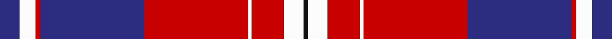

In pattern [BWRBRWRWK](/stripes/bwrbrwrwk/).

This was sourced from tartans-authority.  It is a [9 stripe tartan](/stripes/stripes9/).

Original link http://www.tartansauthority.com/tartan-ferret/display/11186/

## Thread count
DB/10 W8 R2 DB52 R52 W2 R16 W10 K/2

## Palette
Each colour and the base-6 reference it is a variant of.

| Colour | Shade | Base |
|---|---|---|
| DB | <code style="background-color:#2C2C80;">#2C2C80</code> `oklch(35.0% 0.138 276.6)` <small>#2C2C80</small> | B <code style="background-color:#2A418A;">#2A418A</code> |
| K | <code style="background-color:#101010;">#101010</code> `oklch(17.3% 0.000 89.9)` <small>#101010</small> | K <code style="background-color:#000000;">#000000</code> |
| R | <code style="background-color:#C80000;">#C80000</code> `oklch(52.3% 0.215 29.2)` <small>#C80000</small> | R <code style="background-color:#CC0000;">#CC0000</code> |
| W | <code style="background-color:#FCFCFC;">#FCFCFC</code> `oklch(99.1% 0.000 89.9)` <small>#FCFCFC</small> | W <code style="background-color:#F7F7F7;">#F7F7F7</code> |

## Nearest tartans

The nearest existing variants by ΔTartan distance.

1. [Boring and Dull](/setts/s9/db5w4r1db26r25w1r8w5dt1~x2/) — ΔT 0.20
1. [Mercer, James (Personal)](/setts/s9/db24w3db4ly6db4w3db15r52db6/) — ΔT 0.77
1. [Mercer Personal Tartan Tartan Number: 3019. Earliest known date: 2004 Sent to House of Tartan by the owner. See products available Copyright © Blair Urquhart, Comrie, 2015](/setts/s9/db16w2db3ly4db3w2db10r35db4~x2/) — ΔT 0.84
1. [Snoozzzeee (Corporate)](/setts/s9/lb6r3db36r4db12lb24r72lb8db4/) — ΔT 1.08
1. [Richardson](/setts/s10/r25k1ly2k1ly2k1r10db18w2db12~x2/) — ΔT 1.17
1. [Sens](/setts/s10/r26w2ly1k3ly4r8k32w1k1w3~x2/) — ΔT 1.18
1. [Manitoba Masonic (Corporate)](/setts/s8/ly3db8w3db34r34g4r4w2~x2/) — ΔT 1.19
1. [American](/setts/s9/db2r21db1lb4db7lb2db2lb2r2~x4/) — ΔT 1.23
1. [Danish](/setts/s13/w8k1r24k2r4k2r1k2r4k2db20k1w5~x2/) — ΔT 1.25
1. [Sea Dog Bamse, Pride of Norway](/setts/s9/dt3lo2dt32r28w2r2w2r2w3~x2/) — ΔT 1.29

## Neighbour map

Every grey dot is one of 14299 variants placed by the first two principal components of the ΔTartan feature space (44% of its variance). Red is this tartan; blue dots are its nearest — click one to open its page.

<svg viewBox="0 0 640 380" role="img" style="max-width:100%;height:auto;border:1px solid #e0e0e0;border-radius:4px;display:block" xmlns="http://www.w3.org/2000/svg"><image href="/nn/cloud.v1.png" width="640" height="380"/><a href="/setts/s9/db5w4r1db26r25w1r8w5dt1~x2/"><circle cx="284.7" cy="112.1" r="4" fill="#3465a4"><title>Boring and Dull</title></circle></a><a href="/setts/s9/db24w3db4ly6db4w3db15r52db6/"><circle cx="296.7" cy="132.2" r="4" fill="#3465a4"><title>Mercer, James (Personal)</title></circle></a><a href="/setts/s9/db16w2db3ly4db3w2db10r35db4~x2/"><circle cx="301.5" cy="134.6" r="4" fill="#3465a4"><title>Mercer Personal Tartan Tartan Number: 3019. Earliest known date: 2004 Sent to House of Tartan by the owner. See products available Copyright © Blair Urquhart, Comrie, 2015</title></circle></a><a href="/setts/s9/lb6r3db36r4db12lb24r72lb8db4/"><circle cx="307.5" cy="129.1" r="4" fill="#3465a4"><title>Snoozzzeee (Corporate)</title></circle></a><a href="/setts/s10/r25k1ly2k1ly2k1r10db18w2db12~x2/"><circle cx="263.3" cy="91.2" r="4" fill="#3465a4"><title>Richardson</title></circle></a><a href="/setts/s10/r26w2ly1k3ly4r8k32w1k1w3~x2/"><circle cx="293.9" cy="94.0" r="4" fill="#3465a4"><title>Sens</title></circle></a><a href="/setts/s8/ly3db8w3db34r34g4r4w2~x2/"><circle cx="269.7" cy="125.6" r="4" fill="#3465a4"><title>Manitoba Masonic (Corporate)</title></circle></a><a href="/setts/s9/db2r21db1lb4db7lb2db2lb2r2~x4/"><circle cx="339.5" cy="134.7" r="4" fill="#3465a4"><title>American</title></circle></a><a href="/setts/s13/w8k1r24k2r4k2r1k2r4k2db20k1w5~x2/"><circle cx="246.0" cy="90.1" r="4" fill="#3465a4"><title>Danish</title></circle></a><a href="/setts/s9/dt3lo2dt32r28w2r2w2r2w3~x2/"><circle cx="303.1" cy="128.7" r="4" fill="#3465a4"><title>Sea Dog Bamse, Pride of Norway</title></circle></a><circle cx="289.4" cy="114.1" r="5" fill="#c00000"/></svg>

ID: /setts/s9/db5w4r1db26r26w1r8w5k1~x2/
