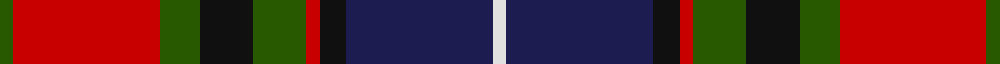

This page is one **sett** — a single exact thread-count. It belongs to the [tartan](/tartans/g1r11g3k4g4r1k2db11ln1/)
(the same proportion at any scale), whose colour order is pattern [GRGKGRKBW](/stripes/grgkgrkbw/).

Sourced from tartans-authority.  It is a [9 stripe tartan](/stripes/stripes9/).

Original link http://www.tartansauthority.com/tartan-ferret/display/987/

## Thread count
G/2 R22 G6 K8 G8 R2 K4 DB22 LN/2

## Palette
Each colour and the base-6 reference it is a variant of.

| Colour | Shade | Base |
|---|---|---|
| DB | <code style="background-color:#1C1C50;">#1C1C50</code> `oklch(26.2% 0.093 277.9)` <small>#1C1C50</small> | B <code style="background-color:#2A418A;">#2A418A</code> |
| G | <code style="background-color:#285800;">#285800</code> `oklch(41.0% 0.122 135.8)` <small>#285800</small> | G <code style="background-color:#006100;">#006100</code> |
| K | <code style="background-color:#101010;">#101010</code> `oklch(17.3% 0.000 89.9)` <small>#101010</small> | K <code style="background-color:#000000;">#000000</code> |
| LN | <code style="background-color:#E0E0E0;">#E0E0E0</code> `oklch(90.7% 0.000 89.9)` <small>#E0E0E0</small> | W <code style="background-color:#F7F7F7;">#F7F7F7</code> |
| R | <code style="background-color:#C80000;">#C80000</code> `oklch(52.3% 0.215 29.2)` <small>#C80000</small> | R <code style="background-color:#CC0000;">#CC0000</code> |

## Nearest tartans

The nearest existing variants by ΔTartan distance, with this tartan at the top so the swatches line up against it.

ΔTartan

Tartan

Sett

—

<a href="/ttd/edit/#slug=dg1r11dg3k4dg4r1k2db11w1~x2">Manson (Name)</a> <a class="nn-out" href="/setts/s9/dg1r11dg3k4dg4r1k2db11w1~x2/" title="open its dictionary page">↗</a>

0.65

<a href="/ttd/edit/#slug=k3dg17k9r2db17r2db2r17dg2w2~x2">MacInroy (Rattray)</a> <a class="nn-out" href="/setts/s10/k3dg17k9r2db17r2db2r17dg2w2~x2/" title="open its dictionary page">↗</a>

0.76

<a href="/ttd/edit/#slug=r6db6r3db3r3db28k21g28r21k2ly4">MacLagan of Glenquiech</a> <a class="nn-out" href="/setts/s11/r6db6r3db3r3db28k21g28r21k2ly4/" title="open its dictionary page">↗</a>

0.78

<a href="/ttd/edit/#slug=r4g6ly3g12k14db5r20db5k4db2~x2">Etienne-Carter, Sir George</a> <a class="nn-out" href="/setts/s10/r4g6ly3g12k14db5r20db5k4db2~x2/" title="open its dictionary page">↗</a>

0.79

<a href="/ttd/edit/#slug=k1g8k4r1db8r1db1r8g1w1~x4">Rattray of Lude</a> <a class="nn-out" href="/setts/s10/k1g8k4r1db8r1db1r8g1w1~x4/" title="open its dictionary page">↗</a>

0.87

<a href="/ttd/edit/#slug=db6k3r14k3g14k3db6ly1~x4">Kilgour (Asymmetrical)</a> <a class="nn-out" href="/setts/s8/db6k3r14k3g14k3db6ly1~x4/" title="open its dictionary page">↗</a>

0.87

<a href="/ttd/edit/#slug=db6ly1db6k3r14k3g14k3~x4">Kilgour (Cant)</a> <a class="nn-out" href="/setts/s8/db6ly1db6k3r14k3g14k3~x4/" title="open its dictionary page">↗</a>

0.87

<a href="/ttd/edit/#slug=db6k3g14k3r14k3db6ly1~x4">Kilgour (Symmetrical)</a> <a class="nn-out" href="/setts/s8/db6k3g14k3r14k3db6ly1~x4/" title="open its dictionary page">↗</a>

0.91

<a href="/ttd/edit/#slug=r6g3r24t7r4t7k18g4k7g3">Law Society of Scotland (Corporate)</a> <a class="nn-out" href="/setts/s10/r6g3r24t7r4t7k18g4k7g3/" title="open its dictionary page">↗</a>

0.96

<a href="/ttd/edit/#slug=r4dg7ly3dg12k16t5r20t5k4t2~x2">Unidentified #9</a> <a class="nn-out" href="/setts/s10/r4dg7ly3dg12k16t5r20t5k4t2~x2/" title="open its dictionary page">↗</a>

0.97

<a href="/ttd/edit/#slug=db18k5r26k5g25k5db18ly2~x2">St. Clement of Rome (Corporate)</a> <a class="nn-out" href="/setts/s8/db18k5r26k5g25k5db18ly2~x2/" title="open its dictionary page">↗</a>

## Neighbour map

Every grey dot is one of 14299 variants placed by the first two principal components of the ΔTartan feature space (44% of its variance). Red is this tartan; blue dots are its nearest — click one to open its page.

<svg viewBox="0 0 640 380" role="img" style="max-width:100%;height:auto;border:1px solid #e0e0e0;border-radius:4px;display:block" xmlns="http://www.w3.org/2000/svg"><image href="/nn/cloud.v1.png" width="640" height="380"/><a href="/setts/s10/k3dg17k9r2db17r2db2r17dg2w2~x2/"><circle cx="133.5" cy="171.8" r="4" fill="#3465a4"><title>MacInroy (Rattray)</title></circle></a><a href="/setts/s11/r6db6r3db3r3db28k21g28r21k2ly4/"><circle cx="143.5" cy="147.8" r="4" fill="#3465a4"><title>MacLagan of Glenquiech</title></circle></a><a href="/setts/s10/r4g6ly3g12k14db5r20db5k4db2~x2/"><circle cx="124.8" cy="172.3" r="4" fill="#3465a4"><title>Etienne-Carter, Sir George</title></circle></a><a href="/setts/s10/k1g8k4r1db8r1db1r8g1w1~x4/"><circle cx="123.8" cy="165.9" r="4" fill="#3465a4"><title>Rattray of Lude</title></circle></a><a href="/setts/s8/db6k3r14k3g14k3db6ly1~x4/"><circle cx="137.0" cy="174.1" r="4" fill="#3465a4"><title>Kilgour (Asymmetrical)</title></circle></a><a href="/setts/s8/db6ly1db6k3r14k3g14k3~x4/"><circle cx="137.0" cy="174.1" r="4" fill="#3465a4"><title>Kilgour (Cant)</title></circle></a><a href="/setts/s8/db6k3g14k3r14k3db6ly1~x4/"><circle cx="137.0" cy="174.1" r="4" fill="#3465a4"><title>Kilgour (Symmetrical)</title></circle></a><a href="/setts/s10/r6g3r24t7r4t7k18g4k7g3/"><circle cx="164.5" cy="187.3" r="4" fill="#3465a4"><title>Law Society of Scotland (Corporate)</title></circle></a><a href="/setts/s10/r4dg7ly3dg12k16t5r20t5k4t2~x2/"><circle cx="114.5" cy="168.0" r="4" fill="#3465a4"><title>Unidentified #9</title></circle></a><a href="/setts/s8/db18k5r26k5g25k5db18ly2~x2/"><circle cx="158.9" cy="185.2" r="4" fill="#3465a4"><title>St. Clement of Rome (Corporate)</title></circle></a><circle cx="154.0" cy="164.7" r="5" fill="#c00000"/></svg>

ID: /setts/s9/dg1r11dg3k4dg4r1k2db11w1~x2/
