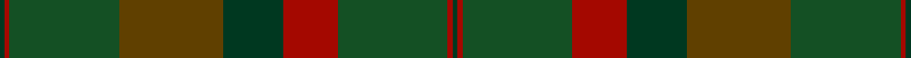

This page is one **sett** — a single exact thread-count. It belongs to the [tartan](/tartans/dg1dr1g22t21dg12dr11g22dr1dg1/)
(the same proportion at any scale), whose colour order is pattern [GRGGGRGRG](/stripes/grgggrgrg/).

Sourced from tartans-authority.  It is a [9 stripe tartan](/stripes/stripes9/).

Original link http://www.tartansauthority.com/tartan-ferret/display/7852/

## Also known as

This cloth is also recorded under:

- Macnaughton Hunting

2 attestations — the source records this cloth was collapsed from (oldest owns this page)

<ul>
<li>Dec. 2008 — MacNaughton Htg (tartans-authority, <a href="http://www.tartansauthority.com/tartan-ferret/display/7852/">record</a>)</li>
<li>undated — Macnaughton Hunting (register-of-tartans, <a href="https://www.tartanregister.gov.uk/tartanDetails.aspx?ref=5804">record</a>)</li>
</ul>

## Register references

External register numbers recorded for this tartan.

- Scottish Register of Tartans: [5804](https://www.tartanregister.gov.uk/tartanDetails.aspx?ref=5804)
- Scottish Tartans Authority (ITI): 7852

## Thread count
DG/2 DR2 G44 T42 DG24 DR22 G44 DR2 DG/2

## Palette
Each colour and the base-6 reference it is a variant of.

| Colour | Shade | Base |
|---|---|---|
| DG | <code style="background-color:#003820;">#003820</code> `oklch(30.0% 0.070 158.3)` <small>#003820</small> | G <code style="background-color:#006100;">#006100</code> |
| DR | <code style="background-color:#A40800;">#A40800</code> `oklch(45.4% 0.183 29.9)` <small>#A40800</small> | R <code style="background-color:#CC0000;">#CC0000</code> |
| G | <code style="background-color:#145024;">#145024</code> `oklch(38.2% 0.095 148.5)` <small>#145024</small> | G <code style="background-color:#006100;">#006100</code> |
| T | <code style="background-color:#604000;">#604000</code> `oklch(39.8% 0.083 76.8)` <small>#604000</small> | G <code style="background-color:#006100;">#006100</code> |

## Nearest tartans

The nearest existing variants by ΔTartan distance, with this tartan at the top so the swatches line up against it.

ΔTartan

Tartan

Sett

—

<a href="/ttd/edit/#slug=dg1r1dg22dy21dg12r11dg22r1dg1~x2">MacNaughton Htg</a> <a class="nn-out" href="/setts/s9/dg1r1dg22dy21dg12r11dg22r1dg1~x2/" title="open its dictionary page">↗</a>

1.20

<a href="/ttd/edit/#slug=dg5k2dg28k10dy26db4dg4~x2">John Telfar Dunbar Hunting</a> <a class="nn-out" href="/setts/s7/dg5k2dg28k10dy26db4dg4~x2/" title="open its dictionary page">↗</a>

1.44

<a href="/ttd/edit/#slug=k2y7k1y9dy21o2dy1o1dy2~x2">Historic Scotland Corporate Tartan Tartan Number: 2122. Earliest known date: 1988 Custodians at Historic Scotland properties throughout Scotland, including Edinburgh Castle, wear this distinctive tartan. See products available Copyright © Blair Urquhart, Comrie, 2015</a> <a class="nn-out" href="/setts/s9/k2y7k1y9dy21o2dy1o1dy2~x2/" title="open its dictionary page">↗</a>

1.67

<a href="/ttd/edit/#slug=dy31do3dy3do3dy3do22y26r4~x2">Devarr (Fashion)</a> <a class="nn-out" href="/setts/s8/dy31do3dy3do3dy3do22y26r4~x2/" title="open its dictionary page">↗</a>

1.69

<a href="/ttd/edit/#slug=dg11n4dg6dy11n1k1dy4~x4">Calais (Fashion)</a> <a class="nn-out" href="/setts/s7/dg11n4dg6dy11n1k1dy4~x4/" title="open its dictionary page">↗</a>

1.72

<a href="/setts/s12/y23o4dy6g6y4lb1y4~x4/">Tricor</a>

1.74

<a href="/ttd/edit/#slug=k3n3k3n21n21k3n3lr1~x2">Granite City (Fashion)</a> <a class="nn-out" href="/setts/s8/k3n3k3n21n21k3n3lr1~x2/" title="open its dictionary page">↗</a>

1.79

<a href="/ttd/edit/#slug=dg18dg4t1dg5dg6dg3k1dy6k1dg25t1~x2">Mack of Stoneywood Hunting (Pers.)</a> <a class="nn-out" href="/setts/s11/dg18dg4t1dg5dg6dg3k1dy6k1dg25t1~x2/" title="open its dictionary page">↗</a>

1.85

<a href="/ttd/edit/#slug=y9g13dg26dy6dp5dy40dp5dy6dg26g13y9dg3~x2">de Meuron (Family)</a> <a class="nn-out" href="/setts/s12/y9g13dg26dy6dp5dy40dp5dy6dg26g13y9dg3~x2/" title="open its dictionary page">↗</a>

1.86

<a href="/ttd/edit/#slug=dg3dt20dg16r2dg2r3dg3r5dg16dt20ly1k2~x2">Alasdair Dhana</a> <a class="nn-out" href="/setts/s12/dg3dt20dg16r2dg2r3dg3r5dg16dt20ly1k2~x2/" title="open its dictionary page">↗</a>

1.86

<a href="/ttd/edit/#slug=do1n2g6n1do3t1n12do1n1g1~x4">Wicklow, County (District)</a> <a class="nn-out" href="/setts/s10/do1n2g6n1do3t1n12do1n1g1~x4/" title="open its dictionary page">↗</a>

## Neighbour map

Every grey dot is one of 14299 variants placed by the first two principal components of the ΔTartan feature space (44% of its variance). Red is this tartan; blue dots are its nearest — click one to open its page.

<svg viewBox="0 0 640 380" role="img" style="max-width:100%;height:auto;border:1px solid #e0e0e0;border-radius:4px;display:block" xmlns="http://www.w3.org/2000/svg"><image href="/nn/cloud.v1.png" width="640" height="380"/><a href="/setts/s7/dg5k2dg28k10dy26db4dg4~x2/"><circle cx="392.1" cy="269.1" r="4" fill="#3465a4"><title>John Telfar Dunbar Hunting</title></circle></a><a href="/setts/s9/k2y7k1y9dy21o2dy1o1dy2~x2/"><circle cx="457.3" cy="212.9" r="4" fill="#3465a4"><title>Historic Scotland Corporate Tartan Tartan Number: 2122. Earliest known date: 1988 Custodians at Historic Scotland properties throughout Scotland, including Edinburgh Castle, wear this distinctive tartan. See products available Copyright © Blair Urquhart, Comrie, 2015</title></circle></a><a href="/setts/s8/dy31do3dy3do3dy3do22y26r4~x2/"><circle cx="364.3" cy="266.0" r="4" fill="#3465a4"><title>Devarr (Fashion)</title></circle></a><a href="/setts/s7/dg11n4dg6dy11n1k1dy4~x4/"><circle cx="369.6" cy="292.4" r="4" fill="#3465a4"><title>Calais (Fashion)</title></circle></a><a href="/setts/s12/y23o4dy6g6y4lb1y4~x4/"><circle cx="385.0" cy="190.5" r="4" fill="#3465a4"><title>Tricor</title></circle></a><a href="/setts/s8/k3n3k3n21n21k3n3lr1~x2/"><circle cx="395.2" cy="224.8" r="4" fill="#3465a4"><title>Granite City (Fashion)</title></circle></a><a href="/setts/s11/dg18dg4t1dg5dg6dg3k1dy6k1dg25t1~x2/"><circle cx="449.5" cy="209.6" r="4" fill="#3465a4"><title>Mack of Stoneywood Hunting (Pers.)</title></circle></a><a href="/setts/s12/y9g13dg26dy6dp5dy40dp5dy6dg26g13y9dg3~x2/"><circle cx="276.2" cy="232.2" r="4" fill="#3465a4"><title>de Meuron (Family)</title></circle></a><a href="/setts/s12/dg3dt20dg16r2dg2r3dg3r5dg16dt20ly1k2~x2/"><circle cx="382.4" cy="219.3" r="4" fill="#3465a4"><title>Alasdair Dhana</title></circle></a><a href="/setts/s10/do1n2g6n1do3t1n12do1n1g1~x4/"><circle cx="455.6" cy="245.1" r="4" fill="#3465a4"><title>Wicklow, County (District)</title></circle></a><circle cx="401.8" cy="242.5" r="5" fill="#c00000"/></svg>

ID: /setts/s9/dg1r1dg22dy21dg12r11dg22r1dg1~x2/
