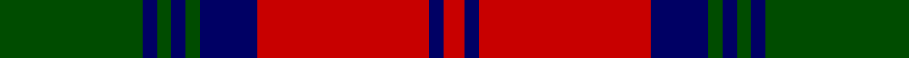

In pattern [GBGBGBRBR](/stripes/gbgbgbrbr/).

This was sourced from weddslist.  It is a [9 stripe tartan](/stripes/stripes9/).

Original link http://www.weddslist.com/cgi-bin/tartans/pg.pl?source=rb

## Also known as

This cloth is also recorded under:

- Lindsay

## Thread count
G/20 DB2 G2 DB2 G2 DB8 R24 DB2 R/3

## Palette
Each colour and the base-6 reference it is a variant of.

| Colour | Shade | Base |
|---|---|---|
| DB | <code style="background-color:#000064;">#000064</code> `oklch(22.7% 0.158 264.1)` <small>#000064</small> | B <code style="background-color:#2A418A;">#2A418A</code> |
| G | <code style="background-color:#004C00;">#004C00</code> `oklch(36.1% 0.123 142.5)` <small>#004C00</small> | G <code style="background-color:#006100;">#006100</code> |
| R | <code style="background-color:#C80000;">#C80000</code> `oklch(52.3% 0.215 29.2)` <small>#C80000</small> | R <code style="background-color:#CC0000;">#CC0000</code> |

## Nearest tartans

The nearest existing variants by ΔTartan distance.

1. [City of Armadale](/setts/s10/k21g2k2g2k3g15r29g2r2g4~x2/) — ΔT 0.75
1. [Douglas (WCWM)](/setts/s10/k2r24n24k2n2k2n3k14r2k2~x2/) — ΔT 0.88
1. [Lindsay](/setts/s9/g20db2g2db2g2db8r24db2r3~x2/) — ΔT 0.98
1. [Private SA Club](/setts/s8/k3r8k3r8lo19r7dt36r3~x2/) — ΔT 1.06
1. [Lindsay #2](/setts/s9/dg12dg1dg1dg1dg1k5r10k1r2~x2/) — ΔT 1.07
1. [Logan - 1810 (Cockburn Collection)](/setts/s7/k14r6k2r6dg25r6k2~x2/) — ΔT 1.09
1. [Unidentified Specimen #2](/setts/s10/w1dg1r1dg14r1db6r11dg1r1w1~x4/) — ΔT 1.15
1. [Stewart of Atholl (Clan)](/setts/s9/dg22k1dg2k1dg3k8r20k1r3~x4/) — ΔT 1.16
1. [Frasers Highlanders (Military?)](/setts/s12/r28g2r2g2db12g18r2g18db12r15g2r3~x2/) — ΔT 1.18
1. [Stuart/Stewart of Urrard](/setts/s14/dg6r2dg2r18db9r3dg3r3db9r3dg24r2dg2r4~x2/) — ΔT 1.18

## Neighbour map

Every grey dot is one of 14299 variants placed by the first two principal components of the ΔTartan feature space (44% of its variance). Red is this tartan; blue dots are its nearest — click one to open its page.

<svg viewBox="0 0 640 380" role="img" style="max-width:100%;height:auto;border:1px solid #e0e0e0;border-radius:4px;display:block" xmlns="http://www.w3.org/2000/svg"><image href="/nn/cloud.v1.png" width="640" height="380"/><a href="/setts/s10/k21g2k2g2k3g15r29g2r2g4~x2/"><circle cx="261.7" cy="164.5" r="4" fill="#3465a4"><title>City of Armadale</title></circle></a><a href="/setts/s10/k2r24n24k2n2k2n3k14r2k2~x2/"><circle cx="248.9" cy="169.9" r="4" fill="#3465a4"><title>Douglas (WCWM)</title></circle></a><a href="/setts/s9/g20db2g2db2g2db8r24db2r3~x2/"><circle cx="253.9" cy="161.2" r="4" fill="#3465a4"><title>Lindsay</title></circle></a><a href="/setts/s8/k3r8k3r8lo19r7dt36r3~x2/"><circle cx="229.6" cy="173.0" r="4" fill="#3465a4"><title>Private SA Club</title></circle></a><a href="/setts/s9/dg12dg1dg1dg1dg1k5r10k1r2~x2/"><circle cx="247.5" cy="167.1" r="4" fill="#3465a4"><title>Lindsay #2</title></circle></a><a href="/setts/s7/k14r6k2r6dg25r6k2~x2/"><circle cx="250.3" cy="206.4" r="4" fill="#3465a4"><title>Logan - 1810 (Cockburn Collection)</title></circle></a><a href="/setts/s10/w1dg1r1dg14r1db6r11dg1r1w1~x4/"><circle cx="260.0" cy="141.9" r="4" fill="#3465a4"><title>Unidentified Specimen #2</title></circle></a><a href="/setts/s9/dg22k1dg2k1dg3k8r20k1r3~x4/"><circle cx="327.5" cy="162.1" r="4" fill="#3465a4"><title>Stewart of Atholl (Clan)</title></circle></a><a href="/setts/s12/r28g2r2g2db12g18r2g18db12r15g2r3~x2/"><circle cx="273.3" cy="180.0" r="4" fill="#3465a4"><title>Frasers Highlanders (Military?)</title></circle></a><a href="/setts/s14/dg6r2dg2r18db9r3dg3r3db9r3dg24r2dg2r4~x2/"><circle cx="271.3" cy="171.1" r="4" fill="#3465a4"><title>Stuart/Stewart of Urrard</title></circle></a><circle cx="274.6" cy="177.2" r="5" fill="#c00000"/></svg>

ID: /setts/s9/dg20db2dg2db2dg2db8r24db2r3/
