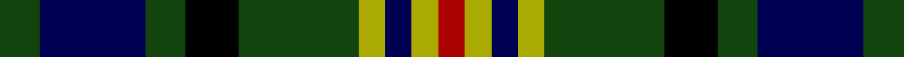

**Bands:** [RYBYGKGBG](/stripes/rybygkgbg/) · **Stripes:** [R LY DB LY DG K DG DB DG](/stripes/stripes9/) R LY DB LY DG K DG DB DG

This was sourced from weddslist.  It is a [9 band tartan](/bands/bands9/).

Original link http://www.weddslist.com/cgi-bin/tartans/pg.pl?source=x

## Register references

External register numbers recorded for this tartan.

- Scottish Register of Tartans: [1166](https://www.tartanregister.gov.uk/tartanDetails.aspx?ref=1166)
- Scottish Register of Tartans: [1758](https://www.tartanregister.gov.uk/tartanDetails.aspx?ref=1758)
- Scottish Register of Tartans: [2307](https://www.tartanregister.gov.uk/tartanDetails.aspx?ref=2307)
- Scottish Register of Tartans: [2540](https://www.tartanregister.gov.uk/tartanDetails.aspx?ref=2540)
- Scottish Register of Tartans: [2625](https://www.tartanregister.gov.uk/tartanDetails.aspx?ref=2625)
- Scottish Register of Tartans: [2862](https://www.tartanregister.gov.uk/tartanDetails.aspx?ref=2862)
- Scottish Register of Tartans: [982](https://www.tartanregister.gov.uk/tartanDetails.aspx?ref=982)
- Scottish Tartans Authority (ITI): 1429
- Scottish Tartans Authority (ITI): 218
- Scottish Tartans World Register: 1042
- Scottish Tartans World Register: 127
- Scottish Tartans World Register: 1429
- Scottish Tartans World Register: 218
- Scottish Tartans World Register: 2218
- Scottish Tartans World Register: 737
- Scottish Tartans World Register: 897

## Variants

Other setts woven to the same stripe pattern.

- [Maitland](/setts/s9/dg3db9dg3k4dg8ly2db2ly2r2/)
- [Maitland](/setts/s9/dg3db8dg3k4dg9ly2db2ly2r2~x2/)

## Thread count
DG/3 DB8 DG3 K4 DG9 LG2 DB2 LG2 DR/2

## Palette
Each colour and its ΔE from the base-6 reference it is a variant of.

| Colour | Shade | Base | ΔE (OKLab) |
|---|---|---|---|
| DB | <code style="background-color:#000052;">#000052</code> `#000052` | B <code style="background-color:#2A418A;">#2A418A</code> | 0.20 |
| DG | <code style="background-color:#11450D;">#11450D</code> `#11450D` | G <code style="background-color:#006100;">#006100</code> | 0.09 |
| DR | <code style="background-color:#AA0000;">#AA0000</code> `#AA0000` | R <code style="background-color:#CC0000;">#CC0000</code> | 0.07 |
| K | <code style="background-color:#000000;">#000000</code> `#000000` | K <code style="background-color:#000000;">#000000</code> | 0.00 |
| LG | <code style="background-color:#AAAA00;">#AAAA00</code> `#AAAA00` | Y <code style="background-color:#F2BF00;">#F2BF00</code> | 0.13 |

## Nearest tartans

The nearest existing variants by ΔTartan distance.

1. [Maitland](/setts/s9/dg3db8dg3k4dg9ly2db2ly2r2~x2/) — ΔT 0.00
1. [Maitland](/setts/s9/dg3db9dg3k4dg8ly2db2ly2r2/) — ΔT 0.53
1. [MacKean Dress (Personal)](/setts/s9/r1k2g4k1g1k2db3k1w1~x6/) — ΔT 0.77
1. [Vosko](/setts/s9/db8k4lo2k3r2k3lo2k4g8~x4/) — ΔT 0.84
1. [Wilson's No.194](/setts/s10/k3r1g5k3w1dp3~x2/) — ΔT 0.98
1. [Scottish Tartan Society](/setts/s9/db20k10lo3k7r4k7lo3k8g20~x2/) — ΔT 0.99
1. [MacKean dress](/setts/s9/r1k2dg4k1dg1k2db3k1w1~x6/) — ΔT 1.00
1. [MacRae Hunting](/setts/s8/dg24k4dg6r4dg6k19dt22w5~x2/) — ΔT 1.01
1. [CSCA (Corporate)](/setts/s8/g5r4g19k10g8w4db18r4~x2/) — ΔT 1.01
1. [MacCallum, of Berwick](/setts/s9/db10r7db31k25g23k8db7k8ly5~x2/) — ΔT 1.02

## Neighbour map

Every grey dot is one of 14299 variants placed by the first two principal components of the ΔTartan feature space (44% of its variance). Red is this tartan; blue dots are its nearest — click one to open its page.

<svg viewBox="0 0 640 380" role="img" style="max-width:100%;height:auto;border:1px solid #e0e0e0;border-radius:4px;display:block" xmlns="http://www.w3.org/2000/svg"><image href="/nn/cloud.v1.png" width="640" height="380"/><a href="/setts/s9/dg3db8dg3k4dg9ly2db2ly2r2~x2/"><circle cx="134.6" cy="228.7" r="4" fill="#3465a4"><title>Maitland</title></circle></a><a href="/setts/s9/dg3db9dg3k4dg8ly2db2ly2r2/"><circle cx="109.3" cy="221.6" r="4" fill="#3465a4"><title>Maitland</title></circle></a><a href="/setts/s9/r1k2g4k1g1k2db3k1w1~x6/"><circle cx="100.2" cy="236.6" r="4" fill="#3465a4"><title>MacKean Dress (Personal)</title></circle></a><a href="/setts/s9/db8k4lo2k3r2k3lo2k4g8~x4/"><circle cx="104.6" cy="241.3" r="4" fill="#3465a4"><title>Vosko</title></circle></a><a href="/setts/s10/k3r1g5k3w1dp3~x2/"><circle cx="109.1" cy="220.6" r="4" fill="#3465a4"><title>Wilson's No.194</title></circle></a><a href="/setts/s9/db20k10lo3k7r4k7lo3k8g20~x2/"><circle cx="149.1" cy="217.1" r="4" fill="#3465a4"><title>Scottish Tartan Society</title></circle></a><a href="/setts/s9/r1k2dg4k1dg1k2db3k1w1~x6/"><circle cx="89.3" cy="233.9" r="4" fill="#3465a4"><title>MacKean dress</title></circle></a><a href="/setts/s8/dg24k4dg6r4dg6k19dt22w5~x2/"><circle cx="156.9" cy="221.2" r="4" fill="#3465a4"><title>MacRae Hunting</title></circle></a><a href="/setts/s8/g5r4g19k10g8w4db18r4~x2/"><circle cx="140.9" cy="224.8" r="4" fill="#3465a4"><title>CSCA (Corporate)</title></circle></a><a href="/setts/s9/db10r7db31k25g23k8db7k8ly5~x2/"><circle cx="120.2" cy="206.3" r="4" fill="#3465a4"><title>MacCallum, of Berwick</title></circle></a><circle cx="134.6" cy="228.7" r="5" fill="#c00000"/></svg>

ID: /setts/s9/dg3db8dg3k4dg9ly2db2ly2r2/
