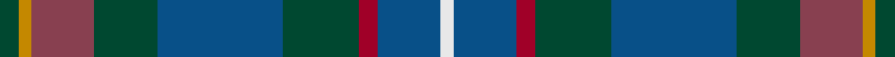

In pattern [GYRGBGRBW](/stripes/gyrgbgrbw/).

This was sourced from house-of-tartan.  It is a [9 stripe tartan](/stripes/stripes9/).

Original link http://www.house-of-tartan.scotland.net/house/TartanViewjs.asp?colr=Def&tnam=10924

## Thread count
DG/6 DY4 DR20 DG20 B40 DG24 DRa6 B20 LN/4

## Palette
Each colour and the base-6 reference it is a variant of.

| Colour | Shade | Base |
|---|---|---|
| B | <code style="background-color:#085088;">#085088</code> `oklch(42.3% 0.113 249.3)` <small>#085088</small> | B <code style="background-color:#2A418A;">#2A418A</code> |
| DG | <code style="background-color:#004830;">#004830</code> `oklch(35.5% 0.077 163.0)` <small>#004830</small> | G <code style="background-color:#006100;">#006100</code> |
| DR | <code style="background-color:#884050;">#884050</code> `oklch(46.9% 0.099 7.7)` <small>#884050</small> | R <code style="background-color:#CC0000;">#CC0000</code> |
| DRa | <code style="background-color:#A00028;">#A00028</code> `oklch(44.7% 0.179 19.5)` <small>#A00028</small> | R <code style="background-color:#CC0000;">#CC0000</code> |
| DY | <code style="background-color:#C48800;">#C48800</code> `oklch(67.0% 0.140 77.5)` <small>#C48800</small> | Y <code style="background-color:#F2BF00;">#F2BF00</code> |
| LN | <code style="background-color:#E8E8E8;">#E8E8E8</code> `oklch(93.1% 0.000 89.9)` <small>#E8E8E8</small> | W <code style="background-color:#F7F7F7;">#F7F7F7</code> |

## Nearest tartans

The nearest existing variants by ΔTartan distance.

1. [Blairmore House (Corporate)](/setts/s8/db17lb2db2r2db2do12dg16lo3~x4/) — ΔT 1.08
1. [Copar a'Beannichte (Personal)](/setts/s9/g20g6dg15dt5dg2dt15o4dt10r2~x2/) — ΔT 1.19
1. [Westbrook (2013)](/setts/s9/dg15y3dr2y3dg8b12db20r2db4~x2/) — ΔT 1.20
1. [Seaford House](/setts/s9/t3dt3t12dt26dg26r3dg26dt28w3/) — ΔT 1.29
1. [Patel (2013)](/setts/s9/dg3lo2m10dg10b20dg12r3b10w2~x2/) — ΔT 1.32
1. [Remember the Somme 1916](/setts/s8/dg5g2db2db15r2lg2dg5r2~x4/) — ΔT 1.34
1. [State Seal of Iowa (Fashion)](/setts/s8/dt5b43dt18lb4b6r5dy25lo5~x2/) — ΔT 1.35
1. [Cowie](/setts/s6/r3dt24k7db11g11ly2~x2/) — ΔT 1.36
1. [MacConnell](/setts/s10/dt20dg6dt6lb2dg20r8dg6r4dg10lr3~x2/) — ΔT 1.39
1. [Blairmore House](/setts/s8/db17w2db2r2db2do12dg16lo3~x4/) — ΔT 1.39

## Neighbour map

Every grey dot is one of 14299 variants placed by the first two principal components of the ΔTartan feature space (44% of its variance). Red is this tartan; blue dots are its nearest — click one to open its page.

<svg viewBox="0 0 640 380" role="img" style="max-width:100%;height:auto;border:1px solid #e0e0e0;border-radius:4px;display:block" xmlns="http://www.w3.org/2000/svg"><image href="/nn/cloud.v1.png" width="640" height="380"/><a href="/setts/s8/db17lb2db2r2db2do12dg16lo3~x4/"><circle cx="193.6" cy="198.5" r="4" fill="#3465a4"><title>Blairmore House (Corporate)</title></circle></a><a href="/setts/s9/g20g6dg15dt5dg2dt15o4dt10r2~x2/"><circle cx="192.0" cy="219.5" r="4" fill="#3465a4"><title>Copar a'Beannichte (Personal)</title></circle></a><a href="/setts/s9/dg15y3dr2y3dg8b12db20r2db4~x2/"><circle cx="175.9" cy="195.7" r="4" fill="#3465a4"><title>Westbrook (2013)</title></circle></a><a href="/setts/s9/t3dt3t12dt26dg26r3dg26dt28w3/"><circle cx="248.8" cy="221.2" r="4" fill="#3465a4"><title>Seaford House</title></circle></a><a href="/setts/s9/dg3lo2m10dg10b20dg12r3b10w2~x2/"><circle cx="185.8" cy="189.7" r="4" fill="#3465a4"><title>Patel (2013)</title></circle></a><a href="/setts/s8/dg5g2db2db15r2lg2dg5r2~x4/"><circle cx="222.5" cy="202.0" r="4" fill="#3465a4"><title>Remember the Somme 1916</title></circle></a><a href="/setts/s8/dt5b43dt18lb4b6r5dy25lo5~x2/"><circle cx="219.6" cy="176.1" r="4" fill="#3465a4"><title>State Seal of Iowa (Fashion)</title></circle></a><a href="/setts/s6/r3dt24k7db11g11ly2~x2/"><circle cx="197.1" cy="207.8" r="4" fill="#3465a4"><title>Cowie</title></circle></a><a href="/setts/s10/dt20dg6dt6lb2dg20r8dg6r4dg10lr3~x2/"><circle cx="279.0" cy="225.0" r="4" fill="#3465a4"><title>MacConnell</title></circle></a><a href="/setts/s8/db17w2db2r2db2do12dg16lo3~x4/"><circle cx="176.9" cy="189.6" r="4" fill="#3465a4"><title>Blairmore House</title></circle></a><circle cx="220.0" cy="210.1" r="5" fill="#c00000"/></svg>

ID: /setts/s9/dg3lo2o10dg10db20dg12r3db10w2~x2/
