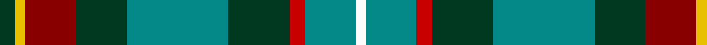

**Bands:** [GYRGGGRGW](/stripes/gyrgggrgw/) · **Stripes:** [DG LY R DG G DG R G W](/stripes/stripes9/) DG LY R DG G DG R G W

This was sourced from tartans-authority.  It is a [9 band tartan](/bands/bands9/).

Original link http://www.tartansauthority.com/tartan-ferret/display/10924/

## Thread count
DG/6 Y4 DR20 DG20 B40 DG24 R6 B20 W/4

## Palette
Each colour and its ΔE from the base-6 reference it is a variant of.

| Colour | Shade | Base | ΔE (OKLab) |
|---|---|---|---|
| B | <code style="background-color:#048888;">#048888</code> `#048888` | G <code style="background-color:#006100;">#006100</code> | 0.18 |
| DG | <code style="background-color:#003820;">#003820</code> `#003820` | G <code style="background-color:#006100;">#006100</code> | 0.15 |
| DR | <code style="background-color:#880000;">#880000</code> `#880000` | R <code style="background-color:#CC0000;">#CC0000</code> | 0.15 |
| R | <code style="background-color:#C80000;">#C80000</code> `#C80000` | R <code style="background-color:#CC0000;">#CC0000</code> | 0.01 |
| W | <code style="background-color:#FCFCFC;">#FCFCFC</code> `#FCFCFC` | W <code style="background-color:#F7F7F7;">#F7F7F7</code> | 0.01 |
| Y | <code style="background-color:#E8C000;">#E8C000</code> `#E8C000` | Y <code style="background-color:#F2BF00;">#F2BF00</code> | 0.02 |

## Nearest tartans

The nearest existing variants by ΔTartan distance.

1. [Ayrshire](/setts/s8/db2r1db10w1o4g8ly1g2~x4/) — ΔT 0.87
1. [Ayrshire District Tartan Tartan Number: 436. Earliest known date: 1988 Dr Phil Smith, a Fellow of the Scottish Tartans Society, designed the Ayrshire district tartan at the suggestion of the Clan Boyd and Clan Cunningham Societies. In his book, 'District Tartans' (1992) co-authored with Dr G Teall, he says, the colours "..reflect the gold of the rising sun, the green of the land and brown of the coast, the blue of the sea and the red of the setting sun. The Ayrshire tartan is intended for those with connections in the districts of Kyle, Cunninghame and Inverclyde." See products available Copyright © Blair Urquhart, Comrie, 2015](/setts/s8/db2r1db10w1dy4g8ly1g2~x4/) — ΔT 1.00
1. [Connelly, James (Personal)](/setts/s8/dg12g6r1dg6g4dp8ly2w2~x4/) — ΔT 1.00
1. [Loch Lomond Millenium Comemmorative Tartan Tartan Number: 2520. Earliest known date: 2002 Designed by Claire Donaldson of the House of Edgar. The application states that it is restricted to H of E by copyright. However, the fabric is produced by Lochcarron. See products available Copyright © Blair Urquhart, Comrie, 2015](/setts/s11/k3g2k12db4g19r3g19db4k12g2ly3~x2/) — ΔT 1.04
1. [State Seal of Kansas (Fashion)](/setts/s9/lo5g23b21lo30k10lo4g4lo16lb3~x2/) — ΔT 1.04
1. [Moskova](/setts/s12/db2g9k1r6k1g4db4ly1k4w1g5k2~x4/) — ΔT 1.08
1. [Connor (Personal)](/setts/s9/db1dy4g8ly1g8db12w1db2r1~x4/) — ΔT 1.08
1. [Dove (Personal)](/setts/s9/n33k16g17o3g17k16n15k3w3~x2/) — ΔT 1.09
1. [Royal British Legion, The](/setts/s7/r6b2g20k3db8g2b4~x2/) — ΔT 1.11
1. [Presbyterian Synod (US) (Corporate)](/setts/s11/db6r2db6ly3g6k1g2lb2g2k1g6~x2/) — ΔT 1.12

## Neighbour map

Every grey dot is one of 14313 variants placed by the first two principal components of the ΔTartan feature space (44% of its variance). Red is this tartan; blue dots are its nearest — click one to open its page.

<svg viewBox="0 0 640 380" role="img" style="max-width:100%;height:auto;border:1px solid #e0e0e0;border-radius:4px;display:block" xmlns="http://www.w3.org/2000/svg"><image href="/nn/cloud.v1.png" width="640" height="380"/><a href="/setts/s8/db2r1db10w1o4g8ly1g2~x4/"><circle cx="192.1" cy="172.4" r="4" fill="#3465a4"><title>Ayrshire</title></circle></a><a href="/setts/s8/db2r1db10w1dy4g8ly1g2~x4/"><circle cx="191.1" cy="172.8" r="4" fill="#3465a4"><title>Ayrshire District Tartan Tartan Number: 436. Earliest known date: 1988 Dr Phil Smith, a Fellow of the Scottish Tartans Society, designed the Ayrshire district tartan at the suggestion of the Clan Boyd and Clan Cunningham Societies. In his book, 'District Tartans' (1992) co-authored with Dr G Teall, he says, the colours &quot;..reflect the gold of the rising sun, the green of the land and brown of the coast, the blue of the sea and the red of the setting sun. The Ayrshire tartan is intended for those with connections in the districts of Kyle, Cunninghame and Inverclyde.&quot; See products available Copyright © Blair Urquhart, Comrie, 2015</title></circle></a><a href="/setts/s8/dg12g6r1dg6g4dp8ly2w2~x4/"><circle cx="186.7" cy="193.8" r="4" fill="#3465a4"><title>Connelly, James (Personal)</title></circle></a><a href="/setts/s11/k3g2k12db4g19r3g19db4k12g2ly3~x2/"><circle cx="180.7" cy="158.8" r="4" fill="#3465a4"><title>Loch Lomond Millenium Comemmorative Tartan Tartan Number: 2520. Earliest known date: 2002 Designed by Claire Donaldson of the House of Edgar. The application states that it is restricted to H of E by copyright. However, the fabric is produced by Lochcarron. See products available Copyright © Blair Urquhart, Comrie, 2015</title></circle></a><a href="/setts/s9/lo5g23b21lo30k10lo4g4lo16lb3~x2/"><circle cx="174.7" cy="179.9" r="4" fill="#3465a4"><title>State Seal of Kansas (Fashion)</title></circle></a><a href="/setts/s12/db2g9k1r6k1g4db4ly1k4w1g5k2~x4/"><circle cx="148.1" cy="159.3" r="4" fill="#3465a4"><title>Moskova</title></circle></a><a href="/setts/s9/db1dy4g8ly1g8db12w1db2r1~x4/"><circle cx="217.0" cy="166.3" r="4" fill="#3465a4"><title>Connor (Personal)</title></circle></a><a href="/setts/s9/n33k16g17o3g17k16n15k3w3~x2/"><circle cx="179.7" cy="203.4" r="4" fill="#3465a4"><title>Dove (Personal)</title></circle></a><a href="/setts/s7/r6b2g20k3db8g2b4~x2/"><circle cx="168.6" cy="164.1" r="4" fill="#3465a4"><title>Royal British Legion, The</title></circle></a><a href="/setts/s11/db6r2db6ly3g6k1g2lb2g2k1g6~x2/"><circle cx="123.3" cy="194.5" r="4" fill="#3465a4"><title>Presbyterian Synod (US) (Corporate)</title></circle></a><circle cx="167.4" cy="179.0" r="5" fill="#c00000"/></svg>

ID: /setts/s9/dg3ly2r10dg10g20dg12r3g10w2~x2/
