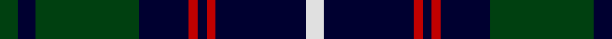

This page is one **sett** — a single exact thread-count. It belongs to the [tartan](/tartans/dg4k4dg23k11r2k2r2k20w4/)
(the same proportion at any scale), whose colour order is pattern [GKGKRKRKW](/stripes/gkgkrkrkw/).

Sourced from weddslist.  It is a [9 stripe tartan](/stripes/stripes9/).

Original link http://www.weddslist.com/cgi-bin/tartans/pg.pl?source=sts

## Thread count
DG/8 DB8 DG46 DB22 R4 DB4 R4 DB40 LN/8

## Palette

Palette: <strong>Tartan Dictionary</strong> <small style="color:#888">(1 of 4 colours)</small>
<table><thead><tr><th>Colour</th><th>Threads</th><th>Shade</th><th>Base</th><th>OKLCh</th></tr></thead><tbody><tr><td>DG/</td><td style="text-align:right;font-variant-numeric:tabular-nums">8</td><td><code style="background-color:#004010;">#004010</code> <small style="color:#888">#004010</small></td><td>G <code style="background-color:#006100;">#006100</code></td><td><small style="color:#888">oklch(32.3% 0.098 146.3)</small></td></tr><tr><td>DB</td><td style="text-align:right;font-variant-numeric:tabular-nums">8</td><td><code style="background-color:#000030;">#000030</code> <small style="color:#888">#000030</small></td><td>K <code style="background-color:#000000;">#000000</code></td><td><small style="color:#888">oklch(14.0% 0.097 264.1)</small></td></tr><tr><td>DG</td><td style="text-align:right;font-variant-numeric:tabular-nums">46</td><td><code style="background-color:#004010;">#004010</code> <small style="color:#888">#004010</small></td><td>G <code style="background-color:#006100;">#006100</code></td><td><small style="color:#888">oklch(32.3% 0.098 146.3)</small></td></tr><tr><td>DB</td><td style="text-align:right;font-variant-numeric:tabular-nums">22</td><td><code style="background-color:#000030;">#000030</code> <small style="color:#888">#000030</small></td><td>K <code style="background-color:#000000;">#000000</code></td><td><small style="color:#888">oklch(14.0% 0.097 264.1)</small></td></tr><tr><td>R</td><td style="text-align:right;font-variant-numeric:tabular-nums">4</td><td><code style="background-color:#C00000;">#C00000</code> <small style="color:#888">#C00000</small></td><td>R <code style="background-color:#CC0000;">#CC0000</code></td><td><small style="color:#888">oklch(50.7% 0.208 29.2)</small></td></tr><tr><td>DB</td><td style="text-align:right;font-variant-numeric:tabular-nums">4</td><td><code style="background-color:#000030;">#000030</code> <small style="color:#888">#000030</small></td><td>K <code style="background-color:#000000;">#000000</code></td><td><small style="color:#888">oklch(14.0% 0.097 264.1)</small></td></tr><tr><td>R</td><td style="text-align:right;font-variant-numeric:tabular-nums">4</td><td><code style="background-color:#C00000;">#C00000</code> <small style="color:#888">#C00000</small></td><td>R <code style="background-color:#CC0000;">#CC0000</code></td><td><small style="color:#888">oklch(50.7% 0.208 29.2)</small></td></tr><tr><td>DB</td><td style="text-align:right;font-variant-numeric:tabular-nums">40</td><td><code style="background-color:#000030;">#000030</code> <small style="color:#888">#000030</small></td><td>K <code style="background-color:#000000;">#000000</code></td><td><small style="color:#888">oklch(14.0% 0.097 264.1)</small></td></tr><tr><td>LN/</td><td style="text-align:right;font-variant-numeric:tabular-nums">8</td><td><code style="background-color:#E0E0E0;">#E0E0E0</code> <small style="color:#888">#E0E0E0</small></td><td>W <code style="background-color:#F7F7F7;">#F7F7F7</code></td><td><small style="color:#888">oklch(90.7% 0.000 89.9)</small></td></tr></tbody></table>

## Nearest tartans

The nearest existing variants by ΔTartan distance, with this tartan at the top so the swatches line up against it.

ΔTartan

Tartan

Sett

—

<a href="/ttd/edit/#slug=dg4k4dg23k11r2k2r2k20w4~x2">New Golf Club</a> <a class="nn-out" href="/setts/s9/dg4k4dg23k11r2k2r2k20w4~x2/" title="open its dictionary page">↗</a>

0.91

<a href="/ttd/edit/#slug=db32dr3db3dr3db3dr10g24m3~x2">Gammell</a> <a class="nn-out" href="/setts/s8/db32dr3db3dr3db3dr10g24m3~x2/" title="open its dictionary page">↗</a>

1.01

<a href="/ttd/edit/#slug=k17o2k3g2k3g2k24b8g4b4g3b8~x2">Kells Irish Pubs (Corporate)</a> <a class="nn-out" href="/setts/s12/k17o2k3g2k3g2k24b8g4b4g3b8~x2/" title="open its dictionary page">↗</a>

1.03

<a href="/ttd/edit/#slug=k1g12k12r1k1r1k12b12r1~x4">Guthrie (Name)</a> <a class="nn-out" href="/setts/s9/k1g12k12r1k1r1k12b12r1~x4/" title="open its dictionary page">↗</a>

1.09

<a href="/ttd/edit/#slug=db56k6g24k6db8k21ly6k21db8k6g24k6db56">Murray of Elibank</a> <a class="nn-out" href="/setts/s13/db56k6g24k6db8k21ly6k21db8k6g24k6db56/" title="open its dictionary page">↗</a>

1.10

<a href="/ttd/edit/#slug=k14t3k3w4k3t3k14db4k4db30k4~x2">Scottish Jewish Community</a> <a class="nn-out" href="/setts/s11/k14t3k3w4k3t3k14db4k4db30k4~x2/" title="open its dictionary page">↗</a>

1.10

<a href="/ttd/edit/#slug=k2g9m2g9k2g2k26dg2~x2">Land's End</a> <a class="nn-out" href="/setts/s8/k2g9m2g9k2g2k26dg2~x2/" title="open its dictionary page">↗</a>

1.12

<a href="/ttd/edit/#slug=r6k55db8g6db10g6db6g4~x2">Frederiction Police Force</a> <a class="nn-out" href="/setts/s8/r6k55db8g6db10g6db6g4~x2/" title="open its dictionary page">↗</a>

1.13

<a href="/ttd/edit/#slug=k17lr2k3g2k3g2k24b8g4b4g3b8~x2">Kells Irish Pubs</a> <a class="nn-out" href="/setts/s12/k17lr2k3g2k3g2k24b8g4b4g3b8~x2/" title="open its dictionary page">↗</a>

1.18

<a href="/ttd/edit/#slug=dg14lb1dg7k7db2k2db2k2db7">Abercrombie</a> <a class="nn-out" href="/setts/s9/dg14lb1dg7k7db2k2db2k2db7/" title="open its dictionary page">↗</a>

1.19

<a href="/setts/s8/g47r3g6db35lo3~x2/">Gracie</a>

## Neighbour map

Every grey dot is one of 14359 variants placed by the first two principal components of the ΔTartan feature space (44% of its variance). Red is this tartan; blue dots are its nearest — click one to open its page.

<svg viewBox="0 0 640 380" role="img" style="max-width:100%;height:auto;border:1px solid #e0e0e0;border-radius:4px;display:block" xmlns="http://www.w3.org/2000/svg"><image href="/nn/cloud.v1.png" width="640" height="380"/><a href="/setts/s8/db32dr3db3dr3db3dr10g24m3~x2/"><circle cx="262.3" cy="194.6" r="4" fill="#3465a4"><title>Gammell</title></circle></a><a href="/setts/s12/k17o2k3g2k3g2k24b8g4b4g3b8~x2/"><circle cx="324.7" cy="181.2" r="4" fill="#3465a4"><title>Kells Irish Pubs (Corporate)</title></circle></a><a href="/setts/s9/k1g12k12r1k1r1k12b12r1~x4/"><circle cx="256.0" cy="187.6" r="4" fill="#3465a4"><title>Guthrie (Name)</title></circle></a><a href="/setts/s13/db56k6g24k6db8k21ly6k21db8k6g24k6db56/"><circle cx="241.4" cy="179.9" r="4" fill="#3465a4"><title>Murray of Elibank</title></circle></a><a href="/setts/s11/k14t3k3w4k3t3k14db4k4db30k4~x2/"><circle cx="284.0" cy="186.7" r="4" fill="#3465a4"><title>Scottish Jewish Community</title></circle></a><a href="/setts/s8/k2g9m2g9k2g2k26dg2~x2/"><circle cx="325.1" cy="180.8" r="4" fill="#3465a4"><title>Land's End</title></circle></a><a href="/setts/s8/r6k55db8g6db10g6db6g4~x2/"><circle cx="321.3" cy="169.4" r="4" fill="#3465a4"><title>Frederiction Police Force</title></circle></a><a href="/setts/s12/k17lr2k3g2k3g2k24b8g4b4g3b8~x2/"><circle cx="305.1" cy="168.2" r="4" fill="#3465a4"><title>Kells Irish Pubs</title></circle></a><a href="/setts/s9/dg14lb1dg7k7db2k2db2k2db7/"><circle cx="256.6" cy="204.0" r="4" fill="#3465a4"><title>Abercrombie</title></circle></a><a href="/setts/s8/g47r3g6db35lo3~x2/"><circle cx="326.0" cy="190.5" r="4" fill="#3465a4"><title>Gracie</title></circle></a><circle cx="287.9" cy="194.2" r="5" fill="#c00000"/></svg>

ID: /setts/s9/dg4k4dg23k11r2k2r2k20w4~x2/
