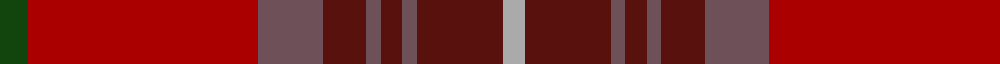

**Bands:** [GRBBBBBBY](/stripes/grbbbbbby/) · **Stripes:** [DG R N DR N DR N DR LR](/stripes/stripes9/) DG R N DR N DR N DR LR

This was sourced from weddslist.  It is a [9 band tartan](/bands/bands9/).

Original link http://www.weddslist.com/cgi-bin/tartans/pg.pl?source=x

## Register references

External register numbers recorded for this tartan.

- Scottish Register of Tartans: [2540](https://www.tartanregister.gov.uk/tartanDetails.aspx?ref=2540)
- Scottish Register of Tartans: [2625](https://www.tartanregister.gov.uk/tartanDetails.aspx?ref=2625)
- Scottish Register of Tartans: [3555](https://www.tartanregister.gov.uk/tartanDetails.aspx?ref=3555)
- Scottish Tartans Authority (ITI): 1429
- Scottish Tartans Authority (ITI): 218
- Scottish Tartans World Register: 1429
- Scottish Tartans World Register: 218
- Scottish Tartans World Register: 864

## Variants

Other setts woven to the same stripe pattern.

- [Rose VS](/setts/s9/dg4r32n9dr6n2dr3n2dr12lr3~x2/)

## Thread count
DG/4 DR32 N9 DRa6 N2 DRa3 N2 DRa12 Na/3

## Palette
Each colour and its ΔE from the base-6 reference it is a variant of.

| Colour | Shade | Base | ΔE (OKLab) |
|---|---|---|---|
| DG | <code style="background-color:#11450D;">#11450D</code> `#11450D` | G <code style="background-color:#006100;">#006100</code> | 0.09 |
| DR | <code style="background-color:#AA0000;">#AA0000</code> `#AA0000` | R <code style="background-color:#CC0000;">#CC0000</code> | 0.07 |
| DRa | <code style="background-color:#59110D;">#59110D</code> `#59110D` | B <code style="background-color:#2A418A;">#2A418A</code> | 0.22 |
| N | <code style="background-color:#6E5058;">#6E5058</code> `#6E5058` | B <code style="background-color:#2A418A;">#2A418A</code> | 0.15 |
| Na | <code style="background-color:#AAAAAA;">#AAAAAA</code> `#AAAAAA` | Y <code style="background-color:#F2BF00;">#F2BF00</code> | 0.19 |

## Nearest tartans

The nearest existing variants by ΔTartan distance.

1. [Rose VS](/setts/s9/dg4r32n9dr6n2dr3n2dr12lr3~x2/) — ΔT 0.00
1. [Rikaco Red](/setts/s10/dt5n5dt2r47dt18o2dt5dy9n7o3~x2/) — ΔT 1.45
1. [Brousseau (Personal)](/setts/s9/y25r2lb2db2lb2r13dy28db2r3~x2/) — ΔT 1.49
1. [Bell of Ardbel (Name)](/setts/s10/o7r4o4r25dp1y32dp4y2w2y5~x2/) — ΔT 1.58
1. [Hyland Day (Personal)](/setts/s8/lo3do2dy29do6dy4r26dy2r3~x2/) — ΔT 1.66
1. [Bell, John](/setts/s10/dr7m4dr4m25p1dy32p4dy2w2dy5~x2/) — ΔT 1.66
1. [Pubcrawlers (Corporate)](/setts/s7/g3dy4g2dy22n5r16ly3~x2/) — ΔT 1.69
1. [Waverly, Check](/setts/s12/dr44o5o8o2o2o2o2o14o9o2o4o2~x2/) — ΔT 1.77
1. [Cetoloni](/setts/s6/db2r22dy11y2dy11db2~x2/) — ΔT 1.78
1. [Barbour - Cardinal Red](/setts/s7/r3ly2r18db8w1r18r2~x2/) — ΔT 1.79

## Neighbour map

Every grey dot is one of 14313 variants placed by the first two principal components of the ΔTartan feature space (44% of its variance). Red is this tartan; blue dots are its nearest — click one to open its page.

<svg viewBox="0 0 640 380" role="img" style="max-width:100%;height:auto;border:1px solid #e0e0e0;border-radius:4px;display:block" xmlns="http://www.w3.org/2000/svg"><image href="/nn/cloud.v1.png" width="640" height="380"/><a href="/setts/s9/dg4r32n9dr6n2dr3n2dr12lr3~x2/"><circle cx="330.6" cy="170.8" r="4" fill="#3465a4"><title>Rose VS</title></circle></a><a href="/setts/s10/dt5n5dt2r47dt18o2dt5dy9n7o3~x2/"><circle cx="353.5" cy="153.9" r="4" fill="#3465a4"><title>Rikaco Red</title></circle></a><a href="/setts/s9/y25r2lb2db2lb2r13dy28db2r3~x2/"><circle cx="269.8" cy="172.3" r="4" fill="#3465a4"><title>Brousseau (Personal)</title></circle></a><a href="/setts/s10/o7r4o4r25dp1y32dp4y2w2y5~x2/"><circle cx="360.6" cy="142.3" r="4" fill="#3465a4"><title>Bell of Ardbel (Name)</title></circle></a><a href="/setts/s8/lo3do2dy29do6dy4r26dy2r3~x2/"><circle cx="342.2" cy="198.5" r="4" fill="#3465a4"><title>Hyland Day (Personal)</title></circle></a><a href="/setts/s10/dr7m4dr4m25p1dy32p4dy2w2dy5~x2/"><circle cx="364.3" cy="146.2" r="4" fill="#3465a4"><title>Bell, John</title></circle></a><a href="/setts/s7/g3dy4g2dy22n5r16ly3~x2/"><circle cx="317.3" cy="215.3" r="4" fill="#3465a4"><title>Pubcrawlers (Corporate)</title></circle></a><a href="/setts/s12/dr44o5o8o2o2o2o2o14o9o2o4o2~x2/"><circle cx="369.3" cy="152.1" r="4" fill="#3465a4"><title>Waverly, Check</title></circle></a><a href="/setts/s6/db2r22dy11y2dy11db2~x2/"><circle cx="354.4" cy="233.0" r="4" fill="#3465a4"><title>Cetoloni</title></circle></a><a href="/setts/s7/r3ly2r18db8w1r18r2~x2/"><circle cx="305.2" cy="162.1" r="4" fill="#3465a4"><title>Barbour - Cardinal Red</title></circle></a><circle cx="330.6" cy="170.8" r="5" fill="#c00000"/></svg>

ID: /setts/s9/dg4r32n9dr6n2dr3n2dr12lr3/
