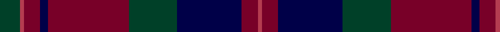

In pattern [GRRBRGBRR](/stripes/grrbrgbrr/).

This was sourced from register-of-tartans.  It is a [9 stripe tartan](/stripes/stripes9/).

Original link https://www.tartanregister.gov.uk/tartanDetails.aspx?ref=931

## Attestations

This cloth appears in 2 source records; the oldest owns this page.

- 01/01/1997 — Diana Princess of Wales (register-of-tartans, [record](https://www.tartanregister.gov.uk/tartanDetails.aspx?ref=931))
- 1997 — Diana Princess of Wales (Fashion) (tartans-authority, [record](http://www.tartansauthority.com/tartan-ferret/display/4683/))

## Register references

External register numbers recorded for this tartan.

- Scottish Register of Tartans: [931](https://www.tartanregister.gov.uk/tartanDetails.aspx?ref=931)
- Scottish Tartans Authority (ITI): 4683

## Thread count
DG/10 R2 DR8 DB4 DR40 DG24 DB32 DR8 R/2

## Palette
Each colour and the base-6 reference it is a variant of.

| Colour | Shade | Base |
|---|---|---|
| DB | <code style="background-color:#000048;">#000048</code> `oklch(18.2% 0.126 264.1)` <small>#000048</small> | B <code style="background-color:#2A418A;">#2A418A</code> |
| DG | <code style="background-color:#004028;">#004028</code> `oklch(32.8% 0.073 160.8)` <small>#004028</small> | G <code style="background-color:#006100;">#006100</code> |
| DR | <code style="background-color:#780028;">#780028</code> `oklch(36.5% 0.146 12.8)` <small>#780028</small> | R <code style="background-color:#CC0000;">#CC0000</code> |
| R | <code style="background-color:#B43C50;">#B43C50</code> `oklch(53.3% 0.155 14.4)` <small>#B43C50</small> | R <code style="background-color:#CC0000;">#CC0000</code> |

## Nearest tartans

The nearest existing variants by ΔTartan distance, with this tartan at the top so the swatches line up against it.

ΔTartan

Tartan

Sett

—

<a href="/ttd/edit/#slug=dg5r1r4db2r20dg12db16r4r1~x2">Diana Princess of Wales</a> <a class="nn-out" href="/setts/s9/dg5r1r4db2r20dg12db16r4r1~x2/" title="open its dictionary page">↗</a>

1.01

<a href="/ttd/edit/#slug=r3dg12r12r5dg2db30r2dg2~x2">Rannoch Moor (Fashion)</a> <a class="nn-out" href="/setts/s8/r3dg12r12r5dg2db30r2dg2~x2/" title="open its dictionary page">↗</a>

1.17

<a href="/ttd/edit/#slug=dg28r12dg4k20lo2k3lo2k3dg7~x2">Cork, County (District)</a> <a class="nn-out" href="/setts/s9/dg28r12dg4k20lo2k3lo2k3dg7~x2/" title="open its dictionary page">↗</a>

1.22

<a href="/ttd/edit/#slug=db2r49dg51r9w2r9db51r49db2~x2">Nethybridge</a> <a class="nn-out" href="/setts/s9/db2r49dg51r9w2r9db51r49db2~x2/" title="open its dictionary page">↗</a>

1.23

<a href="/ttd/edit/#slug=db4dg2r17r9dg10db30n2~x2">Dempster, Ross (Personal)</a> <a class="nn-out" href="/setts/s7/db4dg2r17r9dg10db30n2~x2/" title="open its dictionary page">↗</a>

1.25

<a href="/ttd/edit/#slug=w2k35db30k3r30k2r4k2r30k3w2">Gwyn Welsh Name Tartan Tartan Number: 5734. Earliest known date: 2002 The tartan for this Welsh surname and its spelling variation, Wynn, is actually woven in Wales at the Cambrian Woollen Mill, weaving on the same site since 1830. This tartan differs from many traditional patterns in that the warp and weft differ, giving the finished worsted wool cloth more of a predominant stripe, vertically noticeable in the finished Kilt, or Cilt in Wales. See products available Copyright © Blair Urquhart, Comrie, 2015</a> <a class="nn-out" href="/setts/s11/w2k35db30k3r30k2r4k2r30k3w2/" title="open its dictionary page">↗</a>

1.27

<a href="/ttd/edit/#slug=y6k1y28k24dp25y3dp3y3dp3y4dp3~x2">Rennie (Name)</a> <a class="nn-out" href="/setts/s11/y6k1y28k24dp25y3dp3y3dp3y4dp3~x2/" title="open its dictionary page">↗</a>

1.27

<a href="/ttd/edit/#slug=k2r13k8n2r1k1r21n1r1k2db8k13db2~x2">Alyssa's Theme (Fashion)</a> <a class="nn-out" href="/setts/s13/k2r13k8n2r1k1r21n1r1k2db8k13db2~x2/" title="open its dictionary page">↗</a>

1.30

<a href="/ttd/edit/#slug=r2k3dt30k2dt4k2dt30k36r30k2t2">Evans (Welsh Name)</a> <a class="nn-out" href="/setts/s11/r2k3dt30k2dt4k2dt30k36r30k2t2/" title="open its dictionary page">↗</a>

1.33

<a href="/ttd/edit/#slug=n12dg2n4dg2n4k33dg13r4~x2">Brown of the Southeast (Personal)</a> <a class="nn-out" href="/setts/s8/n12dg2n4dg2n4k33dg13r4~x2/" title="open its dictionary page">↗</a>

1.34

<a href="/ttd/edit/#slug=g22k3g1k3g2dp8r1dp8r16~x2">Queen of Scots (Commemorative))</a> <a class="nn-out" href="/setts/s9/g22k3g1k3g2dp8r1dp8r16~x2/" title="open its dictionary page">↗</a>

## Neighbour map

Every grey dot is one of 14299 variants placed by the first two principal components of the ΔTartan feature space (44% of its variance). Red is this tartan; blue dots are its nearest — click one to open its page.

<svg viewBox="0 0 640 380" role="img" style="max-width:100%;height:auto;border:1px solid #e0e0e0;border-radius:4px;display:block" xmlns="http://www.w3.org/2000/svg"><image href="/nn/cloud.v1.png" width="640" height="380"/><a href="/setts/s8/r3dg12r12r5dg2db30r2dg2~x2/"><circle cx="289.3" cy="185.6" r="4" fill="#3465a4"><title>Rannoch Moor (Fashion)</title></circle></a><a href="/setts/s9/dg28r12dg4k20lo2k3lo2k3dg7~x2/"><circle cx="319.1" cy="203.0" r="4" fill="#3465a4"><title>Cork, County (District)</title></circle></a><a href="/setts/s9/db2r49dg51r9w2r9db51r49db2~x2/"><circle cx="367.6" cy="179.5" r="4" fill="#3465a4"><title>Nethybridge</title></circle></a><a href="/setts/s7/db4dg2r17r9dg10db30n2~x2/"><circle cx="281.3" cy="195.0" r="4" fill="#3465a4"><title>Dempster, Ross (Personal)</title></circle></a><a href="/setts/s11/w2k35db30k3r30k2r4k2r30k3w2/"><circle cx="297.8" cy="159.0" r="4" fill="#3465a4"><title>Gwyn Welsh Name Tartan Tartan Number: 5734. Earliest known date: 2002 The tartan for this Welsh surname and its spelling variation, Wynn, is actually woven in Wales at the Cambrian Woollen Mill, weaving on the same site since 1830. This tartan differs from many traditional patterns in that the warp and weft differ, giving the finished worsted wool cloth more of a predominant stripe, vertically noticeable in the finished Kilt, or Cilt in Wales. See products available Copyright © Blair Urquhart, Comrie, 2015</title></circle></a><a href="/setts/s11/y6k1y28k24dp25y3dp3y3dp3y4dp3~x2/"><circle cx="286.7" cy="154.6" r="4" fill="#3465a4"><title>Rennie (Name)</title></circle></a><a href="/setts/s13/k2r13k8n2r1k1r21n1r1k2db8k13db2~x2/"><circle cx="340.0" cy="154.6" r="4" fill="#3465a4"><title>Alyssa's Theme (Fashion)</title></circle></a><a href="/setts/s11/r2k3dt30k2dt4k2dt30k36r30k2t2/"><circle cx="308.9" cy="167.3" r="4" fill="#3465a4"><title>Evans (Welsh Name)</title></circle></a><a href="/setts/s8/n12dg2n4dg2n4k33dg13r4~x2/"><circle cx="304.0" cy="191.0" r="4" fill="#3465a4"><title>Brown of the Southeast (Personal)</title></circle></a><a href="/setts/s9/g22k3g1k3g2dp8r1dp8r16~x2/"><circle cx="267.7" cy="166.1" r="4" fill="#3465a4"><title>Queen of Scots (Commemorative))</title></circle></a><circle cx="309.5" cy="191.1" r="5" fill="#c00000"/></svg>

ID: /setts/s9/dg5r1r4db2r20dg12db16r4r1~x2/
