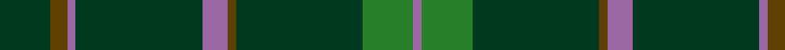

In pattern [GGRGRGGGR](/stripes/ggrgrgggr/).

This was sourced from tartans-authority.  It is a [9 stripe tartan](/stripes/stripes9/).

Original link http://www.tartansauthority.com/tartan-ferret/display/11183/

## Thread count
DG/12 T4 LP2 DG30 LP6 T2 DG30 G12 LP/2

## Palette
Each colour and its ΔE from the base-6 reference it is a variant of.

| Colour | Shade | Base | ΔE (OKLab) |
|---|---|---|---|
| DG | <code style="background-color:#003820;">#003820</code> `#003820` | G <code style="background-color:#006100;">#006100</code> | 0.15 |
| G | <code style="background-color:#288028;">#288028</code> `#288028` | G <code style="background-color:#006100;">#006100</code> | 0.10 |
| LP | <code style="background-color:#9C68A4;">#9C68A4</code> `#9C68A4` | R <code style="background-color:#CC0000;">#CC0000</code> | 0.21 |
| T | <code style="background-color:#604000;">#604000</code> `#604000` | G <code style="background-color:#006100;">#006100</code> | 0.14 |

## Nearest tartans

The nearest existing variants by ΔTartan distance.

1. [McCall, F W (Personal)](/setts/s9/dg6do2m1dg15m3do1dg15g6m1~x2/) — ΔT 0.88
1. [St Andrews Links Corporate Tartan Tartan Number: 2391. Earliest known date: May 1997 Designed by Polly Wittering of the House of Edgar 1997. Corporate tartan for use on merchandise. Green lightened here to show the sett. See products available Copyright © Blair Urquhart, Comrie, 2015](/setts/s12/dt16g4dt3g3lo2g24r2~x2/) — ΔT 1.24
1. [Unnamed C19th - Portrait by Ansdell](/setts/s11/dg22r3k10r3dg24r2k4r2dg24r2k4~x2/) — ΔT 1.34
1. [Glenlivet Check (Corporate)](/setts/s8/dg18r6dg75b6dg13lo35dg12b6/) — ΔT 1.41
1. [Owen Welsh Name Tartan Tartan Number: 5750. Earliest known date: 2002 The tartan for this Welsh surname and its variations, Bowen, Ifan, is actually woven in Wales at the Cambrian Woollen Mill, weaving on the same site since 1830. This tartan differs from many traditional patterns in that the warp and weft differ, giving the finished worsted wool cloth more of a predominant stripe, vertically noticeable in the finished Kilt, or Cilt in Wales. See products available Copyright © Blair Urquhart, Comrie, 2015](/setts/s10/g3dt1g2r1g3db3g2db2g18dt2~x2/) — ΔT 1.52
1. [INSEAD](/setts/s12/lo3g15r2g2r6g2dg6g2dg2g23g2g2~x2/) — ΔT 1.55
1. [St Andrews Links](/setts/s7/dt16g4dt3g3lo2g24r2~x2/) — ΔT 1.68
1. [VersaCold/Atlas (Corporate)](/setts/s9/db3n44k9n10k9n10k9n44r3~x2/) — ΔT 1.70
1. [Kinfauns Castle](/setts/s10/r4p12dg2p2dg24dg2dg2dg16dg2w1~x2/) — ΔT 1.73
1. [Ross Hunting](/setts/s14/dg2g4dg2g1dg1g1dg3k2dg2k2dg12r1dg2r1~x2/) — ΔT 1.73

## Neighbour map

Every grey dot is one of 14299 variants placed by the first two principal components of the ΔTartan feature space (44% of its variance). Red is this tartan; blue dots are its nearest — click one to open its page.

<svg viewBox="0 0 640 380" role="img" style="max-width:100%;height:auto;border:1px solid #e0e0e0;border-radius:4px;display:block" xmlns="http://www.w3.org/2000/svg"><image href="/nn/cloud.v1.png" width="640" height="380"/><a href="/setts/s9/dg6do2m1dg15m3do1dg15g6m1~x2/"><circle cx="453.2" cy="205.8" r="4" fill="#3465a4"><title>McCall, F W (Personal)</title></circle></a><a href="/setts/s12/dt16g4dt3g3lo2g24r2~x2/"><circle cx="448.0" cy="201.1" r="4" fill="#3465a4"><title>St Andrews Links Corporate Tartan Tartan Number: 2391. Earliest known date: May 1997 Designed by Polly Wittering of the House of Edgar 1997. Corporate tartan for use on merchandise. Green lightened here to show the sett. See products available Copyright © Blair Urquhart, Comrie, 2015</title></circle></a><a href="/setts/s11/dg22r3k10r3dg24r2k4r2dg24r2k4~x2/"><circle cx="478.0" cy="229.4" r="4" fill="#3465a4"><title>Unnamed C19th - Portrait by Ansdell</title></circle></a><a href="/setts/s8/dg18r6dg75b6dg13lo35dg12b6/"><circle cx="424.2" cy="201.4" r="4" fill="#3465a4"><title>Glenlivet Check (Corporate)</title></circle></a><a href="/setts/s10/g3dt1g2r1g3db3g2db2g18dt2~x2/"><circle cx="536.7" cy="193.3" r="4" fill="#3465a4"><title>Owen Welsh Name Tartan Tartan Number: 5750. Earliest known date: 2002 The tartan for this Welsh surname and its variations, Bowen, Ifan, is actually woven in Wales at the Cambrian Woollen Mill, weaving on the same site since 1830. This tartan differs from many traditional patterns in that the warp and weft differ, giving the finished worsted wool cloth more of a predominant stripe, vertically noticeable in the finished Kilt, or Cilt in Wales. See products available Copyright © Blair Urquhart, Comrie, 2015</title></circle></a><a href="/setts/s12/lo3g15r2g2r6g2dg6g2dg2g23g2g2~x2/"><circle cx="435.7" cy="188.8" r="4" fill="#3465a4"><title>INSEAD</title></circle></a><a href="/setts/s7/dt16g4dt3g3lo2g24r2~x2/"><circle cx="383.9" cy="221.1" r="4" fill="#3465a4"><title>St Andrews Links</title></circle></a><a href="/setts/s9/db3n44k9n10k9n10k9n44r3~x2/"><circle cx="519.9" cy="207.0" r="4" fill="#3465a4"><title>VersaCold/Atlas (Corporate)</title></circle></a><a href="/setts/s10/r4p12dg2p2dg24dg2dg2dg16dg2w1~x2/"><circle cx="476.6" cy="164.0" r="4" fill="#3465a4"><title>Kinfauns Castle</title></circle></a><a href="/setts/s14/dg2g4dg2g1dg1g1dg3k2dg2k2dg12r1dg2r1~x2/"><circle cx="396.9" cy="183.4" r="4" fill="#3465a4"><title>Ross Hunting</title></circle></a><circle cx="476.3" cy="217.6" r="5" fill="#c00000"/></svg>

ID: /setts/s9/dg6dy2m1dg15m3dy1dg15g6m1~x2/
