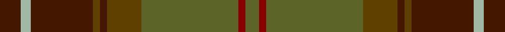

**Bands:** [GRGGBGBYB](/stripes/grggbgbyb/) · **Stripes:** [Y R Y DY DO DY DO LG DO](/stripes/stripes9/) Y R Y DY DO DY DO LG DO

This was sourced from register-of-tartans.  It is a [9 band tartan](/bands/bands9/).

Original link https://www.tartanregister.gov.uk/tartanDetails.aspx?ref=3712

## Attestations

This cloth appears in 2 source records; the oldest owns this page.

- 01/07/2007 — Scottish Crofting Foundation (register-of-tartans, [record](https://www.tartanregister.gov.uk/tartanDetails.aspx?ref=3712))
- July 2007 — Scottish Crofting Foundation (Corp) (tartans-authority, [record](http://www.tartansauthority.com/tartan-ferret/display/7239/))

## Register references

External register numbers recorded for this tartan.

- Scottish Register of Tartans: [3712](https://www.tartanregister.gov.uk/tartanDetails.aspx?ref=3712)
- Scottish Tartans Authority (ITI): 7239

## Thread count
DR/12 N6 DR36 T4 DR4 T20 G56 DRa4 G/8

## Palette
Each colour and its ΔE from the base-6 reference it is a variant of.

| Colour | Shade | Base | ΔE (OKLab) |
|---|---|---|---|
| DR | <code style="background-color:#441800;">#441800</code> `#441800` | B <code style="background-color:#2A418A;">#2A418A</code> | 0.23 |
| DRa | <code style="background-color:#880000;">#880000</code> `#880000` | R <code style="background-color:#CC0000;">#CC0000</code> | 0.15 |
| G | <code style="background-color:#5C6428;">#5C6428</code> `#5C6428` | G <code style="background-color:#006100;">#006100</code> | 0.10 |
| N | <code style="background-color:#A0B8A4;">#A0B8A4</code> `#A0B8A4` | Y <code style="background-color:#F2BF00;">#F2BF00</code> | 0.17 |
| R | <code style="background-color:#C80000;">#C80000</code> `#C80000` | R <code style="background-color:#CC0000;">#CC0000</code> | 0.01 |
| T | <code style="background-color:#604000;">#604000</code> `#604000` | G <code style="background-color:#006100;">#006100</code> | 0.14 |

## Nearest tartans

The nearest existing variants by ΔTartan distance.

1. [John Muir Way](/setts/s8/dy35dg19r3y8r3dg8r3t3~x2/) — ΔT 0.45
1. [John Muir Way](/setts/s8/dy35dg19r3g8r3dg8r3db3~x2/) — ΔT 0.56
1. [State Seal of Minnesota (Fashion)](/setts/s8/r4g46r10db10dy33db5dy4lo3~x2/) — ΔT 0.84
1. [Cozumel](/setts/s9/dy7k1dg1r1k1r7dg15k1lo1~x4/) — ΔT 1.00
1. [Methven](/setts/s11/r2dg3dy18r2dy2r21y6dg2y2dg24lo2~x2/) — ΔT 1.02
1. [Pubcrawlers (Corporate)](/setts/s7/g3dy4g2dy22n5r16ly3~x2/) — ΔT 1.12
1. [Henry, W. A.](/setts/s9/dy16r16lr3dg16o2r1o2dy6r2~x4/) — ΔT 1.21
1. [Ramsay (Green Fashion)](/setts/s7/g1r7g7n2r1dg15lb1~x4/) — ΔT 1.21
1. [Brousseau (Personal)](/setts/s9/y25r2lb2db2lb2r13dy28db2r3~x2/) — ΔT 1.28
1. [Brave for Men (Fashion)](/setts/s8/k5dy5k5dy34n33k6n5o2/) — ΔT 1.29

## Neighbour map

Every grey dot is one of 14299 variants placed by the first two principal components of the ΔTartan feature space (44% of its variance). Red is this tartan; blue dots are its nearest — click one to open its page.

<svg viewBox="0 0 640 380" role="img" style="max-width:100%;height:auto;border:1px solid #e0e0e0;border-radius:4px;display:block" xmlns="http://www.w3.org/2000/svg"><image href="/nn/cloud.v1.png" width="640" height="380"/><a href="/setts/s8/dy35dg19r3y8r3dg8r3t3~x2/"><circle cx="302.0" cy="206.0" r="4" fill="#3465a4"><title>John Muir Way</title></circle></a><a href="/setts/s8/dy35dg19r3g8r3dg8r3db3~x2/"><circle cx="300.4" cy="205.5" r="4" fill="#3465a4"><title>John Muir Way</title></circle></a><a href="/setts/s8/r4g46r10db10dy33db5dy4lo3~x2/"><circle cx="289.3" cy="195.0" r="4" fill="#3465a4"><title>State Seal of Minnesota (Fashion)</title></circle></a><a href="/setts/s9/dy7k1dg1r1k1r7dg15k1lo1~x4/"><circle cx="309.4" cy="174.3" r="4" fill="#3465a4"><title>Cozumel</title></circle></a><a href="/setts/s11/r2dg3dy18r2dy2r21y6dg2y2dg24lo2~x2/"><circle cx="251.5" cy="179.7" r="4" fill="#3465a4"><title>Methven</title></circle></a><a href="/setts/s7/g3dy4g2dy22n5r16ly3~x2/"><circle cx="317.1" cy="215.4" r="4" fill="#3465a4"><title>Pubcrawlers (Corporate)</title></circle></a><a href="/setts/s9/dy16r16lr3dg16o2r1o2dy6r2~x4/"><circle cx="238.0" cy="182.9" r="4" fill="#3465a4"><title>Henry, W. A.</title></circle></a><a href="/setts/s7/g1r7g7n2r1dg15lb1~x4/"><circle cx="314.2" cy="212.2" r="4" fill="#3465a4"><title>Ramsay (Green Fashion)</title></circle></a><a href="/setts/s9/y25r2lb2db2lb2r13dy28db2r3~x2/"><circle cx="269.6" cy="172.5" r="4" fill="#3465a4"><title>Brousseau (Personal)</title></circle></a><a href="/setts/s8/k5dy5k5dy34n33k6n5o2/"><circle cx="356.4" cy="215.8" r="4" fill="#3465a4"><title>Brave for Men (Fashion)</title></circle></a><circle cx="309.8" cy="194.3" r="5" fill="#c00000"/></svg>

ID: /setts/s9/do6lg3do18dy2do2dy10y28r2y4~x2/
