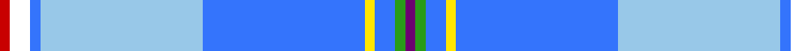

In pattern [BGBYBWBWR](/stripes/bgbybwbwr/).

This was sourced from register-of-tartans.  It is a [9 stripe tartan](/stripes/stripes9/).

Original link https://www.tartanregister.gov.uk/tartanDetails.aspx?ref=11459

## Register references

External register numbers recorded for this tartan.

- Scottish Register of Tartans: [11459](https://www.tartanregister.gov.uk/tartanDetails.aspx?ref=11459)

## Thread count
R/4 W8 B4 LB64 B64 Y4 B8 G4 P/4

## Palette
Each colour and its ΔE from the base-6 reference it is a variant of.

| Colour | Shade | Base | ΔE (OKLab) |
|---|---|---|---|
| B | <code style="background-color:#3474FC;">#3474FC</code> `#3474FC` | B <code style="background-color:#2A418A;">#2A418A</code> | 0.22 |
| G | <code style="background-color:#289C18;">#289C18</code> `#289C18` | G <code style="background-color:#006100;">#006100</code> | 0.19 |
| LB | <code style="background-color:#98C8E8;">#98C8E8</code> `#98C8E8` | W <code style="background-color:#F7F7F7;">#F7F7F7</code> | 0.18 |
| P | <code style="background-color:#6C0070;">#6C0070</code> `#6C0070` | B <code style="background-color:#2A418A;">#2A418A</code> | 0.16 |
| R | <code style="background-color:#C80000;">#C80000</code> `#C80000` | R <code style="background-color:#CC0000;">#CC0000</code> | 0.01 |
| W | <code style="background-color:#FFFFFF;">#FFFFFF</code> `#FFFFFF` | W <code style="background-color:#F7F7F7;">#F7F7F7</code> | 0.02 |
| Y | <code style="background-color:#FFE600;">#FFE600</code> `#FFE600` | Y <code style="background-color:#F2BF00;">#F2BF00</code> | 0.10 |

## Nearest tartans

The nearest existing variants by ΔTartan distance.

1. [Jubilee, South Canterbury Centre Piping & Dancing Association](/setts/s8/b36db5g5w2r4w2m9w22~x2/) — ΔT 1.81
1. [Congo, The Democratic Republic of the](/setts/s11/w4k1db16b20ly2r8ly2b20ly2b1ly4~x2/) — ΔT 1.86
1. [Corryvrechan Dress (Corporate)](/setts/s10/t40db12ly2db2t2db2g6w21r2t2~x2/) — ΔT 1.90
1. [Queensferry High (School)](/setts/s9/lr5lb3lb7lr5lb27b8dt43w3lb3/) — ΔT 1.93
1. [Los Angeles District Tartan Tartan Number: 6071. Earliest known date: 01/01/2003 Based on the Los Angeles coat of arms. Slightly different thread count for the blues in the weft. See products available Copyright © Blair Urquhart, Comrie, 2015](/setts/s14/t33k5b3g2t5b24ly4b24t5g2b3k5t33r2~x2/) — ΔT 2.07
1. [Manx National #2](/setts/s7/dp8dg31r4lo4db17b64w4/) — ΔT 2.11
1. [South Canterbury Jubillee (Corporate](/setts/s8/t36db5g5w2r4w2r9w22~x2/) — ΔT 2.12
1. [Fogarty (Tipperary)](/setts/s10/r4b60g35b4ly4b4y12b18k3w2/) — ΔT 2.12
1. [Festival Intercltico de Avils (Coror](/setts/s10/g2k1r5w7r1db10w1db10b30ly1~x2/) — ΔT 2.12
1. [Los Angeles](/setts/s8/ly4db24t5g2db3k5t33r2~x2/) — ΔT 2.15

## Neighbour map

Every grey dot is one of 14299 variants placed by the first two principal components of the ΔTartan feature space (44% of its variance). Red is this tartan; blue dots are its nearest — click one to open its page.

<svg viewBox="0 0 640 380" role="img" style="max-width:100%;height:auto;border:1px solid #e0e0e0;border-radius:4px;display:block" xmlns="http://www.w3.org/2000/svg"><image href="/nn/cloud.v1.png" width="640" height="380"/><a href="/setts/s8/b36db5g5w2r4w2m9w22~x2/"><circle cx="189.3" cy="113.5" r="4" fill="#3465a4"><title>Jubilee, South Canterbury Centre Piping &amp; Dancing Association</title></circle></a><a href="/setts/s11/w4k1db16b20ly2r8ly2b20ly2b1ly4~x2/"><circle cx="226.7" cy="106.8" r="4" fill="#3465a4"><title>Congo, The Democratic Republic of the</title></circle></a><a href="/setts/s10/t40db12ly2db2t2db2g6w21r2t2~x2/"><circle cx="228.7" cy="91.4" r="4" fill="#3465a4"><title>Corryvrechan Dress (Corporate)</title></circle></a><a href="/setts/s9/lr5lb3lb7lr5lb27b8dt43w3lb3/"><circle cx="196.9" cy="122.1" r="4" fill="#3465a4"><title>Queensferry High (School)</title></circle></a><a href="/setts/s14/t33k5b3g2t5b24ly4b24t5g2b3k5t33r2~x2/"><circle cx="285.9" cy="131.5" r="4" fill="#3465a4"><title>Los Angeles District Tartan Tartan Number: 6071. Earliest known date: 01/01/2003 Based on the Los Angeles coat of arms. Slightly different thread count for the blues in the weft. See products available Copyright © Blair Urquhart, Comrie, 2015</title></circle></a><a href="/setts/s7/dp8dg31r4lo4db17b64w4/"><circle cx="196.7" cy="118.5" r="4" fill="#3465a4"><title>Manx National #2</title></circle></a><a href="/setts/s8/t36db5g5w2r4w2r9w22~x2/"><circle cx="194.5" cy="115.3" r="4" fill="#3465a4"><title>South Canterbury Jubillee (Corporate</title></circle></a><a href="/setts/s10/r4b60g35b4ly4b4y12b18k3w2/"><circle cx="314.1" cy="83.3" r="4" fill="#3465a4"><title>Fogarty (Tipperary)</title></circle></a><a href="/setts/s10/g2k1r5w7r1db10w1db10b30ly1~x2/"><circle cx="220.0" cy="73.9" r="4" fill="#3465a4"><title>Festival Intercltico de Avils (Coror</title></circle></a><a href="/setts/s8/ly4db24t5g2db3k5t33r2~x2/"><circle cx="251.2" cy="128.4" r="4" fill="#3465a4"><title>Los Angeles</title></circle></a><circle cx="241.1" cy="96.6" r="5" fill="#c00000"/></svg>

ID: /setts/s9/dp1g1b2ly1b16lb16b1w2r1~x4/
