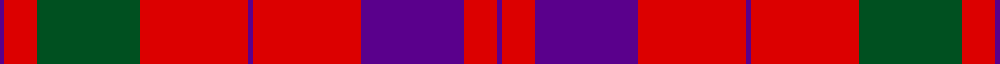

**Bands:** [BRGRBRBRB](/stripes/brgrbrbrb/) · **Stripes:** [DP R DG R DP R DP R DP](/stripes/stripes9/) DP R DG R DP R DP R DP

This was sourced from register-of-tartans.  It is a [9 band tartan](/bands/bands9/).

Original link https://www.tartanregister.gov.uk/tartanDetails.aspx?ref=2235

## Also known as

This cloth is also recorded under:

- Lovat, or Fraser

## Register references

External register numbers recorded for this tartan.

- Scottish Register of Tartans: [2235](https://www.tartanregister.gov.uk/tartanDetails.aspx?ref=2235)
- Scottish Tartans World Register: 400

## Thread count
P/2 R14 G44 R46 P2 R46 P44 R14 P/2

## Palette
Each colour and its ΔE from the base-6 reference it is a variant of.

| Colour | Shade | Base | ΔE (OKLab) |
|---|---|---|---|
| G | <code style="background-color:#005020;">#005020</code> `#005020` | G <code style="background-color:#006100;">#006100</code> | 0.07 |
| P | <code style="background-color:#5A008C;">#5A008C</code> `#5A008C` | B <code style="background-color:#2A418A;">#2A418A</code> | 0.13 |
| R | <code style="background-color:#DC0000;">#DC0000</code> `#DC0000` | R <code style="background-color:#CC0000;">#CC0000</code> | 0.03 |

## Nearest tartans

The nearest existing variants by ΔTartan distance.

1. [Lovat, or Fraser](/setts/s9/p1r7g22r23p1r23p22r7p1~x2/) — ΔT 0.83
1. [Franklin Museum Unidentified 2](/setts/s8/r5g20r25db1r25db20r5db1~x4/) — ΔT 0.87
1. [Lovat or Fraser Clan Tartan Tartan Number: 400. Earliest known date: 1820 The Scottish Tartans Society archives contain several queries on this name. J. Scarlett lists this sett under Fraser (Frasers of Lovat) with the comment. "The pattern is reputed to have been woven by Wilson's c.1820." (STS archive). 18 year old Simon Fraser became 25th chief of the Frasers of Lovat in March 1995, on the death of his grandfather, Lord Lovat, the famous war veteran. (Scotsman 17 March 1995) See products available Copyright © Blair Urquhart, Comrie, 2015](/setts/s9/dp1r7dp22r23dp1r23g22r7dp1~x2/) — ΔT 0.91
1. [Unidentified Cant #14](/setts/s12/db80r56dg3r56dg88r64db3r4dg3r4db3r64/) — ΔT 1.14
1. [Caledonian](/setts/s6/r60dp20r8dg45r8dp2~x2/) — ΔT 1.16
1. [MacKintosh #2](/setts/s6/r68db18r9dg34r9db3~x2/) — ΔT 1.29
1. [MacDougall](/setts/s11/dp4dg8db6dp8r6dg2r2dg2r24dg1r3~x2/) — ΔT 1.29
1. [MacKintosh Plaid](/setts/s6/r16db6r2dg6r2db1~x2/) — ΔT 1.32
1. [MacDonald #7](/setts/s9/dg2r2db1r24db6r3dg12r4db1~x2/) — ΔT 1.33
1. [Buccleuch](/setts/s7/r107k9r5dp41r5g51r14/) — ΔT 1.34

## Neighbour map

Every grey dot is one of 14299 variants placed by the first two principal components of the ΔTartan feature space (44% of its variance). Red is this tartan; blue dots are its nearest — click one to open its page.

<svg viewBox="0 0 640 380" role="img" style="max-width:100%;height:auto;border:1px solid #e0e0e0;border-radius:4px;display:block" xmlns="http://www.w3.org/2000/svg"><image href="/nn/cloud.v1.png" width="640" height="380"/><a href="/setts/s9/p1r7g22r23p1r23p22r7p1~x2/"><circle cx="380.2" cy="179.0" r="4" fill="#3465a4"><title>Lovat, or Fraser</title></circle></a><a href="/setts/s8/r5g20r25db1r25db20r5db1~x4/"><circle cx="381.1" cy="180.5" r="4" fill="#3465a4"><title>Franklin Museum Unidentified 2</title></circle></a><a href="/setts/s9/dp1r7dp22r23dp1r23g22r7dp1~x2/"><circle cx="385.7" cy="181.1" r="4" fill="#3465a4"><title>Lovat or Fraser Clan Tartan Tartan Number: 400. Earliest known date: 1820 The Scottish Tartans Society archives contain several queries on this name. J. Scarlett lists this sett under Fraser (Frasers of Lovat) with the comment. &quot;The pattern is reputed to have been woven by Wilson's c.1820.&quot; (STS archive). 18 year old Simon Fraser became 25th chief of the Frasers of Lovat in March 1995, on the death of his grandfather, Lord Lovat, the famous war veteran. (Scotsman 17 March 1995) See products available Copyright © Blair Urquhart, Comrie, 2015</title></circle></a><a href="/setts/s12/db80r56dg3r56dg88r64db3r4dg3r4db3r64/"><circle cx="394.2" cy="149.4" r="4" fill="#3465a4"><title>Unidentified Cant #14</title></circle></a><a href="/setts/s6/r60dp20r8dg45r8dp2~x2/"><circle cx="370.3" cy="171.8" r="4" fill="#3465a4"><title>Caledonian</title></circle></a><a href="/setts/s6/r68db18r9dg34r9db3~x2/"><circle cx="412.7" cy="180.5" r="4" fill="#3465a4"><title>MacKintosh #2</title></circle></a><a href="/setts/s11/dp4dg8db6dp8r6dg2r2dg2r24dg1r3~x2/"><circle cx="328.5" cy="128.7" r="4" fill="#3465a4"><title>MacDougall</title></circle></a><a href="/setts/s6/r16db6r2dg6r2db1~x2/"><circle cx="402.9" cy="199.9" r="4" fill="#3465a4"><title>MacKintosh Plaid</title></circle></a><a href="/setts/s9/dg2r2db1r24db6r3dg12r4db1~x2/"><circle cx="414.5" cy="147.2" r="4" fill="#3465a4"><title>MacDonald #7</title></circle></a><a href="/setts/s7/r107k9r5dp41r5g51r14/"><circle cx="363.9" cy="153.0" r="4" fill="#3465a4"><title>Buccleuch</title></circle></a><circle cx="361.6" cy="168.5" r="5" fill="#c00000"/></svg>

ID: /setts/s9/dp1r7dg22r23dp1r23dp22r7dp1~x2/
