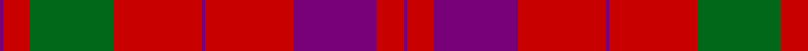

**Bands:** [BRBRBRGRB](/stripes/brbrbrgrb/) · **Stripes:** [DP R DP R DP R G R DP](/stripes/stripes9/) DP R DP R DP R G R DP

This was sourced from house-of-tartan.  It is a [9 band tartan](/bands/bands9/).

Original link http://www.house-of-tartan.scotland.net/house/TartanViewjs.asp?colr=Def&tnam=400

## Thread count
P/2 R14 G44 R46 P2 R46 P44 R14 P/2

## Palette
Each colour and its ΔE from the base-6 reference it is a variant of.

| Colour | Shade | Base | ΔE (OKLab) |
|---|---|---|---|
| G | <code style="background-color:#006818;">#006818</code> `#006818` | G <code style="background-color:#006100;">#006100</code> | 0.02 |
| P | <code style="background-color:#780078;">#780078</code> `#780078` | B <code style="background-color:#2A418A;">#2A418A</code> | 0.17 |
| R | <code style="background-color:#C80000;">#C80000</code> `#C80000` | R <code style="background-color:#CC0000;">#CC0000</code> | 0.01 |

## Nearest tartans

The nearest existing variants by ΔTartan distance.

1. [Lovat, or Fraser](/setts/s9/p1r7g22r23p1r23p22r7p1~x2/) — ΔT 0.23
1. [Lovat or Fraser](/setts/s9/dp1r7dg22r23dp1r23dp22r7dp1~x2/) — ΔT 0.91
1. [Franklin Museum Unidentified 2](/setts/s8/r5g20r25db1r25db20r5db1~x4/) — ΔT 1.05
1. [Unidentified Cant #14](/setts/s12/db80r56dg3r56dg88r64db3r4dg3r4db3r64/) — ΔT 1.08
1. [Caledonian District Tartan Tartan Number: 526. Earliest known date: 1819 In view of its widespread use as a foundation for other tartans it is perhaps not surprising that Wilson's named the Mackintosh tartan 'Caledonian'. They also called it 'Lovat or Fraser'. For this reason the tartan is not suitable for persons seeking a Caledonian tartan unless they are also Frasers of Lovat or Mackintoshes. See products available Copyright © Blair Urquhart, Comrie, 2015](/setts/s6/r60dp20r8g45r8dp2~x2/) — ΔT 1.24
1. [MacKintosh Plaid](/setts/s6/r16db6r2dg6r2db1~x2/) — ΔT 1.29
1. [MacKintosh](/setts/s6/r70db20r10g40r10db3/) — ΔT 1.33
1. [MacDougal 4](/setts/s11/p4g8db6p8r6g2r2g2r24g1r3~x2/) — ΔT 1.35
1. [MacKintosh #2](/setts/s6/r68db18r9dg34r9db3~x2/) — ΔT 1.36
1. [MacDonald #7](/setts/s9/dg2r2db1r24db6r3dg12r4db1~x2/) — ΔT 1.40

## Neighbour map

Every grey dot is one of 14313 variants placed by the first two principal components of the ΔTartan feature space (44% of its variance). Red is this tartan; blue dots are its nearest — click one to open its page.

<svg viewBox="0 0 640 380" role="img" style="max-width:100%;height:auto;border:1px solid #e0e0e0;border-radius:4px;display:block" xmlns="http://www.w3.org/2000/svg"><image href="/nn/cloud.v1.png" width="640" height="380"/><a href="/setts/s9/p1r7g22r23p1r23p22r7p1~x2/"><circle cx="380.6" cy="179.1" r="4" fill="#3465a4"><title>Lovat, or Fraser</title></circle></a><a href="/setts/s9/dp1r7dg22r23dp1r23dp22r7dp1~x2/"><circle cx="362.0" cy="168.7" r="4" fill="#3465a4"><title>Lovat or Fraser</title></circle></a><a href="/setts/s8/r5g20r25db1r25db20r5db1~x4/"><circle cx="381.5" cy="180.7" r="4" fill="#3465a4"><title>Franklin Museum Unidentified 2</title></circle></a><a href="/setts/s12/db80r56dg3r56dg88r64db3r4dg3r4db3r64/"><circle cx="394.6" cy="149.6" r="4" fill="#3465a4"><title>Unidentified Cant #14</title></circle></a><a href="/setts/s6/r60dp20r8g45r8dp2~x2/"><circle cx="387.8" cy="181.6" r="4" fill="#3465a4"><title>Caledonian District Tartan Tartan Number: 526. Earliest known date: 1819 In view of its widespread use as a foundation for other tartans it is perhaps not surprising that Wilson's named the Mackintosh tartan 'Caledonian'. They also called it 'Lovat or Fraser'. For this reason the tartan is not suitable for persons seeking a Caledonian tartan unless they are also Frasers of Lovat or Mackintoshes. See products available Copyright © Blair Urquhart, Comrie, 2015</title></circle></a><a href="/setts/s6/r16db6r2dg6r2db1~x2/"><circle cx="403.2" cy="200.1" r="4" fill="#3465a4"><title>MacKintosh Plaid</title></circle></a><a href="/setts/s6/r70db20r10g40r10db3/"><circle cx="401.6" cy="187.9" r="4" fill="#3465a4"><title>MacKintosh</title></circle></a><a href="/setts/s11/p4g8db6p8r6g2r2g2r24g1r3~x2/"><circle cx="343.2" cy="137.3" r="4" fill="#3465a4"><title>MacDougal 4</title></circle></a><a href="/setts/s6/r68db18r9dg34r9db3~x2/"><circle cx="413.1" cy="180.7" r="4" fill="#3465a4"><title>MacKintosh #2</title></circle></a><a href="/setts/s9/dg2r2db1r24db6r3dg12r4db1~x2/"><circle cx="415.0" cy="147.4" r="4" fill="#3465a4"><title>MacDonald #7</title></circle></a><circle cx="386.1" cy="181.2" r="5" fill="#c00000"/></svg>

ID: /setts/s9/dp1r7dp22r23dp1r23g22r7dp1~x2/
