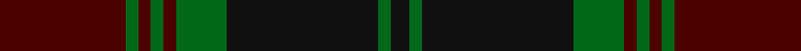

In pattern [BGBGBGKGK](/stripes/bgbgbgkgk/).

This was sourced from register-of-tartans.  It is a [9 stripe tartan](/stripes/stripes9/).

Original link https://www.tartanregister.gov.uk/tartanDetails.aspx?ref=564

## Also known as

This cloth is also recorded under:

- Carlow, County

## Attestations

This cloth appears in 2 source records; the oldest owns this page.

- 01/01/1996 — Carlow, County (register-of-tartans, [record](https://www.tartanregister.gov.uk/tartanDetails.aspx?ref=564))
- 1996 — Carlow, County (District) (tartans-authority, [record](http://www.tartansauthority.com/tartan-ferret/display/2275/))

## Register references

External register numbers recorded for this tartan.

- Scottish Register of Tartans: [564](https://www.tartanregister.gov.uk/tartanDetails.aspx?ref=564)
- Scottish Tartans Authority (ITI): 2275
- Scottish Tartans World Register: 2275

## Thread count
DR/40 G4 DR4 G4 DR4 G16 K48 G4 K/6

## Palette
Each colour and the base-6 reference it is a variant of.

| Colour | Shade | Base |
|---|---|---|
| DG | <code style="background-color:#003820;">#003820</code> `oklch(30.0% 0.070 158.3)` <small>#003820</small> | G <code style="background-color:#006100;">#006100</code> |
| DR | <code style="background-color:#4C0000;">#4C0000</code> `oklch(26.2% 0.107 29.2)` <small>#4C0000</small> | B <code style="background-color:#2A418A;">#2A418A</code> |
| G | <code style="background-color:#006818;">#006818</code> `oklch(45.0% 0.142 145.0)` <small>#006818</small> | G <code style="background-color:#006100;">#006100</code> |
| K | <code style="background-color:#101010;">#101010</code> `oklch(17.3% 0.000 89.9)` <small>#101010</small> | K <code style="background-color:#000000;">#000000</code> |

## Nearest tartans

The nearest existing variants by ΔTartan distance.

1. [Lindsay](/setts/s9/dg20db2dg2db2dg2db8dr24db2dr3~x2/) — ΔT 0.71
1. [Lindsay](/setts/s9/dg20db2dg2db2dg2db8dr24db2dr3/) — ΔT 0.71
1. [Lindsay](/setts/s9/dg20db2dg2db2dg2db8r24db2r3~x2/) — ΔT 0.88
1. [Lindsay](/setts/s9/dg24dt3dg3dt3dg3dt9m24dg3m4~x2/) — ΔT 1.06
1. [Herron from Ulster (Personal)](/setts/s9/dg12k11dg1k1dg1db10dg1k1dg1~x4/) — ΔT 1.18
1. [Lindsay (Chisholm Red)](/setts/s9/dg24db3dg3db3dg3db9m24dg3m4~x2/) — ΔT 1.19
1. [Lindsay (Crimson version) (Clan?)](/setts/s9/k12g1k1g1k1r5k10g1k2~x4/) — ΔT 1.31
1. [Wcwm 1527](/setts/s10/k2r26n26k2n3k2n3k14r2k2~x2/) — ΔT 1.39
1. [Lindsay](/setts/s9/dg20db2dg2db2dg2db8o24db2o3/) — ΔT 1.46
1. [Cork, County (District)](/setts/s9/dg28r12dg4k20lo2k3lo2k3dg7~x2/) — ΔT 1.51

## Neighbour map

Every grey dot is one of 14299 variants placed by the first two principal components of the ΔTartan feature space (44% of its variance). Red is this tartan; blue dots are its nearest — click one to open its page.

<svg viewBox="0 0 640 380" role="img" style="max-width:100%;height:auto;border:1px solid #e0e0e0;border-radius:4px;display:block" xmlns="http://www.w3.org/2000/svg"><image href="/nn/cloud.v1.png" width="640" height="380"/><a href="/setts/s9/dg20db2dg2db2dg2db8dr24db2dr3~x2/"><circle cx="351.1" cy="230.4" r="4" fill="#3465a4"><title>Lindsay</title></circle></a><a href="/setts/s9/dg20db2dg2db2dg2db8dr24db2dr3/"><circle cx="351.1" cy="230.4" r="4" fill="#3465a4"><title>Lindsay</title></circle></a><a href="/setts/s9/dg20db2dg2db2dg2db8r24db2r3~x2/"><circle cx="324.6" cy="211.1" r="4" fill="#3465a4"><title>Lindsay</title></circle></a><a href="/setts/s9/dg24dt3dg3dt3dg3dt9m24dg3m4~x2/"><circle cx="336.5" cy="248.0" r="4" fill="#3465a4"><title>Lindsay</title></circle></a><a href="/setts/s9/dg12k11dg1k1dg1db10dg1k1dg1~x4/"><circle cx="319.8" cy="227.2" r="4" fill="#3465a4"><title>Herron from Ulster (Personal)</title></circle></a><a href="/setts/s9/dg24db3dg3db3dg3db9m24dg3m4~x2/"><circle cx="342.1" cy="251.2" r="4" fill="#3465a4"><title>Lindsay (Chisholm Red)</title></circle></a><a href="/setts/s9/k12g1k1g1k1r5k10g1k2~x4/"><circle cx="291.4" cy="206.2" r="4" fill="#3465a4"><title>Lindsay (Crimson version) (Clan?)</title></circle></a><a href="/setts/s10/k2r26n26k2n3k2n3k14r2k2~x2/"><circle cx="316.2" cy="195.4" r="4" fill="#3465a4"><title>Wcwm 1527</title></circle></a><a href="/setts/s9/dg20db2dg2db2dg2db8o24db2o3/"><circle cx="305.2" cy="204.2" r="4" fill="#3465a4"><title>Lindsay</title></circle></a><a href="/setts/s9/dg28r12dg4k20lo2k3lo2k3dg7~x2/"><circle cx="319.1" cy="203.0" r="4" fill="#3465a4"><title>Cork, County (District)</title></circle></a><circle cx="340.6" cy="224.6" r="5" fill="#c00000"/></svg>

ID: /setts/s9/dr20g2dr2g2dr2g8k24g2k3~x2/
