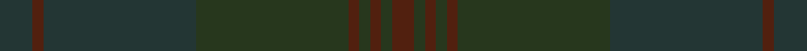

In pattern [BBBGBGBGB](/stripes/bbbgbgbgb/).

This was sourced from register-of-tartans.  It is a [9 stripe tartan](/stripes/stripes9/).

Original link https://www.tartanregister.gov.uk/tartanDetails.aspx?ref=10031

## Register references

External register numbers recorded for this tartan.

- Scottish Register of Tartans: [10031](https://www.tartanregister.gov.uk/tartanDetails.aspx?ref=10031)

## Thread count
DN/12 T4 DN56 K56 T4 K4 T4 K4 T/8

## Palette
Each colour and the base-6 reference it is a variant of.

| Colour | Shade | Base |
|---|---|---|
| DN | <code style="background-color:#233634;">#233634</code> `oklch(31.6% 0.025 187.8)` <small>#233634</small> | B <code style="background-color:#2A418A;">#2A418A</code> |
| K | <code style="background-color:#27371D;">#27371D</code> `oklch(31.5% 0.049 134.2)` <small>#27371D</small> | G <code style="background-color:#006100;">#006100</code> |
| T | <code style="background-color:#51200F;">#51200F</code> `oklch(31.2% 0.079 39.1)` <small>#51200F</small> | B <code style="background-color:#2A418A;">#2A418A</code> |

## Nearest tartans

The nearest existing variants by ΔTartan distance, with this tartan at the top so the swatches line up against it.

ΔTartan

Tartan

Sett

—

<a href="/ttd/edit/#slug=dt3dr1dt14dg14dr1dg1dr1dg1dr2~x4">Breckon Hunting</a> <a class="nn-out" href="/setts/s9/dt3dr1dt14dg14dr1dg1dr1dg1dr2~x4/" title="open its dictionary page">↗</a>

3.29

<a href="/ttd/edit/#slug=r1o7o25o7r1~x2">Unnamed Brown (Teddy Bear)</a> <a class="nn-out" href="/setts/s5/r1o7o25o7r1~x2/" title="open its dictionary page">↗</a>

3.53

<a href="/ttd/edit/#slug=r3o8r3o20o20o3o8o3~x2">Miyuki, House Check Tan, 1004A</a> <a class="nn-out" href="/setts/s8/r3o8r3o20o20o3o8o3~x2/" title="open its dictionary page">↗</a>

3.58

<a href="/ttd/edit/#slug=dt1dt8k8dt8dg1dt4k11dt1k1dt1k1dt1k11dt4dt1~x4">ShadowHalls</a> <a class="nn-out" href="/setts/s15/dt1dt8k8dt8dg1dt4k11dt1k1dt1k1dt1k11dt4dt1~x4/" title="open its dictionary page">↗</a>

4.48

<a href="/ttd/edit/#slug=db13dt13dg21db34dt55do3">Bouncing Blackie (Personal)</a> <a class="nn-out" href="/setts/s6/db13dt13dg21db34dt55do3/" title="open its dictionary page">↗</a>

4.50

<a href="/ttd/edit/#slug=dy6dg2dy29dg29dy2dg6~x2">Harmony 11 #2</a> <a class="nn-out" href="/setts/s6/dy6dg2dy29dg29dy2dg6~x2/" title="open its dictionary page">↗</a>

4.56

<a href="/ttd/edit/#slug=dy2n4y12n3dy6t2n24dy2n2y2~x2">Wicklow Irish County Tartan Tartan Number: 2265. Earliest known date: 1995 One of a series of Irish District tartans designed by Polly Wittering of the House of Edgar, with colours reminiscent of the Country with soft warm colours dominating. See products available Copyright © Blair Urquhart, Comrie, 2015</a> <a class="nn-out" href="/setts/s10/dy2n4y12n3dy6t2n24dy2n2y2~x2/" title="open its dictionary page">↗</a>

4.58

<a href="/ttd/edit/#slug=o6y2o29y29o2y6~x2">Harmony, 12</a> <a class="nn-out" href="/setts/s6/o6y2o29y29o2y6~x2/" title="open its dictionary page">↗</a>

4.90

<a href="/ttd/edit/#slug=dt4k2dt4k45dt2k3dt2~x2">STLTH</a> <a class="nn-out" href="/setts/s7/dt4k2dt4k45dt2k3dt2~x2/" title="open its dictionary page">↗</a>

## Neighbour map

Every grey dot is one of 14299 variants placed by the first two principal components of the ΔTartan feature space (44% of its variance). Red is this tartan; blue dots are its nearest — click one to open its page.

<svg viewBox="0 0 640 380" role="img" style="max-width:100%;height:auto;border:1px solid #e0e0e0;border-radius:4px;display:block" xmlns="http://www.w3.org/2000/svg"><image href="/nn/cloud.v1.png" width="640" height="380"/><a href="/setts/s5/r1o7o25o7r1~x2/"><circle cx="626.0" cy="360.9" r="4" fill="#3465a4"><title>Unnamed Brown (Teddy Bear)</title></circle></a><a href="/setts/s8/r3o8r3o20o20o3o8o3~x2/"><circle cx="552.6" cy="366.0" r="4" fill="#3465a4"><title>Miyuki, House Check Tan, 1004A</title></circle></a><a href="/setts/s15/dt1dt8k8dt8dg1dt4k11dt1k1dt1k1dt1k11dt4dt1~x4/"><circle cx="516.9" cy="316.0" r="4" fill="#3465a4"><title>ShadowHalls</title></circle></a><a href="/setts/s6/db13dt13dg21db34dt55do3/"><circle cx="528.7" cy="353.0" r="4" fill="#3465a4"><title>Bouncing Blackie (Personal)</title></circle></a><a href="/setts/s6/dy6dg2dy29dg29dy2dg6~x2/"><circle cx="621.8" cy="366.0" r="4" fill="#3465a4"><title>Harmony 11 #2</title></circle></a><a href="/setts/s10/dy2n4y12n3dy6t2n24dy2n2y2~x2/"><circle cx="551.6" cy="299.3" r="4" fill="#3465a4"><title>Wicklow Irish County Tartan Tartan Number: 2265. Earliest known date: 1995 One of a series of Irish District tartans designed by Polly Wittering of the House of Edgar, with colours reminiscent of the Country with soft warm colours dominating. See products available Copyright © Blair Urquhart, Comrie, 2015</title></circle></a><a href="/setts/s6/o6y2o29y29o2y6~x2/"><circle cx="626.0" cy="360.1" r="4" fill="#3465a4"><title>Harmony, 12</title></circle></a><a href="/setts/s7/dt4k2dt4k45dt2k3dt2~x2/"><circle cx="626.0" cy="328.5" r="4" fill="#3465a4"><title>STLTH</title></circle></a><circle cx="626.0" cy="366.0" r="5" fill="#c00000"/></svg>

ID: /setts/s9/dt3dr1dt14dg14dr1dg1dr1dg1dr2~x4/
