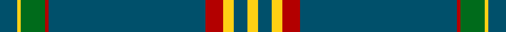

This page is one **sett** — a single exact thread-count. It belongs to the [tartan](/tartans/dt5ly1g7r1dt45r5ly3dt4ly3/)
(the same proportion at any scale), whose colour order is pattern [BYGRBRYBY](/stripes/bygrbryby/).

Sourced from house-of-tartan.  It is a [9 stripe tartan](/stripes/stripes9/).

Original link http://www.house-of-tartan.scotland.net/house/TartanViewjs.asp?colr=Def&tnam=10652

## Thread count
DB/10 Y2 G14 DR2 DB90 DR10 Y6 DB8 Y/6

## Palette

Palette: <strong>custom</strong>
<table><thead><tr><th>Colour</th><th>Threads</th><th>Shade</th><th>Base</th><th>OKLCh</th></tr></thead><tbody><tr><td>DB/</td><td style="text-align:right;font-variant-numeric:tabular-nums">10</td><td><code style="background-color:#00506B;">#00506B</code> <small style="color:#888">#00506B</small></td><td>B <code style="background-color:#2A418A;">#2A418A</code></td><td><small style="color:#888">oklch(40.4% 0.080 229.4)</small></td></tr><tr><td>Y</td><td style="text-align:right;font-variant-numeric:tabular-nums">2</td><td><code style="background-color:#FFD014;">#FFD014</code> <small style="color:#888">#FFD014</small></td><td>Y <code style="background-color:#F2BF00;">#F2BF00</code></td><td><small style="color:#888">oklch(87.3% 0.176 91.9)</small></td></tr><tr><td>G</td><td style="text-align:right;font-variant-numeric:tabular-nums">14</td><td><code style="background-color:#006B1B;">#006B1B</code> <small style="color:#888">#006B1B</small></td><td>G <code style="background-color:#006100;">#006100</code></td><td><small style="color:#888">oklch(45.9% 0.143 145.3)</small></td></tr><tr><td>DR</td><td style="text-align:right;font-variant-numeric:tabular-nums">2</td><td><code style="background-color:#B30000;">#B30000</code> <small style="color:#888">#B30000</small></td><td>R <code style="background-color:#CC0000;">#CC0000</code></td><td><small style="color:#888">oklch(48.1% 0.198 29.2)</small></td></tr><tr><td>DB</td><td style="text-align:right;font-variant-numeric:tabular-nums">90</td><td><code style="background-color:#00506B;">#00506B</code> <small style="color:#888">#00506B</small></td><td>B <code style="background-color:#2A418A;">#2A418A</code></td><td><small style="color:#888">oklch(40.4% 0.080 229.4)</small></td></tr><tr><td>DR</td><td style="text-align:right;font-variant-numeric:tabular-nums">10</td><td><code style="background-color:#B30000;">#B30000</code> <small style="color:#888">#B30000</small></td><td>R <code style="background-color:#CC0000;">#CC0000</code></td><td><small style="color:#888">oklch(48.1% 0.198 29.2)</small></td></tr><tr><td>Y</td><td style="text-align:right;font-variant-numeric:tabular-nums">6</td><td><code style="background-color:#FFD014;">#FFD014</code> <small style="color:#888">#FFD014</small></td><td>Y <code style="background-color:#F2BF00;">#F2BF00</code></td><td><small style="color:#888">oklch(87.3% 0.176 91.9)</small></td></tr><tr><td>DB</td><td style="text-align:right;font-variant-numeric:tabular-nums">8</td><td><code style="background-color:#00506B;">#00506B</code> <small style="color:#888">#00506B</small></td><td>B <code style="background-color:#2A418A;">#2A418A</code></td><td><small style="color:#888">oklch(40.4% 0.080 229.4)</small></td></tr><tr><td>Y/</td><td style="text-align:right;font-variant-numeric:tabular-nums">6</td><td><code style="background-color:#FFD014;">#FFD014</code> <small style="color:#888">#FFD014</small></td><td>Y <code style="background-color:#F2BF00;">#F2BF00</code></td><td><small style="color:#888">oklch(87.3% 0.176 91.9)</small></td></tr></tbody></table>

## Nearest tartans

The nearest existing variants by ΔTartan distance, with this tartan at the top so the swatches line up against it.

ΔTartan

Tartan

Sett

—

<a href="/ttd/edit/#slug=dt5ly1g7r1dt45r5ly3dt4ly3~x2">Brooks Brothers Signature Corporate Tartan Tartan Number: 10652. Earliest known date: 01/05/2012 Brooks Brothers' Scottish roots originate in Perthshire's Glen Lyon. Thomas Lyon emigrated from Glen Lyon to the USA in the 1600s. It was his granddaughter, Lavinia, who married Henry Sands Brooks, founder of the Brooks empire. Brooks opened his first store in Cherry Street, New York in 1818. This simple and elegant tartan contains elements of the traditional 1819 Campbell tartan (the major clan in Glen Lyon) and incorporates the gold from the Brooks Brothers famous Golden Fleece logo and their equally famous necktie design, No. 1 stripe. See products available Copyright © Blair Urquhart, Comrie, 2015</a> <a class="nn-out" href="/setts/s9/dt5ly1g7r1dt45r5ly3dt4ly3~x2/" title="open its dictionary page">↗</a>

1.05

<a href="/ttd/edit/#slug=db40g8k1ly2k1g8db5~x4">Salvation Army, Hunting</a> <a class="nn-out" href="/setts/s7/db40g8k1ly2k1g8db5~x4/" title="open its dictionary page">↗</a>

1.14

<a href="/ttd/edit/#slug=n140k3w16k3do16k3do16">Crail</a> <a class="nn-out" href="/setts/s7/n140k3w16k3do16k3do16/" title="open its dictionary page">↗</a>

1.23

<a href="/ttd/edit/#slug=g44db11g5t3g4db8g4w1~x2">Hastings-Stephenson (Personal)</a> <a class="nn-out" href="/setts/s8/g44db11g5t3g4db8g4w1~x2/" title="open its dictionary page">↗</a>

1.40

<a href="/ttd/edit/#slug=n36k3dy3t1dy3k3n4dy6k1t2~x4">Chateau</a> <a class="nn-out" href="/setts/s10/n36k3dy3t1dy3k3n4dy6k1t2~x4/" title="open its dictionary page">↗</a>

1.51

<a href="/ttd/edit/#slug=r4dp12g2dp2g46w1~x2">Kinfauns Castle (Corporate)</a> <a class="nn-out" href="/setts/s6/r4dp12g2dp2g46w1~x2/" title="open its dictionary page">↗</a>

1.51

<a href="/ttd/edit/#slug=n1k6n35k6n2dp3n1k6n2w1~x2">Melrose Newbigging Grey (Name)</a> <a class="nn-out" href="/setts/s10/n1k6n35k6n2dp3n1k6n2w1~x2/" title="open its dictionary page">↗</a>

1.54

<a href="/ttd/edit/#slug=db8w4dt6db2dt6o10dt63w3">Pride of the Clyde</a> <a class="nn-out" href="/setts/s8/db8w4dt6db2dt6o10dt63w3/" title="open its dictionary page">↗</a>

1.59

<a href="/ttd/edit/#slug=r4g3dp3g44dp16g10w2g2dp2~x2">Glenfeshie (Personal)</a> <a class="nn-out" href="/setts/s9/r4g3dp3g44dp16g10w2g2dp2~x2/" title="open its dictionary page">↗</a>

1.59

<a href="/ttd/edit/#slug=dg49r3w2ly1t3dg19w2ly1dg5r3w2ly1t3~x2">Hogan</a> <a class="nn-out" href="/setts/s13/dg49r3w2ly1t3dg19w2ly1dg5r3w2ly1t3~x2/" title="open its dictionary page">↗</a>

1.62

<a href="/ttd/edit/#slug=y5k1y33dp1y9k9dp5k1r2k4~x2">Lochnagar Dress (Fashion)</a> <a class="nn-out" href="/setts/s10/y5k1y33dp1y9k9dp5k1r2k4~x2/" title="open its dictionary page">↗</a>

## Neighbour map

Every grey dot is one of 14359 variants placed by the first two principal components of the ΔTartan feature space (44% of its variance). Red is this tartan; blue dots are its nearest — click one to open its page.

<svg viewBox="0 0 640 380" role="img" style="max-width:100%;height:auto;border:1px solid #e0e0e0;border-radius:4px;display:block" xmlns="http://www.w3.org/2000/svg"><image href="/nn/cloud.v1.png" width="640" height="380"/><a href="/setts/s7/db40g8k1ly2k1g8db5~x4/"><circle cx="486.5" cy="143.3" r="4" fill="#3465a4"><title>Salvation Army, Hunting</title></circle></a><a href="/setts/s7/n140k3w16k3do16k3do16/"><circle cx="501.4" cy="111.6" r="4" fill="#3465a4"><title>Crail</title></circle></a><a href="/setts/s8/g44db11g5t3g4db8g4w1~x2/"><circle cx="501.6" cy="146.5" r="4" fill="#3465a4"><title>Hastings-Stephenson (Personal)</title></circle></a><a href="/setts/s10/n36k3dy3t1dy3k3n4dy6k1t2~x4/"><circle cx="450.4" cy="123.6" r="4" fill="#3465a4"><title>Chateau</title></circle></a><a href="/setts/s6/r4dp12g2dp2g46w1~x2/"><circle cx="517.4" cy="140.9" r="4" fill="#3465a4"><title>Kinfauns Castle (Corporate)</title></circle></a><a href="/setts/s10/n1k6n35k6n2dp3n1k6n2w1~x2/"><circle cx="475.0" cy="126.2" r="4" fill="#3465a4"><title>Melrose Newbigging Grey (Name)</title></circle></a><a href="/setts/s8/db8w4dt6db2dt6o10dt63w3/"><circle cx="509.8" cy="146.4" r="4" fill="#3465a4"><title>Pride of the Clyde</title></circle></a><a href="/setts/s9/r4g3dp3g44dp16g10w2g2dp2~x2/"><circle cx="449.0" cy="147.9" r="4" fill="#3465a4"><title>Glenfeshie (Personal)</title></circle></a><a href="/setts/s13/dg49r3w2ly1t3dg19w2ly1dg5r3w2ly1t3~x2/"><circle cx="527.0" cy="75.5" r="4" fill="#3465a4"><title>Hogan</title></circle></a><a href="/setts/s10/y5k1y33dp1y9k9dp5k1r2k4~x2/"><circle cx="467.3" cy="137.4" r="4" fill="#3465a4"><title>Lochnagar Dress (Fashion)</title></circle></a><circle cx="507.0" cy="114.1" r="5" fill="#c00000"/></svg>

ID: /setts/s9/dt5ly1g7r1dt45r5ly3dt4ly3~x2/
