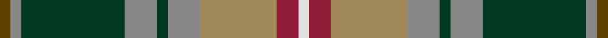

**Bands:** [GRGRGRYRW](/stripes/grgrgryrw/) · **Stripes:** [DY O DG O DG O LO R W](/stripes/stripes9/) DY O DG O DG O LO R W

This was sourced from tartans-authority.  It is a [9 band tartan](/bands/bands9/).

Original link http://www.tartansauthority.com/tartan-ferret/display/2091/

## Variants

Other setts woven to the same stripe pattern.

- [Royal Pharmaceutical Society](/setts/s9/dy3o2dg19o6dg2o6lo14r4w2~x2/)

## Thread count
T/4 N4 DG38 N12 DG4 N12 LT28 DR8 LN/4

## Palette
Each colour and its ΔE from the base-6 reference it is a variant of.

| Colour | Shade | Base | ΔE (OKLab) |
|---|---|---|---|
| DG | <code style="background-color:#003820;">#003820</code> `#003820` | G <code style="background-color:#006100;">#006100</code> | 0.15 |
| DR | <code style="background-color:#901C38;">#901C38</code> `#901C38` | R <code style="background-color:#CC0000;">#CC0000</code> | 0.13 |
| LN | <code style="background-color:#E0E0E0;">#E0E0E0</code> `#E0E0E0` | W <code style="background-color:#F7F7F7;">#F7F7F7</code> | 0.07 |
| LT | <code style="background-color:#A08858;">#A08858</code> `#A08858` | Y <code style="background-color:#F2BF00;">#F2BF00</code> | 0.21 |
| N | <code style="background-color:#888888;">#888888</code> `#888888` | R <code style="background-color:#CC0000;">#CC0000</code> | 0.24 |
| T | <code style="background-color:#604000;">#604000</code> `#604000` | G <code style="background-color:#006100;">#006100</code> | 0.14 |

## Nearest tartans

The nearest existing variants by ΔTartan distance.

1. [Royal Pharmaceutical Society](/setts/s9/dy3o2dg19o6dg2o6lo14r4w2~x2/) — ΔT 0.13
1. [State Seal of Florida (Fashion)](/setts/s10/r3lo21r14lb3db11g36do3db3do4lo3~x2/) — ΔT 0.72
1. [Royal Pharmaceutical Society Commemorative Tartan Tartan Number: 2091. Earliest known date: 1991 Created by Kinloch Anderson of Edinburgh for the 150th Anniversary of the Royal Pharmaceutical Society of Great Britain which was held at Scone Palace, Perthshire in 1991. See products available Copyright © Blair Urquhart, Comrie, 2015](/setts/s10/do3db2g19db6g2db6lo14w2dp4w2~x2/) — ΔT 0.77
1. [Paisley](/setts/s12/g7r2g3r5g17ly2k15ly2t22g3w2t7~x2/) — ΔT 0.89
1. [Haines Family (Personal)](/setts/s10/r2y6t1y1t1y1t3dt8ly1b1~x4/) — ΔT 0.90
1. [Wcwm 9275-1258](/setts/s12/y8g2k4lo1k1lb1k1do8y3k1y1lb1~x4/) — ΔT 0.98
1. [Gallagher Irish Fashion Tartan Tartan Number: 4053. Earliest known date: 2001 February See products available Copyright © Blair Urquhart, Comrie, 2015](/setts/s9/db4dg41lo4g4lo4g9o18lo4w4~x2/) — ΔT 1.00
1. [Unidentified (Woven sample)](/setts/s11/g18r4g4r6g28dp28r4lt3ly4lt13r6/) — ΔT 1.00
1. [State Seal of New Mexico (Fashion)](/setts/s8/lb5o49lb3dg24r5lo4dy30lb4~x2/) — ΔT 1.00
1. [Gallagher Ancient](/setts/s9/db4dg41lo4g4lo4g9r18lo4w4~x2/) — ΔT 1.01

## Neighbour map

Every grey dot is one of 14299 variants placed by the first two principal components of the ΔTartan feature space (44% of its variance). Red is this tartan; blue dots are its nearest — click one to open its page.

<svg viewBox="0 0 640 380" role="img" style="max-width:100%;height:auto;border:1px solid #e0e0e0;border-radius:4px;display:block" xmlns="http://www.w3.org/2000/svg"><image href="/nn/cloud.v1.png" width="640" height="380"/><a href="/setts/s9/dy3o2dg19o6dg2o6lo14r4w2~x2/"><circle cx="151.8" cy="164.6" r="4" fill="#3465a4"><title>Royal Pharmaceutical Society</title></circle></a><a href="/setts/s10/r3lo21r14lb3db11g36do3db3do4lo3~x2/"><circle cx="164.8" cy="142.4" r="4" fill="#3465a4"><title>State Seal of Florida (Fashion)</title></circle></a><a href="/setts/s10/do3db2g19db6g2db6lo14w2dp4w2~x2/"><circle cx="129.1" cy="151.6" r="4" fill="#3465a4"><title>Royal Pharmaceutical Society Commemorative Tartan Tartan Number: 2091. Earliest known date: 1991 Created by Kinloch Anderson of Edinburgh for the 150th Anniversary of the Royal Pharmaceutical Society of Great Britain which was held at Scone Palace, Perthshire in 1991. See products available Copyright © Blair Urquhart, Comrie, 2015</title></circle></a><a href="/setts/s12/g7r2g3r5g17ly2k15ly2t22g3w2t7~x2/"><circle cx="145.1" cy="146.4" r="4" fill="#3465a4"><title>Paisley</title></circle></a><a href="/setts/s10/r2y6t1y1t1y1t3dt8ly1b1~x4/"><circle cx="131.7" cy="163.1" r="4" fill="#3465a4"><title>Haines Family (Personal)</title></circle></a><a href="/setts/s12/y8g2k4lo1k1lb1k1do8y3k1y1lb1~x4/"><circle cx="148.6" cy="150.5" r="4" fill="#3465a4"><title>Wcwm 9275-1258</title></circle></a><a href="/setts/s9/db4dg41lo4g4lo4g9o18lo4w4~x2/"><circle cx="209.7" cy="147.0" r="4" fill="#3465a4"><title>Gallagher Irish Fashion Tartan Tartan Number: 4053. Earliest known date: 2001 February See products available Copyright © Blair Urquhart, Comrie, 2015</title></circle></a><a href="/setts/s11/g18r4g4r6g28dp28r4lt3ly4lt13r6/"><circle cx="159.3" cy="146.2" r="4" fill="#3465a4"><title>Unidentified (Woven sample)</title></circle></a><a href="/setts/s8/lb5o49lb3dg24r5lo4dy30lb4~x2/"><circle cx="197.1" cy="135.7" r="4" fill="#3465a4"><title>State Seal of New Mexico (Fashion)</title></circle></a><a href="/setts/s9/db4dg41lo4g4lo4g9r18lo4w4~x2/"><circle cx="203.4" cy="143.4" r="4" fill="#3465a4"><title>Gallagher Ancient</title></circle></a><circle cx="157.6" cy="162.1" r="5" fill="#c00000"/></svg>

ID: /setts/s9/dy2o2dg19o6dg2o6lo14r4w2~x2/
