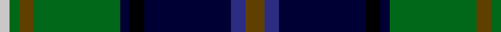

**Bands:** [GBKKKGGGW](/stripes/gbkkkgggw/) · **Stripes:** [DY DB K K K G DY G LB](/stripes/stripes9/) DY DB K K K G DY G LB

This was sourced from register-of-tartans.  It is a [9 band tartan](/bands/bands9/).

Original link https://www.tartanregister.gov.uk/tartanDetails.aspx?ref=4136

## Attestations

This cloth appears in 2 source records; the oldest owns this page.

- 01/01/2000 — Tombow 21st School Memorial (register-of-tartans, [record](https://www.tartanregister.gov.uk/tartanDetails.aspx?ref=4136))
- 2000 — Tombow 21st School Memorial (Corp) (tartans-authority, [record](http://www.tartansauthority.com/tartan-ferret/display/4216/))

## Register references

External register numbers recorded for this tartan.

- Scottish Register of Tartans: [4136](https://www.tartanregister.gov.uk/tartanDetails.aspx?ref=4136)
- Scottish Tartans Authority (ITI): 4216

## Thread count
T/16 DBa12 DB72 K12 DB8 G72 T12 G8 N/8

## Palette
Each colour and its ΔE from the base-6 reference it is a variant of.

| Colour | Shade | Base | ΔE (OKLab) |
|---|---|---|---|
| DB | <code style="background-color:#000034;">#000034</code> `#000034` | K <code style="background-color:#000000;">#000000</code> | 0.18 |
| DBa | <code style="background-color:#2C2C80;">#2C2C80</code> `#2C2C80` | B <code style="background-color:#2A418A;">#2A418A</code> | 0.06 |
| G | <code style="background-color:#006818;">#006818</code> `#006818` | G <code style="background-color:#006100;">#006100</code> | 0.02 |
| K | <code style="background-color:#000000;">#000000</code> `#000000` | K <code style="background-color:#000000;">#000000</code> | 0.00 |
| N | <code style="background-color:#C8C8C8;">#C8C8C8</code> `#C8C8C8` | W <code style="background-color:#F7F7F7;">#F7F7F7</code> | 0.14 |
| T | <code style="background-color:#604000;">#604000</code> `#604000` | G <code style="background-color:#006100;">#006100</code> | 0.14 |

## Nearest tartans

The nearest existing variants by ΔTartan distance.

1. [Tindal](/setts/s11/r3k2g18k18db3k3db3k3db18ly2w3~x2/) — ΔT 0.78
1. [McComb](/setts/s7/db3r2db18k6dg18ly2g3~x2/) — ΔT 0.85
1. [Loch Freuchie (District)](/setts/s10/r3dt3k2dt18ly2k25g20r2g3lb3~x2/) — ΔT 0.87
1. [Schmidt (2014)](/setts/s10/k3db20db8db4g20k2g2r2g3ly3~x2/) — ΔT 0.93
1. [Loch Awe](/setts/s9/ly3k2r3db20k24g20r3k2lb3~x2/) — ΔT 0.97
1. [Blairmore](/setts/s8/db34w5db5r5db5dr26g33o6~x2/) — ΔT 1.03
1. [Roderick Dhu](/setts/s9/b3k2r2k12g10ly1k1g2lb2~x4/) — ΔT 1.05
1. [St. Andrews Golf Club (Corporate)](/setts/s9/w1db12k9g1k1g5lb1g3lo1~x4/) — ΔT 1.06
1. [Big Rory (Corporate)](/setts/s10/n10w5n48k35g5k5g35r5g5dp5/) — ΔT 1.06
1. [Royal Burgh of Peebles (District)](/setts/s7/r3g3db4g17k13dt26w3~x2/) — ΔT 1.08

## Neighbour map

Every grey dot is one of 14299 variants placed by the first two principal components of the ΔTartan feature space (44% of its variance). Red is this tartan; blue dots are its nearest — click one to open its page.

<svg viewBox="0 0 640 380" role="img" style="max-width:100%;height:auto;border:1px solid #e0e0e0;border-radius:4px;display:block" xmlns="http://www.w3.org/2000/svg"><image href="/nn/cloud.v1.png" width="640" height="380"/><a href="/setts/s11/r3k2g18k18db3k3db3k3db18ly2w3~x2/"><circle cx="141.0" cy="153.9" r="4" fill="#3465a4"><title>Tindal</title></circle></a><a href="/setts/s7/db3r2db18k6dg18ly2g3~x2/"><circle cx="177.3" cy="181.7" r="4" fill="#3465a4"><title>McComb</title></circle></a><a href="/setts/s10/r3dt3k2dt18ly2k25g20r2g3lb3~x2/"><circle cx="155.9" cy="143.2" r="4" fill="#3465a4"><title>Loch Freuchie (District)</title></circle></a><a href="/setts/s10/k3db20db8db4g20k2g2r2g3ly3~x2/"><circle cx="175.0" cy="158.9" r="4" fill="#3465a4"><title>Schmidt (2014)</title></circle></a><a href="/setts/s9/ly3k2r3db20k24g20r3k2lb3~x2/"><circle cx="145.2" cy="144.4" r="4" fill="#3465a4"><title>Loch Awe</title></circle></a><a href="/setts/s8/db34w5db5r5db5dr26g33o6~x2/"><circle cx="119.3" cy="179.1" r="4" fill="#3465a4"><title>Blairmore</title></circle></a><a href="/setts/s9/b3k2r2k12g10ly1k1g2lb2~x4/"><circle cx="187.3" cy="145.8" r="4" fill="#3465a4"><title>Roderick Dhu</title></circle></a><a href="/setts/s9/w1db12k9g1k1g5lb1g3lo1~x4/"><circle cx="164.5" cy="149.8" r="4" fill="#3465a4"><title>St. Andrews Golf Club (Corporate)</title></circle></a><a href="/setts/s10/n10w5n48k35g5k5g35r5g5dp5/"><circle cx="169.5" cy="161.9" r="4" fill="#3465a4"><title>Big Rory (Corporate)</title></circle></a><a href="/setts/s7/r3g3db4g17k13dt26w3~x2/"><circle cx="155.6" cy="190.3" r="4" fill="#3465a4"><title>Royal Burgh of Peebles (District)</title></circle></a><circle cx="155.6" cy="161.3" r="5" fill="#c00000"/></svg>

ID: /setts/s9/dy4db3k18k3k2g18dy3g2lb2~x4/
