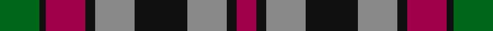

In pattern [GKRKRKRKR](/stripes/gkrkrkrkr/).

This was sourced from house-of-tartan.  It is a [9 stripe tartan](/stripes/stripes9/).

Original link http://www.house-of-tartan.scotland.net/house/TartanViewjs.asp?colr=Def&tnam=816

## Also known as

This cloth is also recorded under:

- Borthwick

## Thread count
G/24 K4 R24 K6 N24 K32 N24 K6 R/12

## Palette
Each colour and the base-6 reference it is a variant of.

| Colour | Shade | Base |
|---|---|---|
| G | <code style="background-color:#006818;">#006818</code> `oklch(45.0% 0.142 145.0)` <small>#006818</small> | G <code style="background-color:#006100;">#006100</code> |
| K | <code style="background-color:#101010;">#101010</code> `oklch(17.3% 0.000 89.9)` <small>#101010</small> | K <code style="background-color:#000000;">#000000</code> |
| N | <code style="background-color:#888888;">#888888</code> `oklch(62.7% 0.000 89.9)` <small>#888888</small> | R <code style="background-color:#CC0000;">#CC0000</code> |
| R | <code style="background-color:#A00048;">#A00048</code> `oklch(45.4% 0.182 5.3)` <small>#A00048</small> | R <code style="background-color:#CC0000;">#CC0000</code> |

## Nearest tartans

The nearest existing variants by ΔTartan distance.

1. [Borthwick](/setts/s9/dg12k2r12k3o12k16o12k3r6~x2/) — ΔT 0.19
1. [Carnegie](/setts/s8/r33g17db50g17r11g17r9k7/) — ΔT 0.87
1. [Utah (US State)](/setts/s8/w2r3dg9r3db2r3db3w1~x6/) — ΔT 0.90
1. [Carnegie #3](/setts/s8/r33dg17db50dg17r11dg17r9k7/) — ΔT 0.91
1. [Hueg (Personal)](/setts/s11/r10k10r4g2r2k2r4g12dt12g3dt4~x2/) — ΔT 0.97
1. [Wilson's No.160](/setts/s10/g19ly2g4k13dp12k3~x2/) — ΔT 1.04
1. [Borthwick](/setts/s9/g12k2r12k3y12k16y12k3r6~x2/) — ΔT 1.06
1. [Wilson's No.076](/setts/s10/dp17k18w2g17k3g17w2k18dp17g3~x2/) — ΔT 1.07
1. [Wilson's No.158](/setts/s10/g19w2g4k13dp12k3~x2/) — ΔT 1.07
1. [Wilson's No.175](/setts/s10/dp16k17g18w2k5w2g18k17dp16k3~x2/) — ΔT 1.08

## Neighbour map

Every grey dot is one of 14299 variants placed by the first two principal components of the ΔTartan feature space (44% of its variance). Red is this tartan; blue dots are its nearest — click one to open its page.

<svg viewBox="0 0 640 380" role="img" style="max-width:100%;height:auto;border:1px solid #e0e0e0;border-radius:4px;display:block" xmlns="http://www.w3.org/2000/svg"><image href="/nn/cloud.v1.png" width="640" height="380"/><a href="/setts/s9/dg12k2r12k3o12k16o12k3r6~x2/"><circle cx="128.0" cy="225.1" r="4" fill="#3465a4"><title>Borthwick</title></circle></a><a href="/setts/s8/r33g17db50g17r11g17r9k7/"><circle cx="158.1" cy="221.0" r="4" fill="#3465a4"><title>Carnegie</title></circle></a><a href="/setts/s8/w2r3dg9r3db2r3db3w1~x6/"><circle cx="158.7" cy="206.3" r="4" fill="#3465a4"><title>Utah (US State)</title></circle></a><a href="/setts/s8/r33dg17db50dg17r11dg17r9k7/"><circle cx="171.9" cy="226.0" r="4" fill="#3465a4"><title>Carnegie #3</title></circle></a><a href="/setts/s11/r10k10r4g2r2k2r4g12dt12g3dt4~x2/"><circle cx="130.0" cy="220.0" r="4" fill="#3465a4"><title>Hueg (Personal)</title></circle></a><a href="/setts/s10/g19ly2g4k13dp12k3~x2/"><circle cx="167.2" cy="206.2" r="4" fill="#3465a4"><title>Wilson's No.160</title></circle></a><a href="/setts/s9/g12k2r12k3y12k16y12k3r6~x2/"><circle cx="100.2" cy="213.9" r="4" fill="#3465a4"><title>Borthwick</title></circle></a><a href="/setts/s10/dp17k18w2g17k3g17w2k18dp17g3~x2/"><circle cx="155.3" cy="206.7" r="4" fill="#3465a4"><title>Wilson's No.076</title></circle></a><a href="/setts/s10/g19w2g4k13dp12k3~x2/"><circle cx="163.4" cy="204.5" r="4" fill="#3465a4"><title>Wilson's No.158</title></circle></a><a href="/setts/s10/dp16k17g18w2k5w2g18k17dp16k3~x2/"><circle cx="164.7" cy="215.2" r="4" fill="#3465a4"><title>Wilson's No.175</title></circle></a><circle cx="124.3" cy="222.6" r="5" fill="#c00000"/></svg>

ID: /setts/s9/g12k2m12k3o12k16o12k3m6~x2/
