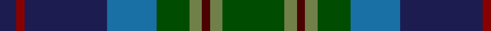

In pattern [BRBBGGBGG](/patterns/brbbggbgg/).

This was sourced from register-of-tartans.  It is a [9 stripes tartan](/stripes/stripes9/).

Original link https://www.tartanregister.gov.uk/tartanDetails.aspx?ref=10929

## Register references

External register numbers recorded for this tartan.

- Scottish Register of Tartans: [10929](https://www.tartanregister.gov.uk/tartanDetails.aspx?ref=10929)

## Thread count
DB/8 DR4 DB40 B24 G16 Ga6 DRa4 Ga6 G/30

## Palette
Each colour and its ΔE from the base-6 reference it is a variant of.

| Colour | Shade | Base | ΔE (OKLab) |
|---|---|---|---|
| B | <code style="background-color:#1870A4;">#1870A4</code> `#1870A4` | B <code style="background-color:#2A418A;">#2A418A</code> | 0.13 |
| DB | <code style="background-color:#1C1C50;">#1C1C50</code> `#1C1C50` | B <code style="background-color:#2A418A;">#2A418A</code> | 0.14 |
| DR | <code style="background-color:#880000;">#880000</code> `#880000` | R <code style="background-color:#CC0000;">#CC0000</code> | 0.15 |
| DRa | <code style="background-color:#4C0000;">#4C0000</code> `#4C0000` | B <code style="background-color:#2A418A;">#2A418A</code> | 0.25 |
| G | <code style="background-color:#004C00;">#004C00</code> `#004C00` | G <code style="background-color:#006100;">#006100</code> | 0.07 |
| Ga | <code style="background-color:#718048;">#718048</code> `#718048` | G <code style="background-color:#006100;">#006100</code> | 0.17 |

## Nearest tartans

The nearest existing variants by ΔTartan distance.

1. [Blairmore House (Corporate)](/setts/s8/b17w2b2r2b2ba12g16y3~b003478-ba3c2010-g0c5454-r8c0000-wc8c8c8-yc88c00~x4/) — ΔT 0.89
1. [Blairmore House](/setts/s8/b17w2b2r2b2ba12g16y3~b003478-ba3c2010-g0c5454-r8c0000-wffffff-yc88c00~x4/) — ΔT 0.98
1. [Greg Wells (Personal)](/setts/s13/b12k3b12g2k12y1k12g2ga12k1r2k1ga12~b383c60-g787878-ga285828-k101010-r9c2430-yc8a438~x2/) — ΔT 1.12
1. [Scottish Odyssey (Fashion)](/setts/s7/b7ba12k3ba12g12ga25bb3~b000048-ba3850c8-bb1c3848-g604000-ga006818-k101010~x2/) — ΔT 1.15
1. [State Seal of North Dakota (Fashion)](/setts/s11/g37b5g5b12ba10bb5ba5bb40ga4bb4y4~b440044-ba1474b4-bb2c2c80-g006818-ga604000-ybc8c00~x2/) — ΔT 1.15
1. [Gow Hunting](/setts/s11/r3k1g12k12b12ba3b12k12g12k1y3~b2c4084-ba080848-g005020-k101010-rdc0000-ye8c000~x2/) — ΔT 1.17
1. [Cowie](/setts/s6/r3b24k7ba11g11y2~b003c64-ba2c2c80-g006818-k101010-rc80000-ye8c000~x2/) — ΔT 1.18
1. [Patel Name Tartan Tartan Number: 10924. Earliest known date: 2013 Designed for the Patel family using colours associated with the Gujarat, a state in the North-West coast of India known locally as Jewel of the West. See products available Copyright © Blair Urquhart, Comrie, 2015](/setts/s9/g3y2r10g10b20g12ra3b10w2~b085088-g004830-r884050-raa00028-we8e8e8-yc48800~x2/) — ΔT 1.20
1. [Porteous Family Tartan Tartan Number: 1264. Earliest known date: 1978 Designed for the Porteous Family Association, and submitted to the Monitoring Committee of the Scottish Tartan Society by Captain Barry Porteous who was president of the association at that time. See products available Copyright © Blair Urquhart, Comrie, 2015](/setts/s6/k1y1b8g10ba7w1~b2c2c80-ba1c4874-g006818-k101010-we0e0e0-ye8c000~x2/) — ΔT 1.21
1. [Loch Freuchie District Tartan Tartan Number: 10725. Earliest known date: 25 October 2012 A tartan for the area around Loch Freuchie near Crieff. The tartan is based on the Murray of Atholl and Breadalbane setts, with differences, to relate the tartan to the particular Loch Freuchie area. Mr MacArthur-Fox has created a tartan for anyone to wear without fear of offending another person or group. See products available Copyright © Blair Urquhart, Comrie, 2015](/setts/s10/b3g3r2g20k25ka2ba13k2ba3r3~b4a708b-ba2c4e75-g124d36-k101010-ka000000-rff0000~x2/) — ΔT 1.22

## Neighbour map

Every grey dot is one of 15726 variants placed by the first two principal components of the ΔTartan feature space (44% of its variance). Red is this tartan; blue dots are its nearest — click one to open its page.

<svg viewBox="0 0 640 380" role="img" style="max-width:100%;height:auto;border:1px solid #e0e0e0;border-radius:4px;display:block" xmlns="http://www.w3.org/2000/svg"><image href="/nn/cloud.v1.png" width="640" height="380"/><a href="/setts/s8/b17w2b2r2b2ba12g16y3~b003478-ba3c2010-g0c5454-r8c0000-wc8c8c8-yc88c00~x4/"><circle cx="190.7" cy="188.6" r="4" fill="#3465a4"><title>Blairmore House (Corporate)</title></circle></a><a href="/setts/s8/b17w2b2r2b2ba12g16y3~b003478-ba3c2010-g0c5454-r8c0000-wffffff-yc88c00~x4/"><circle cx="173.8" cy="181.6" r="4" fill="#3465a4"><title>Blairmore House</title></circle></a><a href="/setts/s13/b12k3b12g2k12y1k12g2ga12k1r2k1ga12~b383c60-g787878-ga285828-k101010-r9c2430-yc8a438~x2/"><circle cx="192.0" cy="170.5" r="4" fill="#3465a4"><title>Greg Wells (Personal)</title></circle></a><a href="/setts/s7/b7ba12k3ba12g12ga25bb3~b000048-ba3850c8-bb1c3848-g604000-ga006818-k101010~x2/"><circle cx="128.9" cy="207.6" r="4" fill="#3465a4"><title>Scottish Odyssey (Fashion)</title></circle></a><a href="/setts/s11/g37b5g5b12ba10bb5ba5bb40ga4bb4y4~b440044-ba1474b4-bb2c2c80-g006818-ga604000-ybc8c00~x2/"><circle cx="191.4" cy="152.8" r="4" fill="#3465a4"><title>State Seal of North Dakota (Fashion)</title></circle></a><a href="/setts/s11/r3k1g12k12b12ba3b12k12g12k1y3~b2c4084-ba080848-g005020-k101010-rdc0000-ye8c000~x2/"><circle cx="131.8" cy="177.7" r="4" fill="#3465a4"><title>Gow Hunting</title></circle></a><a href="/setts/s6/r3b24k7ba11g11y2~b003c64-ba2c2c80-g006818-k101010-rc80000-ye8c000~x2/"><circle cx="194.1" cy="199.1" r="4" fill="#3465a4"><title>Cowie</title></circle></a><a href="/setts/s9/g3y2r10g10b20g12ra3b10w2~b085088-g004830-r884050-raa00028-we8e8e8-yc48800~x2/"><circle cx="217.6" cy="199.4" r="4" fill="#3465a4"><title>Patel Name Tartan Tartan Number: 10924. Earliest known date: 2013 Designed for the Patel family using colours associated with the Gujarat, a state in the North-West coast of India known locally as Jewel of the West. See products available Copyright © Blair Urquhart, Comrie, 2015</title></circle></a><a href="/setts/s6/k1y1b8g10ba7w1~b2c2c80-ba1c4874-g006818-k101010-we0e0e0-ye8c000~x2/"><circle cx="161.5" cy="194.2" r="4" fill="#3465a4"><title>Porteous Family Tartan Tartan Number: 1264. Earliest known date: 1978 Designed for the Porteous Family Association, and submitted to the Monitoring Committee of the Scottish Tartan Society by Captain Barry Porteous who was president of the association at that time. See products available Copyright © Blair Urquhart, Comrie, 2015</title></circle></a><a href="/setts/s10/b3g3r2g20k25ka2ba13k2ba3r3~b4a708b-ba2c4e75-g124d36-k101010-ka000000-rff0000~x2/"><circle cx="190.9" cy="148.5" r="4" fill="#3465a4"><title>Loch Freuchie District Tartan Tartan Number: 10725. Earliest known date: 25 October 2012 A tartan for the area around Loch Freuchie near Crieff. The tartan is based on the Murray of Atholl and Breadalbane setts, with differences, to relate the tartan to the particular Loch Freuchie area. Mr MacArthur-Fox has created a tartan for anyone to wear without fear of offending another person or group. See products available Copyright © Blair Urquhart, Comrie, 2015</title></circle></a><circle cx="172.6" cy="185.8" r="5" fill="#c00000"/></svg>

ID: /setts/s9/g15ga3b2ga3g8ba12bb20r2bb4~b4c0000-ba1870a4-bb1c1c50-g004c00-ga718048-r880000~x2/
