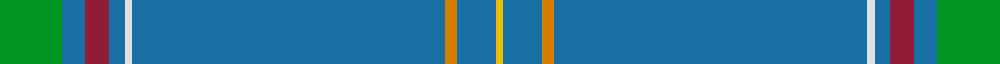

**Bands:** [YBYBWBRBG](/stripes/ybybwbrbg/) · **Stripes:** [LY B LO B W B R B G](/stripes/stripes9/) LY B LO B W B R B G

This was sourced from register-of-tartans.  It is a [9 band tartan](/bands/bands9/).

Original link https://www.tartanregister.gov.uk/tartanDetails.aspx?ref=1644

## Attestations

This cloth appears in 2 source records; the oldest owns this page.

- 01/01/2005 — Heart of Strathearn (register-of-tartans, [record](https://www.tartanregister.gov.uk/tartanDetails.aspx?ref=1644))
- 2005 — Heart of Strathearn (Corporate) (tartans-authority, [record](http://www.tartansauthority.com/tartan-ferret/display/6844/))

## Register references

External register numbers recorded for this tartan.

- Scottish Register of Tartans: [1644](https://www.tartanregister.gov.uk/tartanDetails.aspx?ref=1644)
- Scottish Tartans Authority (ITI): 6844

## Thread count
Ga/16 B6 DR6 B4 LN2 B80 O3 B10 Ya/2

## Palette
Each colour and its ΔE from the base-6 reference it is a variant of.

| Colour | Shade | Base | ΔE (OKLab) |
|---|---|---|---|
| B | <code style="background-color:#1870A4;">#1870A4</code> `#1870A4` | B <code style="background-color:#2A418A;">#2A418A</code> | 0.13 |
| DR | <code style="background-color:#901C38;">#901C38</code> `#901C38` | R <code style="background-color:#CC0000;">#CC0000</code> | 0.13 |
| G | <code style="background-color:#285800;">#285800</code> `#285800` | G <code style="background-color:#006100;">#006100</code> | 0.03 |
| Ga | <code style="background-color:#009420;">#009420</code> `#009420` | G <code style="background-color:#006100;">#006100</code> | 0.16 |
| LN | <code style="background-color:#E0E0E0;">#E0E0E0</code> `#E0E0E0` | W <code style="background-color:#F7F7F7;">#F7F7F7</code> | 0.07 |
| O | <code style="background-color:#D87C00;">#D87C00</code> `#D87C00` | Y <code style="background-color:#F2BF00;">#F2BF00</code> | 0.17 |
| W | <code style="background-color:#F8F8F8;">#F8F8F8</code> `#F8F8F8` | W <code style="background-color:#F7F7F7;">#F7F7F7</code> | 0.00 |
| Y | <code style="background-color:#D8B000;">#D8B000</code> `#D8B000` | Y <code style="background-color:#F2BF00;">#F2BF00</code> | 0.06 |
| Ya | <code style="background-color:#E8C000;">#E8C000</code> `#E8C000` | Y <code style="background-color:#F2BF00;">#F2BF00</code> | 0.02 |

## Nearest tartans

The nearest existing variants by ΔTartan distance.

1. [Dallas (Lochcarron) (Personal)](/setts/s11/b79o2b10o5w2o5b10w2dg8g6w2~x2/) — ΔT 1.40
1. [Craven County (Commemorative)](/setts/s11/b46ly1dy5ly1g5ly1dp5ly1b16r1ly4~x2/) — ΔT 1.62
1. [Quigley of Knockcroghery Htg (Per.)](/setts/s11/b27w2b15ly1b1ly1b15k2w2y16r1~x2/) — ΔT 1.80
1. [Craven County Commemorative Tartan Tartan Number: 10679. Earliest known date: 21 August 2012 2012 marks the 300th year of Craven County, North Carolina, USA. The 300th Anniversary District 2 Committee, under the leadership of Chairperson, Kelly Beasley, voted for a Craven County Tartan to represent the large number of Craven County residents with Scottish heritage. The colours are drawn from the Craven County Coat of Arms, the waterways, rivers and streams, sky, colonial history, governors, royalty, the military, education, and the agricultural background of the county, as well as forestry, tobacco, indigo, and its many other crops. Brian Dodds designed the tartan, submitting four ideas of which the District 2 committee selected Pattern #2. The tartan has been approved by the Craven County 300th Anniversary Committee and the Craven County Board of Commissioners, with the Board signing a resolution on 16 April, 2012. Ila McIlwean White-Lewis volunteered to pay to register the tartan and to have sufficient tartan woven for a banner to be displayed in the Craven County Courthouse. See products available Copyright © Blair Urquhart, Comrie, 2015](/setts/s11/n46lo1do5lo1dg5lo1dp5lo1n16r1lo4~x2/) — ΔT 1.82
1. [Highland Dusk](/setts/s13/n43db2n2r1n1dt11n2db2n1n1n20w4n7~x2/) — ΔT 1.86
1. [Cullen (Christian Hill) (Personal)](/setts/s7/t8lo2t8dg7t57k3lb1~x2/) — ΔT 1.88
1. [Highland Dusk (Fashion)](/setts/s13/n43db2n2db1n1r11n2db2n1n1n20w4n7~x2/) — ΔT 1.90
1. [Stratford, (Oregon) City of (Dist.)](/setts/s10/b42w5b1w1lo9b1g2w1b1r1~x4/) — ΔT 1.92
1. [Highland Sky (Fashion)](/setts/s13/n43dt2n2dt1n1dt11n2dt2n1lb1n20lb4n7~x2/) — ΔT 1.94
1. [Blue Toon (Fashion)](/setts/s11/t49dt11w2dt2lr2dt2t10lg4dt2lg2ly3~x2/) — ΔT 1.96

## Neighbour map

Every grey dot is one of 14299 variants placed by the first two principal components of the ΔTartan feature space (44% of its variance). Red is this tartan; blue dots are its nearest — click one to open its page.

<svg viewBox="0 0 640 380" role="img" style="max-width:100%;height:auto;border:1px solid #e0e0e0;border-radius:4px;display:block" xmlns="http://www.w3.org/2000/svg"><image href="/nn/cloud.v1.png" width="640" height="380"/><a href="/setts/s11/b79o2b10o5w2o5b10w2dg8g6w2~x2/"><circle cx="567.2" cy="121.6" r="4" fill="#3465a4"><title>Dallas (Lochcarron) (Personal)</title></circle></a><a href="/setts/s11/b46ly1dy5ly1g5ly1dp5ly1b16r1ly4~x2/"><circle cx="467.3" cy="74.0" r="4" fill="#3465a4"><title>Craven County (Commemorative)</title></circle></a><a href="/setts/s11/b27w2b15ly1b1ly1b15k2w2y16r1~x2/"><circle cx="426.8" cy="124.7" r="4" fill="#3465a4"><title>Quigley of Knockcroghery Htg (Per.)</title></circle></a><a href="/setts/s11/n46lo1do5lo1dg5lo1dp5lo1n16r1lo4~x2/"><circle cx="511.5" cy="88.9" r="4" fill="#3465a4"><title>Craven County Commemorative Tartan Tartan Number: 10679. Earliest known date: 21 August 2012 2012 marks the 300th year of Craven County, North Carolina, USA. The 300th Anniversary District 2 Committee, under the leadership of Chairperson, Kelly Beasley, voted for a Craven County Tartan to represent the large number of Craven County residents with Scottish heritage. The colours are drawn from the Craven County Coat of Arms, the waterways, rivers and streams, sky, colonial history, governors, royalty, the military, education, and the agricultural background of the county, as well as forestry, tobacco, indigo, and its many other crops. Brian Dodds designed the tartan, submitting four ideas of which the District 2 committee selected Pattern #2. The tartan has been approved by the Craven County 300th Anniversary Committee and the Craven County Board of Commissioners, with the Board signing a resolution on 16 April, 2012. Ila McIlwean White-Lewis volunteered to pay to register the tartan and to have sufficient tartan woven for a banner to be displayed in the Craven County Courthouse. See products available Copyright © Blair Urquhart, Comrie, 2015</title></circle></a><a href="/setts/s13/n43db2n2r1n1dt11n2db2n1n1n20w4n7~x2/"><circle cx="605.2" cy="122.0" r="4" fill="#3465a4"><title>Highland Dusk</title></circle></a><a href="/setts/s7/t8lo2t8dg7t57k3lb1~x2/"><circle cx="626.0" cy="132.9" r="4" fill="#3465a4"><title>Cullen (Christian Hill) (Personal)</title></circle></a><a href="/setts/s13/n43db2n2db1n1r11n2db2n1n1n20w4n7~x2/"><circle cx="584.0" cy="104.0" r="4" fill="#3465a4"><title>Highland Dusk (Fashion)</title></circle></a><a href="/setts/s10/b42w5b1w1lo9b1g2w1b1r1~x4/"><circle cx="481.7" cy="83.2" r="4" fill="#3465a4"><title>Stratford, (Oregon) City of (Dist.)</title></circle></a><a href="/setts/s13/n43dt2n2dt1n1dt11n2dt2n1lb1n20lb4n7~x2/"><circle cx="580.9" cy="110.0" r="4" fill="#3465a4"><title>Highland Sky (Fashion)</title></circle></a><a href="/setts/s11/t49dt11w2dt2lr2dt2t10lg4dt2lg2ly3~x2/"><circle cx="424.8" cy="102.9" r="4" fill="#3465a4"><title>Blue Toon (Fashion)</title></circle></a><circle cx="549.1" cy="109.3" r="5" fill="#c00000"/></svg>

ID: /setts/s9/g16b6r6b4w2b80lo3b10ly2/
