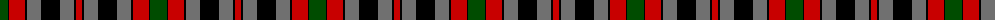

In pattern [GKRKGKGKR](/patterns/gkrkgkgkr/).

This was sourced from weddslist.  It is a [9 stripes tartan](/stripes/stripes9/).

Original link http://www.weddslist.com/cgi-bin/tartans/pg.pl?source=rb

## Thread count
G/17 K1 R16 K2 N14 K19 N14 K2 R/6

## Palette
Each colour and its ΔE from the base-6 reference it is a variant of.

| Colour | Shade | Base | ΔE (OKLab) |
|---|---|---|---|
| G | <code style="background-color:#004C00;">#004C00</code> `#004C00` | G <code style="background-color:#006100;">#006100</code> | 0.07 |
| K | <code style="background-color:#000000;">#000000</code> `#000000` | K <code style="background-color:#000000;">#000000</code> | 0.00 |
| N | <code style="background-color:#707070;">#707070</code> `#707070` | G <code style="background-color:#006100;">#006100</code> | 0.19 |
| R | <code style="background-color:#C80000;">#C80000</code> `#C80000` | R <code style="background-color:#CC0000;">#CC0000</code> | 0.01 |

## Nearest tartans

The nearest existing variants by ΔTartan distance.

1. [Borthwick](/setts/s9/g34k2r32k4ga28k38ga28k4r12-g008000-ga808080-k000000-r900030/) — ΔT 0.42
1. [Borthwick D](/setts/s9/g24k2r20k4ga20k28ga20k4r8-g004c00-ga707070-k000000-rc80000/) — ΔT 0.51
1. [Borthwick](/setts/s9/g34k2b32k4ga28k38ga28k4b12-b59110d-g11450d-ga7e7e7e-k000000/) — ΔT 0.68
1. [Borthwick](/setts/s9/g17k1b16k2ga14k19ga14k2b6-b59110d-g11450d-ga7e7e7e-k000000/) — ΔT 0.68
1. [Borthwick D](/setts/s9/g24k2b20k4ga20k28ga20k4b8-b59110d-g11450d-ga7e7e7e-k000000/) — ΔT 0.88
1. [Borthwick (Clan)](/setts/s9/g34k2r32k4ra28k38ra28k4r12-g006818-k101010-r901c38-ra888888/) — ΔT 1.15
1. [Kilgour](/setts/s8/b24k12g56k12r56k12b24y4-b304080-g008000-k000000-rc00000-yf0c000/) — ΔT 1.16
1. [Prince Edward Island #2](/setts/s7/w4k2g32k24r24k2w4-g005020-k101010-rdc0000-we0e0e0/) — ΔT 1.19
1. [Bonner, (Bonnar)](/setts/s13/r26k2r6g20r10k4r6k24b4k4b4k4b24-b304080-g008000-k000000-rc00000/) — ΔT 1.25
1. [MacBrine (Name)](/setts/s11/k8r12g16r32k12b20k4b20k4g16y2-b2c2c80-g00881c-k101010-rc80000-ye8c000/) — ΔT 1.26

## Neighbour map

Every grey dot is one of 15726 variants placed by the first two principal components of the ΔTartan feature space (44% of its variance). Red is this tartan; blue dots are its nearest — click one to open its page.

<svg viewBox="0 0 640 380" role="img" style="max-width:100%;height:auto;border:1px solid #e0e0e0;border-radius:4px;display:block" xmlns="http://www.w3.org/2000/svg"><image href="/nn/cloud.v1.png" width="640" height="380"/><a href="/setts/s9/g34k2r32k4ga28k38ga28k4r12-g008000-ga808080-k000000-r900030/"><circle cx="138.7" cy="171.1" r="4" fill="#3465a4"><title>Borthwick</title></circle></a><a href="/setts/s9/g24k2r20k4ga20k28ga20k4r8-g004c00-ga707070-k000000-rc80000/"><circle cx="130.9" cy="187.0" r="4" fill="#3465a4"><title>Borthwick D</title></circle></a><a href="/setts/s9/g34k2b32k4ga28k38ga28k4b12-b59110d-g11450d-ga7e7e7e-k000000/"><circle cx="150.9" cy="180.1" r="4" fill="#3465a4"><title>Borthwick</title></circle></a><a href="/setts/s9/g17k1b16k2ga14k19ga14k2b6-b59110d-g11450d-ga7e7e7e-k000000/"><circle cx="150.9" cy="180.1" r="4" fill="#3465a4"><title>Borthwick</title></circle></a><a href="/setts/s9/g24k2b20k4ga20k28ga20k4b8-b59110d-g11450d-ga7e7e7e-k000000/"><circle cx="135.3" cy="194.0" r="4" fill="#3465a4"><title>Borthwick D</title></circle></a><a href="/setts/s9/g34k2r32k4ra28k38ra28k4r12-g006818-k101010-r901c38-ra888888/"><circle cx="167.2" cy="181.9" r="4" fill="#3465a4"><title>Borthwick (Clan)</title></circle></a><a href="/setts/s8/b24k12g56k12r56k12b24y4-b304080-g008000-k000000-rc00000-yf0c000/"><circle cx="109.9" cy="163.7" r="4" fill="#3465a4"><title>Kilgour</title></circle></a><a href="/setts/s7/w4k2g32k24r24k2w4-g005020-k101010-rdc0000-we0e0e0/"><circle cx="188.6" cy="167.5" r="4" fill="#3465a4"><title>Prince Edward Island #2</title></circle></a><a href="/setts/s13/r26k2r6g20r10k4r6k24b4k4b4k4b24-b304080-g008000-k000000-rc00000/"><circle cx="155.0" cy="154.2" r="4" fill="#3465a4"><title>Bonner, (Bonnar)</title></circle></a><a href="/setts/s11/k8r12g16r32k12b20k4b20k4g16y2-b2c2c80-g00881c-k101010-rc80000-ye8c000/"><circle cx="120.2" cy="161.1" r="4" fill="#3465a4"><title>MacBrine (Name)</title></circle></a><circle cx="145.7" cy="172.1" r="5" fill="#c00000"/></svg>

ID: /setts/s9/g17k1r16k2ga14k19ga14k2r6-g004c00-ga707070-k000000-rc80000/
