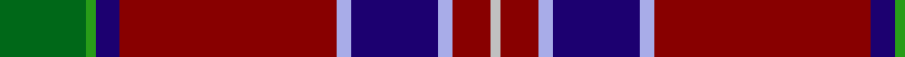

In pattern [GGBRWBWRW](/patterns/ggbrwbwrw/).

This was sourced from register-of-tartans.  It is a [9 stripes tartan](/stripes/stripes9/).

Original link https://www.tartanregister.gov.uk/tartanDetails.aspx?ref=2693

## Attestations

This cloth appears in 2 source records; the oldest owns this page.

- 01/01/1988 — MacNiven (register-of-tartans, [record](https://www.tartanregister.gov.uk/tartanDetails.aspx?ref=2693))
- pre 1988 — MacNiven (tartans-authority, [record](http://www.tartansauthority.com/tartan-ferret/display/752/))

## Thread count
G/36 Ga4 DB10 DR90 LP6 DB36 LP6 DR16 N/4

## Palette
Each colour and its ΔE from the base-6 reference it is a variant of.

| Colour | Shade | Base | ΔE (OKLab) |
|---|---|---|---|
| DB | <code style="background-color:#1C0070;">#1C0070</code> `#1C0070` | B <code style="background-color:#2A418A;">#2A418A</code> | 0.14 |
| DR | <code style="background-color:#880000;">#880000</code> `#880000` | R <code style="background-color:#CC0000;">#CC0000</code> | 0.15 |
| G | <code style="background-color:#006818;">#006818</code> `#006818` | G <code style="background-color:#006100;">#006100</code> | 0.02 |
| Ga | <code style="background-color:#289C18;">#289C18</code> `#289C18` | G <code style="background-color:#006100;">#006100</code> | 0.19 |
| LP | <code style="background-color:#A8ACE8;">#A8ACE8</code> `#A8ACE8` | W <code style="background-color:#F7F7F7;">#F7F7F7</code> | 0.23 |
| N | <code style="background-color:#C0C0C0;">#C0C0C0</code> `#C0C0C0` | W <code style="background-color:#F7F7F7;">#F7F7F7</code> | 0.17 |

## Nearest tartans

The nearest existing variants by ΔTartan distance.

1. [MacNiven Family Tartan Tartan Number: 752. Earliest known date: 1986 Based in part on the MacNaughton of which the MacNivens are a Sept. The name in Mr Cannonito's family was spelt, MacKniffen. Other members of the family have dropped the 'Mac' since arriving in America in 1650. This clan tartan was accredited by the Scottish Tartans Society in 1988. See products available Copyright © Blair Urquhart, Comrie, 2015](/setts/s9/g18ga2b5r45ba3b18ba3r5w2~b202060-ba2c2c80-g006818-ga289c18-rc80000-we0e0e0/) — ΔT 0.73
1. [MacNiven](/setts/s9/g18ga2b5r45ba3b18ba3r5w2~b000050-ba304080-g008000-ga30a010-rc00000-we0e0e0/) — ΔT 0.81
1. [Heirloom Red Alba (Fashion)](/setts/s9/r4y2r34b10g4b4ba4b23w3x2~b202060-ba2888c4-g5c6428-ra00000-we0e0e0-ye8c000/) — ΔT 0.97
1. [Blais](/setts/s11/b20y1r1b3k1g2k1ra10k1g2ra4x2~b304080-g808080-k000000-r806050-rac00000-yf0c000/) — ΔT 0.99
1. [Hyland Evening (Personal)](/setts/s8/b3y2r19ra4ba6k36ba2y3x2~b440044-ba780078-k101010-rc8002c-rab03000-ydc943c/) — ΔT 1.04
1. [Banause-Zunft zu Olte](/setts/s11/y2g4b1r3b3g3ga1r32b14w3y2x2~b003c64-g285800-ga289c18-r880000-we0e0e0-ye8c000/) — ΔT 1.07
1. [Java Saint Andrew Society Dress](/setts/s7/b50r26k9r4w2y2r10x2~b003c64-k101010-rc80000-we0e0e0-yd09800/) — ΔT 1.17
1. [Blais (Personal)](/setts/s11/b20y1g1b3k1r2k1ra10k1r2ra4x4~b2c2c80-g604000-k101010-r888888-rac80000-ye8c000/) — ΔT 1.20
1. [Sidey Dress Tartan (Name)](/setts/s10/b4w1k2b25k12ba1k2r16k2y1x2~b202060-ba1474b4-k101010-rc80000-we0e0e0-yd87c00/) — ΔT 1.21
1. [King (Austria) (Personal)](/setts/s9/w2r2b14g16y2k2g2r35g1x2~b2c2c80-g006818-k101010-rc80000-we0e0e0-ye8c000/) — ΔT 1.24

## Neighbour map

Every grey dot is one of 15726 variants placed by the first two principal components of the ΔTartan feature space (44% of its variance). Red is this tartan; blue dots are its nearest — click one to open its page.

<svg viewBox="0 0 640 380" role="img" style="max-width:100%;height:auto;border:1px solid #e0e0e0;border-radius:4px;display:block" xmlns="http://www.w3.org/2000/svg"><image href="/nn/cloud.v1.png" width="640" height="380"/><a href="/setts/s9/g18ga2b5r45ba3b18ba3r5w2~b202060-ba2c2c80-g006818-ga289c18-rc80000-we0e0e0/"><circle cx="273.3" cy="99.4" r="4" fill="#3465a4"><title>MacNiven Family Tartan Tartan Number: 752. Earliest known date: 1986 Based in part on the MacNaughton of which the MacNivens are a Sept. The name in Mr Cannonito's family was spelt, MacKniffen. Other members of the family have dropped the 'Mac' since arriving in America in 1650. This clan tartan was accredited by the Scottish Tartans Society in 1988. See products available Copyright © Blair Urquhart, Comrie, 2015</title></circle></a><a href="/setts/s9/g18ga2b5r45ba3b18ba3r5w2~b000050-ba304080-g008000-ga30a010-rc00000-we0e0e0/"><circle cx="255.9" cy="95.4" r="4" fill="#3465a4"><title>MacNiven</title></circle></a><a href="/setts/s9/r4y2r34b10g4b4ba4b23w3x2~b202060-ba2888c4-g5c6428-ra00000-we0e0e0-ye8c000/"><circle cx="251.2" cy="122.6" r="4" fill="#3465a4"><title>Heirloom Red Alba (Fashion)</title></circle></a><a href="/setts/s11/b20y1r1b3k1g2k1ra10k1g2ra4x2~b304080-g808080-k000000-r806050-rac00000-yf0c000/"><circle cx="281.7" cy="93.6" r="4" fill="#3465a4"><title>Blais</title></circle></a><a href="/setts/s8/b3y2r19ra4ba6k36ba2y3x2~b440044-ba780078-k101010-rc8002c-rab03000-ydc943c/"><circle cx="253.1" cy="113.1" r="4" fill="#3465a4"><title>Hyland Evening (Personal)</title></circle></a><a href="/setts/s11/y2g4b1r3b3g3ga1r32b14w3y2x2~b003c64-g285800-ga289c18-r880000-we0e0e0-ye8c000/"><circle cx="308.7" cy="71.9" r="4" fill="#3465a4"><title>Banause-Zunft zu Olte</title></circle></a><a href="/setts/s7/b50r26k9r4w2y2r10x2~b003c64-k101010-rc80000-we0e0e0-yd09800/"><circle cx="312.3" cy="135.0" r="4" fill="#3465a4"><title>Java Saint Andrew Society Dress</title></circle></a><a href="/setts/s11/b20y1g1b3k1r2k1ra10k1r2ra4x4~b2c2c80-g604000-k101010-r888888-rac80000-ye8c000/"><circle cx="283.8" cy="93.6" r="4" fill="#3465a4"><title>Blais (Personal)</title></circle></a><a href="/setts/s10/b4w1k2b25k12ba1k2r16k2y1x2~b202060-ba1474b4-k101010-rc80000-we0e0e0-yd87c00/"><circle cx="257.1" cy="103.1" r="4" fill="#3465a4"><title>Sidey Dress Tartan (Name)</title></circle></a><a href="/setts/s9/w2r2b14g16y2k2g2r35g1x2~b2c2c80-g006818-k101010-rc80000-we0e0e0-ye8c000/"><circle cx="288.6" cy="76.9" r="4" fill="#3465a4"><title>King (Austria) (Personal)</title></circle></a><circle cx="279.5" cy="108.7" r="5" fill="#c00000"/></svg>

ID: /setts/s9/g18ga2b5r45w3b18w3r8wa2x2~b1c0070-g006818-ga289c18-r880000-wa8ace8-wac0c0c0/
