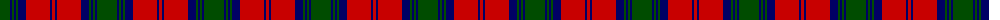

In pattern [GBGBGBRBR](/patterns/gbgbgbrbr/).

This was sourced from weddslist.  It is a [9 stripes tartan](/stripes/stripes9/).

Original link http://www.weddslist.com/cgi-bin/tartans/pg.pl?source=rb

## Thread count
G/20 DB2 G2 DB2 G2 DB8 R24 DB2 R/3

## Palette
Each colour and its ΔE from the base-6 reference it is a variant of.

| Colour | Shade | Base | ΔE (OKLab) |
|---|---|---|---|
| DB | <code style="background-color:#000064;">#000064</code> `#000064` | B <code style="background-color:#2C4084;">#2C4084</code> | 0.17 |
| G | <code style="background-color:#004C00;">#004C00</code> `#004C00` | G <code style="background-color:#006400;">#006400</code> | 0.08 |
| R | <code style="background-color:#C80000;">#C80000</code> `#C80000` | R <code style="background-color:#C80000;">#C80000</code> | 0.00 |

## Nearest tartans

The nearest existing variants by ΔTartan distance.

1. [City of Armadale](/setts/s10/k42g4k4g4k6g30r58g4r4g8-g006818-k101010-rc80000/) — ΔT 0.75
1. [Douglas (WCWM)](/setts/s10/k4r48b48k4b4k4b6k28r4k4-b646464-k000000-r8c0000/) — ΔT 0.88
1. [Lindsay](/setts/s9/g40b4g4b4g4b16r48b4r6-b000080-g006818-rff0000/) — ΔT 0.97
1. [Private SA Club](/setts/s8/k6r16k6r16y38r14b72r6-b14283c-k101010-r880000-yd8a028/) — ΔT 1.06
1. [Lindsay #2](/setts/s9/g24b2g2b2g2k10r20k2r4-b002814-g005020-k101010-rdc0000/) — ΔT 1.06
1. [Logan - 1810 (Cockburn Collection)](/setts/s7/k28r12k4r12g50r12k4-g285800-k00002c-rc80000/) — ΔT 1.08
1. [Red Remony Trade Tartan Tartan Number: 2235. Earliest known date: 1971 Red Remony See products available Copyright © Blair Urquhart, Comrie, 2015](/setts/s8/r34b4r4b26r4b4g34b4-b2c2c80-g006818-rc80000/) — ΔT 1.14
1. [Unidentified Specimen #2](/setts/s10/w4g4r4g56r4b24r44g4r4w4-b2c4084-g005020-rdc0000-we0e0e0/) — ΔT 1.15
1. [Stewart of Atholl (Clan)](/setts/s9/g88k4g8k4g12k32r80k4r12-g005028-k101010-rc80000/) — ΔT 1.16
1. [Frasers Highlanders (Military?)](/setts/s12/r56g4r4g4b24g36r4g36b24r30g4r6-b1c1c50-g006818-rc80000/) — ΔT 1.17

## Neighbour map

Every grey dot is one of 15726 variants placed by the first two principal components of the ΔTartan feature space (44% of its variance). Red is this tartan; blue dots are its nearest — click one to open its page.

<svg viewBox="0 0 640 380" role="img" style="max-width:100%;height:auto;border:1px solid #e0e0e0;border-radius:4px;display:block" xmlns="http://www.w3.org/2000/svg"><image href="/nn/cloud.v1.png" width="640" height="380"/><a href="/setts/s10/k42g4k4g4k6g30r58g4r4g8-g006818-k101010-rc80000/"><circle cx="259.2" cy="163.7" r="4" fill="#3465a4"><title>City of Armadale</title></circle></a><a href="/setts/s10/k4r48b48k4b4k4b6k28r4k4-b646464-k000000-r8c0000/"><circle cx="246.1" cy="169.3" r="4" fill="#3465a4"><title>Douglas (WCWM)</title></circle></a><a href="/setts/s9/g40b4g4b4g4b16r48b4r6-b000080-g006818-rff0000/"><circle cx="252.2" cy="162.6" r="4" fill="#3465a4"><title>Lindsay</title></circle></a><a href="/setts/s8/k6r16k6r16y38r14b72r6-b14283c-k101010-r880000-yd8a028/"><circle cx="227.1" cy="172.4" r="4" fill="#3465a4"><title>Private SA Club</title></circle></a><a href="/setts/s9/g24b2g2b2g2k10r20k2r4-b002814-g005020-k101010-rdc0000/"><circle cx="244.9" cy="165.8" r="4" fill="#3465a4"><title>Lindsay #2</title></circle></a><a href="/setts/s7/k28r12k4r12g50r12k4-g285800-k00002c-rc80000/"><circle cx="248.3" cy="205.6" r="4" fill="#3465a4"><title>Logan - 1810 (Cockburn Collection)</title></circle></a><a href="/setts/s8/r34b4r4b26r4b4g34b4-b2c2c80-g006818-rc80000/"><circle cx="239.0" cy="209.5" r="4" fill="#3465a4"><title>Red Remony Trade Tartan Tartan Number: 2235. Earliest known date: 1971 Red Remony See products available Copyright © Blair Urquhart, Comrie, 2015</title></circle></a><a href="/setts/s10/w4g4r4g56r4b24r44g4r4w4-b2c4084-g005020-rdc0000-we0e0e0/"><circle cx="257.2" cy="141.2" r="4" fill="#3465a4"><title>Unidentified Specimen #2</title></circle></a><a href="/setts/s9/g88k4g8k4g12k32r80k4r12-g005028-k101010-rc80000/"><circle cx="325.1" cy="160.2" r="4" fill="#3465a4"><title>Stewart of Atholl (Clan)</title></circle></a><a href="/setts/s12/r56g4r4g4b24g36r4g36b24r30g4r6-b1c1c50-g006818-rc80000/"><circle cx="271.6" cy="178.9" r="4" fill="#3465a4"><title>Frasers Highlanders (Military?)</title></circle></a><circle cx="272.3" cy="176.4" r="5" fill="#c00000"/></svg>

ID: /setts/s9/g20b2g2b2g2b8r24b2r3-b000064-g004c00-rc80000/
