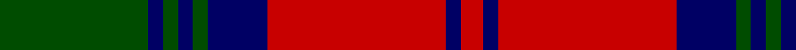

In pattern [GBGBGBRBR](/patterns/gbgbgbrbr/).

This was sourced from weddslist.  It is a [9 stripes tartan](/stripes/stripes9/).

Original link http://www.weddslist.com/cgi-bin/tartans/pg.pl?source=rb

## Thread count
G/20 DB2 G2 DB2 G2 DB8 R24 DB2 R/3

## Palette
Each colour and its ΔE from the base-6 reference it is a variant of.

| Colour | Shade | Base | ΔE (OKLab) |
|---|---|---|---|
| DB | <code style="background-color:#000064;">#000064</code> `#000064` | B <code style="background-color:#2A418A;">#2A418A</code> | 0.18 |
| G | <code style="background-color:#004C00;">#004C00</code> `#004C00` | G <code style="background-color:#006100;">#006100</code> | 0.07 |
| R | <code style="background-color:#C80000;">#C80000</code> `#C80000` | R <code style="background-color:#CC0000;">#CC0000</code> | 0.01 |

## Nearest tartans

The nearest existing variants by ΔTartan distance.

1. [City of Armadale](/setts/s10/k21g2k2g2k3g15r29g2r2g4~g006818-k101010-rc80000~x2/) — ΔT 0.75
1. [Douglas (WCWM)](/setts/s10/k2r24b24k2b2k2b3k14r2k2~b646464-k000000-r8c0000~x2/) — ΔT 0.88
1. [Lindsay](/setts/s9/g20b2g2b2g2b8r24b2r3~b000080-g006818-rff0000~x2/) — ΔT 0.98
1. [Private SA Club](/setts/s8/k3r8k3r8y19r7b36r3~b14283c-k101010-r880000-yd8a028~x2/) — ΔT 1.06
1. [Lindsay #2](/setts/s9/g12ga1g1ga1g1k5r10k1r2~g005020-ga002814-k101010-rdc0000~x2/) — ΔT 1.07
1. [Logan - 1810 (Cockburn Collection)](/setts/s7/k14r6k2r6g25r6k2~g285800-k00002c-rc80000~x2/) — ΔT 1.08
1. [Red Remony Trade Tartan Tartan Number: 2235. Earliest known date: 1971 Red Remony See products available Copyright © Blair Urquhart, Comrie, 2015](/setts/s8/r17b2r2b13r2b2g17b2~b2c2c80-g006818-rc80000~x2/) — ΔT 1.14
1. [Unidentified Specimen #2](/setts/s10/w1g1r1g14r1b6r11g1r1w1~b2c4084-g005020-rdc0000-we0e0e0~x4/) — ΔT 1.15
1. [Stewart of Atholl (Clan)](/setts/s9/g22k1g2k1g3k8r20k1r3~g005028-k101010-rc80000~x4/) — ΔT 1.17
1. [Frasers Highlanders (Military?)](/setts/s12/r28g2r2g2b12g18r2g18b12r15g2r3~b1c1c50-g006818-rc80000~x2/) — ΔT 1.18

## Neighbour map

Every grey dot is one of 15726 variants placed by the first two principal components of the ΔTartan feature space (44% of its variance). Red is this tartan; blue dots are its nearest — click one to open its page.

<svg viewBox="0 0 640 380" role="img" style="max-width:100%;height:auto;border:1px solid #e0e0e0;border-radius:4px;display:block" xmlns="http://www.w3.org/2000/svg"><image href="/nn/cloud.v1.png" width="640" height="380"/><a href="/setts/s10/k21g2k2g2k3g15r29g2r2g4~g006818-k101010-rc80000~x2/"><circle cx="259.9" cy="165.2" r="4" fill="#3465a4"><title>City of Armadale</title></circle></a><a href="/setts/s10/k2r24b24k2b2k2b3k14r2k2~b646464-k000000-r8c0000~x2/"><circle cx="246.7" cy="171.2" r="4" fill="#3465a4"><title>Douglas (WCWM)</title></circle></a><a href="/setts/s9/g20b2g2b2g2b8r24b2r3~b000080-g006818-rff0000~x2/"><circle cx="252.3" cy="165.0" r="4" fill="#3465a4"><title>Lindsay</title></circle></a><a href="/setts/s8/k3r8k3r8y19r7b36r3~b14283c-k101010-r880000-yd8a028~x2/"><circle cx="227.7" cy="173.5" r="4" fill="#3465a4"><title>Private SA Club</title></circle></a><a href="/setts/s9/g12ga1g1ga1g1k5r10k1r2~g005020-ga002814-k101010-rdc0000~x2/"><circle cx="245.8" cy="166.7" r="4" fill="#3465a4"><title>Lindsay #2</title></circle></a><a href="/setts/s7/k14r6k2r6g25r6k2~g285800-k00002c-rc80000~x2/"><circle cx="248.1" cy="207.5" r="4" fill="#3465a4"><title>Logan - 1810 (Cockburn Collection)</title></circle></a><a href="/setts/s8/r17b2r2b13r2b2g17b2~b2c2c80-g006818-rc80000~x2/"><circle cx="239.1" cy="210.3" r="4" fill="#3465a4"><title>Red Remony Trade Tartan Tartan Number: 2235. Earliest known date: 1971 Red Remony See products available Copyright © Blair Urquhart, Comrie, 2015</title></circle></a><a href="/setts/s10/w1g1r1g14r1b6r11g1r1w1~b2c4084-g005020-rdc0000-we0e0e0~x4/"><circle cx="258.4" cy="142.3" r="4" fill="#3465a4"><title>Unidentified Specimen #2</title></circle></a><a href="/setts/s9/g22k1g2k1g3k8r20k1r3~g005028-k101010-rc80000~x4/"><circle cx="326.1" cy="161.9" r="4" fill="#3465a4"><title>Stewart of Atholl (Clan)</title></circle></a><a href="/setts/s12/r28g2r2g2b12g18r2g18b12r15g2r3~b1c1c50-g006818-rc80000~x2/"><circle cx="272.0" cy="180.1" r="4" fill="#3465a4"><title>Frasers Highlanders (Military?)</title></circle></a><circle cx="272.7" cy="178.2" r="5" fill="#c00000"/></svg>

ID: /setts/s9/g20b2g2b2g2b8r24b2r3~b000064-g004c00-rc80000/
